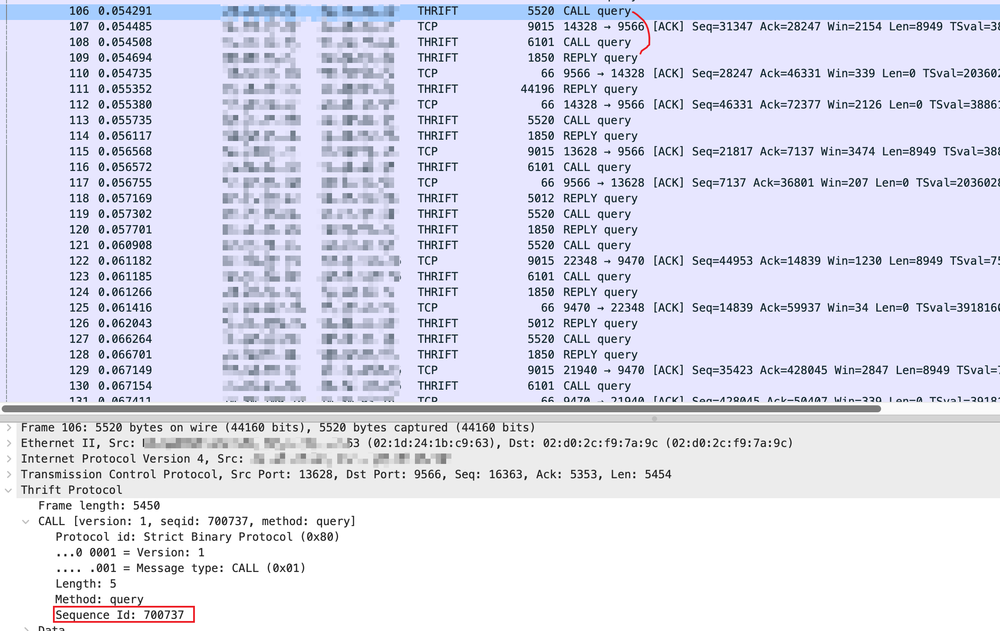
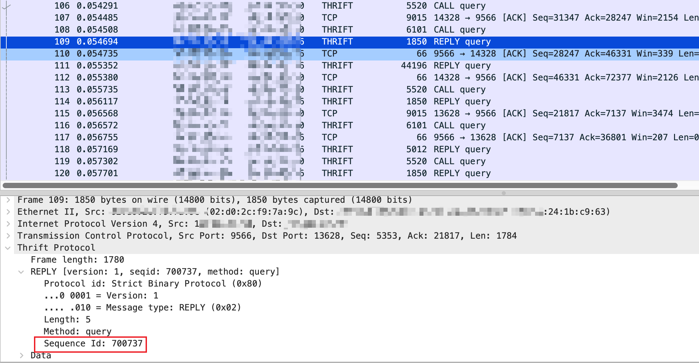
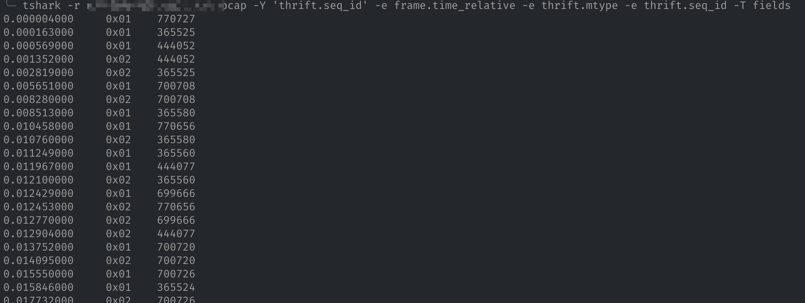
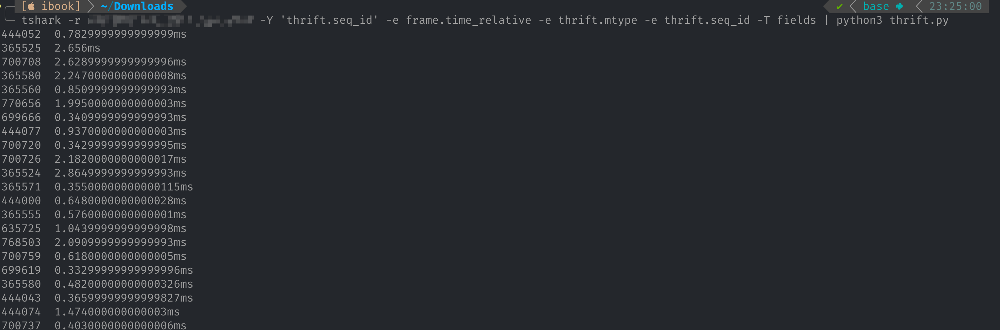

生产环境两个内部模块之间使用了 thrift 协议进行通信，现在怀疑调用延迟过高，但是由于没有上报指标或打印日志，为了快速确认延迟是否升高，在机器上抓了通信包，想通过抓包确认延迟。

`thrift` 使用多路复用，每次请求需要在请求体中添加标识，以便区分请求，`thrift` 使用了 `Sequence Id`，其请求和响应中均包含相同的 `Sequence Id` 。





但是 `wireshark` 并没有可以直接分析 `thrift` `RT` 的能力。想要分析只能借助 `tshark` 这个工具。`tshark` 是命令行版本的 `wireshark`，借助 `tshark` 命令，我们可以将 `thrift` 包中的 `Sequence Id` 单独打印出来，再配合时间等字段分析出一次请求响应的 RT。

首先是将需要的抓包字段打印出来，为了分析出 `RT`，我们需要请求和响应的时间（相对时间即可）、标识请求响应的类型字段以及一次请求的`Sequence Id` ，同时为了减少输出的无用字段，还需要过滤掉不包含`Sequence Id`的包（ACK 等数据包）。

```bash
tshark -r /path/to/capture.pcap -Y '
' -e frame.time_relative -e thrift.mtype -e thrift.seq_id -T fields
```



有了相关数据，我们就可以通过其它工具（如 `awk`、`python` 等）进行分析了，这里选用了 `python` 语言进行分析，代码如下：

```python
import sys

mapper = {}

# 按行读取
for line in sys.stdin:
    line = line.strip()
    t, mtype, req_id = line.split()
    if mtype == "0x01":
          # 请求包，建立 KV 映射
        mapper[req_id] = float(t)
        continue
    if req_id not in mapper:
        continue
    # 取出请求时间
    request_t = mapper[req_id]
    latency = float(t) - request_t
    print("{}\t{}ms".format(req_id, latency * 1000))
```

将两个命令通过管道符连接：

```bash
tshark -r /path/to/capture.pcap -Y 'thrift.seq_id' -e frame.time_relative -e thrift.mtype -e thrift.seq_id -T fields | python3 thrift.py
```



最后，我们可以得到每一个请求的 `RT`（Response Time 响应时间）。
