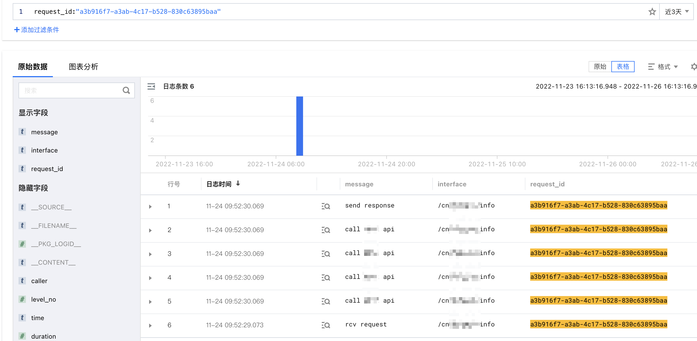

日志作为应用故障排查的一个重要利器，是应用开发中的重要一环。但是日志如何打印、打印那些信息却没有一个非常好的规范，本文根据自己多年开发经验，总结出一些日志打印的好的实践。

好的日志用一句话来说就是在正确的位置输出有用的信息。这里包含几个重要信息：

1. 日志打印的位置
2. 日志打印级别
3. 日志输出内容

## 一、日志级别

日志一般有**DEBUG**、**INFO**、**WARNING**、**ERROR**、**FATAL**等5个级别，

| 级别 | 说明 |
| --- | --- |
| DEBUG | 开发调试信息，方便开发过程中定位问题 |
| INFO | 对于现网定位问题比较有用的信息，但又不会输出过多信息，如请求、响应信息 |
| WARNING | 不会对服务运行造成影响的，但是又不符合预期的，如请求参数检验不通过，触发限频等 |
| ERROR | 记录导致接口无法正常运行的错误详情，如查询MySQL失败、调用外部服务报错等 |
| FATAL | 记录导致服务异常停止的信息，一般不常用 |

生产环境中，我们一般会开启**INFO**级别日志的打印，这样可以在保证有足够信息的前提下，又不会丢失一些重要的应用运行信息。而且一旦INFO日志不足以定位应用信息，可以临时把日志级别调整为**DEBUG**以获取更多日志信息。

## 二、日志内容与时机

### 2.1、日志中的字段

日志中需要记录尽可能多的信息，以保证后续更方便快捷的定位问题，但是记录太多会导致日志文件膨胀过快，如果日志上报Elasticsearch等搜索系统，也会造成占用空间过大的问题，因此需要对日志写入的字段做一个取舍。

下面表格中总结出一些常用字段及其说明

| 字段 | 必选 | 示例 | 说明 |
| --- | --- | --- | --- |
| time | 是 | 2022-01-22 12:23:34.234 | 日志时间，精确到毫秒 |
| client_ip | 是 | 2.3.12.3 | 接口调用方IP |
| remote_ip | 是 | 10.1.2.56 | TCP/IP的对端IP，可以快速获知负载均衡IP |
| level | 是 | INFO | 日志级别 |
| level_no | 是 | 400 | 日志级别对应的数字 |
| request_id | 是 | d0d32288-817d-444c-b4ae-e703f5ab1f2f | 请求ID，用于标识一次请求全过程，推荐使用uuidv4。 |
| trace_id | 是 | 591fe421-1915-4efc-bfe6-4d1c4470d650 | 跟踪ID，用于记录外部传递过来的请求ID，可以记录页面关联的请求链。 |
| uid | 是 | 123234 | 客户的账号ID |
| channel | 否 | app | 用于标识日志类型，可选 |
| interface | 是 | /api/v1/pets | 请求接口名称，如果时uri形式，则直接为请求路径，如：/api/v1/pets/dogs |
| message | 是 | Rcv request | 简短的描述，重点是要通过该字符串可以定位到某一类请求，如：Send Response、Query price、Call UpdateDomainInfo failed |
| context | 是 |  | 用于补全message中操作上下文信息，如更新域名是的域名和更新的信息等 |

以上表格中的每个字段应该出现在每条日志中以便于搜索所有涉及到的日志。其中`request_id`应该在一次请求过程中确定且唯一，以便定位整个请求。



上图中可以和很方便的定位一次请求中所有相关日志

### 2.1、日志格式

日志信息中应该包含一段**可以说明日志作用的简短描述**，比如接收到请求（Rcv request）、发送响应（Send response）、调用第三方http接口（Call http api）等。当然只有这些信息还是不够的，应该将输出日志时的上写文也输出到日志中才能方便后续问题的定位。如接收到请求时的请求详情（请求url、请求方法、请求body和请求头等）、触发限频时的相关信息（限频Key、限频值）等。

确定了要写入的内容后，就是要确定以什么形式写入日志。一般我们会直接将相关信息与描述一起拼接为字符串，如：接收到请求会拼接为

> Rcv request: POST /api/v1/pets headers: {“host”:”example.com”,”content-type”:”application/json”,”user-agent”:”curl”} body:{"category":"pig"}
>

这种方式简单直接，但是日志字符串需要提前拼接，如果这是一条**DEBUG**日志，在生产环境不会真实写入的情况下，依然会提前拼接，而字符串拼接会造成一定的性能损失。一个好的方法是将上下文信息传入日志参数来实现延迟拼接（序列化）。

```python
logger.debug("Rcv request", context={
		"method": "POST",
		"body": "{\"category\":\"pig\"}",
		"headers": {
		    "host": "example.com",
		    "content-type": "application/json",
		    "user-agent": "curl"
		}
})
```

通过参数传递上下文并且写入日志的方式还有一个好处就是后期如果需要分析日志会非常方便快捷。


通过搜索rcv request可以快速定位所有请求

日志最终输出的格式可以选择常用的JSON格式，然后上报日志统一搜集平台进行解析搜索，以下是一个请求和响应的日志条目示例。


请求日志示例


响应日志示例

### 2.3、常见日志输出位置及内容

下表中总结了一些常见的打印日志的位置、消息内容及应该记录的消息内容。


## 三、日志上报

日志一般以文件的形式写入本地硬盘，对于k8s也可以输出到`stdout`、`stderr`。如果应用是单机部署，可以直接使用`grep`来过滤查询日志，但是当应用部署在多台机器再使用`grep`来查询日志会有点不太现实，这时候需要一个日志搜集处理系统，但是此系统不做为本文的重点，只是简单介绍一些平台：

1. 自建ELK（Elasticsearch+Logstash/Filebeat+Kibana）
2. [腾讯云CLS](https://cloud.tencent.com/product/cls)
3. [阿里云SLS](https://www.aliyun.com/product/sls)
