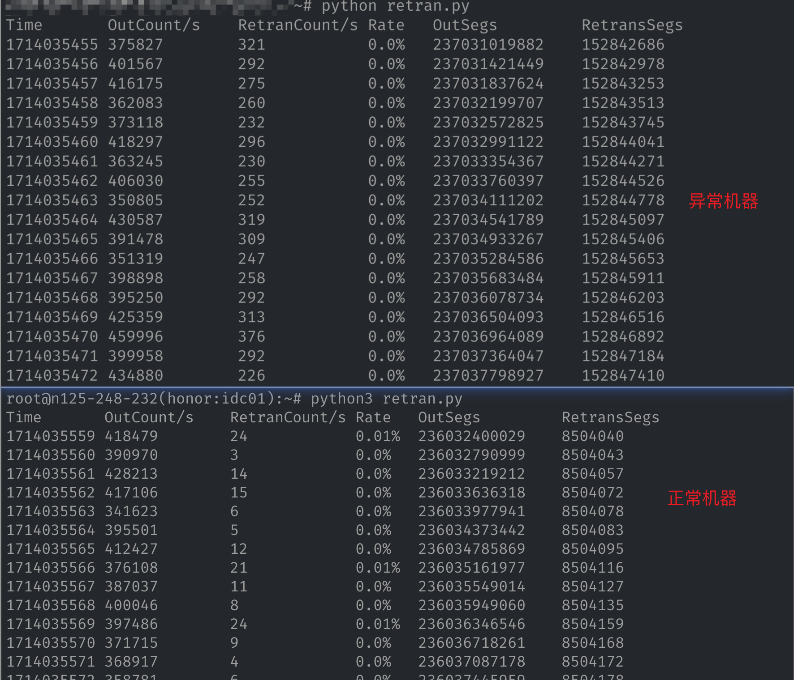
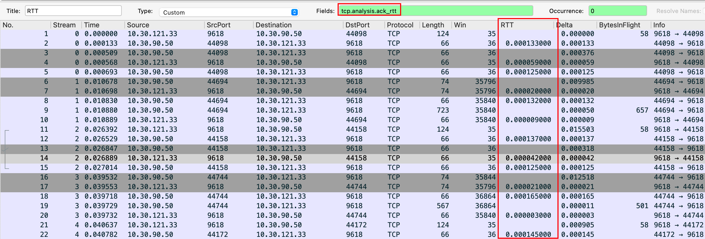

网络对应用造成主要问题是延迟，造成网络延迟的**主要（不是全部）**原因是丢包和 RTT 变大，一般情况下我们会通过抓包确认是否有丢包和 RTT 变大的情况，但是抓包代价相对比较大、而且分析起来也比较麻烦。有没有其它快速的确认、排查手段呢？下面尝试给出一些相对简单的初步排查方案。

## 0x01 丢包

丢包会导致重传，而重传就会增加耗时，即使是快速重传，多了也会导致不小的延迟增加。linux 中没有丢包的相关指标，但是重传有的指标，因此可以通过重传来感知丢包的频率。

### 1.1 重传率

Linux 中记录了发送数据包（`OutSegs`）和重传数据包（`RetransSegs`）的数量，通过这个指标计算出重传率。这两个指标保存在 `/proc/net/snmp` 文件中，两个指标的值都是自增的，即发送一个包 `OutSegs` 指标加 1，重传一个包 `RetransSegs` 指标加 1，因此需要定时读取该文件，计算前后差值，然后通过 `RestransSegsDiffValue / OutSegsDiffValue` 计算出重传率。


下面是一个通过 python 计算重传率的代码：

```bash
#!/usr/bin/env python3
import time

def read_retrans():
    with open("/proc/net/snmp", "r") as f:
        for line in f:
            if (not line.startswith("Tcp:")) or line.startswith("Tcp: RtoAlgorithm"):
                continue
            parts = line.split()
            total = int(parts[11])
            retrans = int(parts[12])
            return total, retrans

prev_total, prev_retrans = read_retrans()
prev_tm = time.time()
print("{:<10} {:<13} {:<13} {:<6} {:<15} {:<15}".format("Time", "OutCount/s", "RetranCount/s", "Rate", "OutSegs", "RetransSegs"))
while True:
    time.sleep(1)
    tm = time.time()
    total, retrans = read_retrans()
    if total is None:
        continue
    delta_total = total - prev_total
    delta_retrans = retrans - prev_retrans
    rate = (delta_retrans / delta_total) * 100
    print("{:<10} {:<13} {:<13} {:<6} {:<15d} {:<15d}".format(int(tm), delta_total, delta_retrans, str(round(rate, 2))+"%", total, retrans))
    prev_tm, prev_total, prev_retrans = tm, total, retrans

```


这个指标在重传数量小的情况下，单独看的时候没有太大意义，但是如果相同服务的不同机器，如果服务在某台机器上异常的时候，对比看这个指标会有很大的发现。如下图是相同的服务集群中，延迟较高的机器和正常机器的重传情况。



### 1.2 重传详情

**a.通过 tracepoint 获取**

仅仅有重传率只能知道当前网络质量可能有问题，存在丢包重传的问题，但如果要定位具体问题，还是需要知道更为详细的重传信息。抓包可以满足这一点，但是依然笨重。**Linux4.16** 之后的内核提供了一个 `tracepoint`，可以更为方便的感知这些信息。具体操作如下：

```bash
# 打开 tracing
echo 1 > /sys/kernel/debug/tracing/events/tcp/tcp_retransmit_skb/enable
# 查看重传详情
cat /sys/kernel/debug/tracing/trace_pipe
# 使用完毕后关闭 tracing
echo 0 > /sys/kernel/debug/tracing/events/tcp/tcp_retransmit_skb/enable
```


**b. 通过 ebpf 动态追踪获取**

tracepoint 的方式要求内核要在 4.16 之后，对于之前的 4.x 版本，可以使用 ebpf 进行追踪（需要安装 bcc tool 等相关工具），相关脚本可以参考 [tcpretrans.py](http://tcpretrans.py/) 工具，相关链接如下：

1. [https://github.com/iovisor/bcc/blob/master/tools/tcpretrans.py](https://github.com/iovisor/bcc/blob/master/tools/tcpretrans.py)
2. [https://github.com/iovisor/bcc/blob/master/tools/tcpretrans_example.txt](https://github.com/iovisor/bcc/blob/master/tools/tcpretrans_example.txt)

**c. 通过 bpftrace 工具获取**

`bpftrace` 的方式其实就是通过 ebpf 获取，只是为了方便使用，封装了一个更为简单的工具提供给使用者。`bpftrace` 官方已经给出了一个写好的 tcp 重传详情的脚本，具体脚本链接如下：

1. [https://github.com/bpftrace/bpftrace/blob/master/tools/tcpretrans.bt](https://github.com/bpftrace/bpftrace/blob/master/tools/tcpretrans.bt)
2. [https://github.com/bpftrace/bpftrace/blob/master/tools/tcpretrans_example.txt](https://github.com/bpftrace/bpftrace/blob/master/tools/tcpretrans_example.txt)

### 1.3 抓包

如果内核版本过低无法使用 ebpf，可以通过抓包进行深入分析确认，抓包之后的一些分析可以查看我之前的网络相关文章或者 google 定向搜索，这里给出一个 `tshark` 筛选 TCP 重传包的命令。

```bash
tshark -r /path/to/pcap.pcap -Y 'tcp.analysis.retransmission'
```


## 0x02 RTT 延迟增大

RTT 全称 **Round Trip Time**，简单解释就是数据包从发送端到接收端再返回的时间，这个时间能直接体现出网络的延迟。wireshark（tshark）中有一个`ack_rtt` 的指标，该指标是  TCP 数据包从发送到接收到对应 ACK 包的时间差，这个时间差基本上可以看作 RTT。



但是 Linux 中并没有 RTT 相关的指标可供使用，你可以通过抓包后使用 wireshark 分析获取，但是这比较笨重，一个更简单的方法是使用 `ping` 工具确认。

`ping` 工作在网络层，其基本原理就是发送端向对端发送一个带有指定长度（默认 56 字节）数据的 IP 包，对端收到后立即返回一个具有相同内容的 IP 包，发送端接收后会统计时间差等信息并输出。

从对 `ping` 原理的描述可以发现，`ping` 的延迟其实可以等同于 RTT，那么我们就可以直接在服务器上确认当前是否有延迟波动的情况。当然，在确认的时候需要指定一下 `ping` 包发送的速率，速率太小采样就小，不容易发现问题，最好指定速率为每秒大于 100。

```bash
ping -i 0.01 1.2.3.4
```

ping 的过程中，一旦可以稳定复现延迟波动的情况，那基本可以确认**链路上**有导致延迟增加的因素。


## 0x03 总结

以上的方案仅仅是部分场景（应该是大部分场景）下初步排查定位的一些方法，这些方法能帮助快速定位到问题的排查方向，减少前期定位的时间。当然定位到排查方向后还需要顺着排查方向深入进去排查根因。
