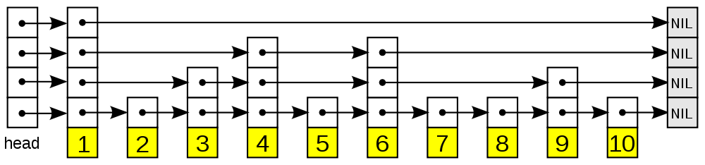

跳跃表（[skiplist](http://en.wikipedia.org/wiki/Skip_list)）是一种随机化的数据， 由 William Pugh 在论文[《Skip lists: a probabilistic alternative to balanced trees》](http://www.cl.cam.ac.uk/teaching/0506/Algorithms/skiplists.pdf)中提出， 跳跃表以有序的方式在层次化的链表中保存元素， 效率和平衡树媲美 —— 查找、删除、添加等操作都可以在对数期望时间下完成， 并且比起平衡树来说， 跳跃表的实现要简单直观得多。

以下是个典型的跳跃表例子（图片来自[维基百科](http://en.wikipedia.org/wiki/File:Skip_list.svg)）：



从图中可以看到， 跳跃表主要由以下部分构成：

+ 表头（head）：负责维护跳跃表的节点指针。
+ 跳跃表节点：保存着元素值，以及多个层。
+ 层：保存着指向其他元素的指针。高层的指针越过的元素数量大于等于低层的指针，为了提高查找的效率，程序总是从高层先开始访问，然后随着元素值范围的缩小，慢慢降低层次。
+ 表尾：全部由 NULL 组成，表示跳跃表的末尾。

因为跳跃表的定义可以在任何一本算法或数据结构的书中找到， 所以本章不介绍跳跃表的具体实现方式或者具体的算法， 而只介绍跳跃表在 Redis 的应用、核心数据结构和 API 。

## 跳跃表的实现

为了满足自身的功能需要， Redis 基于 William Pugh 论文中描述的跳跃表进行了以下修改：

1. 允许重复的 score 值：多个不同的 member 的 score 值可以相同。
2. 进行对比操作时，不仅要检查 score 值，还要检查 member ：当 score 值可以重复时，单靠 score 值无法判断一个元素的身份，所以需要连 member 域都一并检查才行。
3. 每个节点都带有一个高度为 1 层的后退指针，用于从表尾方向向表头方向迭代：当执行 ZREVRANGE 或 ZREVRANGEBYSCORE 这类以逆序处理有序集的命令时，就会用到这个属性。

这个修改版的跳跃表由 redis.h/zskiplist 结构定义：

```c
typedef struct zskiplist {

    // 头节点，尾节点
    struct zskiplistNode *header, *tail;

    // 节点数量
    unsigned long length;

    // 目前表内节点的最大层数
    int level;

} zskiplist;
```

跳跃表的节点由 redis.h/zskiplistNode 定义：

```c
typedef struct zskiplistNode {

    // member 对象
    robj *obj;

    // 分值
    double score;

    // 后退指针
    struct zskiplistNode *backward;

    // 层
    struct zskiplistLevel {

        // 前进指针
        struct zskiplistNode *forward;

        // 这个层跨越的节点数量
        unsigned int span;

    } level[];

} zskiplistNode;
```

以下是操作这两个数据结构的 API ，API 的用途与相应的算法复杂度：

| 函数 |  作用 |  复杂度 |
| --- | --- | --- |
| zslCreateNode |   创建并返回一个新的跳跃表节点  | 最坏 O(1) |
| zslFreeNode | 释放给定的跳跃表节点  | 最坏 O(1) |
| zslCreate |   创建并初始化一个新的跳跃表   | 最坏 O(1) |
| zslFree | 释放给定的跳跃表    | 最坏 O(N) |
| zslInsert |   将一个包含给定 score 和 member 的新节点添加到跳跃表中  | 最坏 O(N) 平均 O(logN) |
| zslDeleteNode |   删除给定的跳跃表节点  | 最坏 O(N) |
| zslDelete |   删除匹配给定 member 和 score 的元素   | 最坏 O(N) 平均 O(logN) |
| zslFirstInRange | 找到跳跃表中第一个符合给定范围的元素  | 最坏 O(N) 平均 O(logN) |
| zslLastInRange |  找到跳跃表中最后一个符合给定范围的元素 | 最坏 O(N) 平均 O(logN) |
| zslDeleteRangeByScore |   删除 score 值在给定范围内的所有节点   | 最坏 O(N2) |
| zslDeleteRangeByRank |    删除给定排序范围内的所有节点  | 最坏 O(N2) |
| zslGetRank |  返回目标元素在有序集中的排位  | 最坏 O(N) 平均 O(logN) |
| zslGetElementByRank | 根据给定排位，返回该排位上的元素节点  | 最坏 O(N) 平均 O(logN) |

## 跳跃表的应用

和字典、链表或者字符串这几种在 Redis 中大量使用的数据结构不同， 跳跃表在 Redis 的唯一作用， 就是实现有序集数据类型。

跳跃表将指向有序集的 score 值和 member 域的指针作为元素， 并以 score 值为索引， 对有序集元素进行排序。

举个例子， 以下代码创建了一个带有 3 个元素的有序集：

```bash
redis> ZADD s 6 x 10 y 15 z
(integer) 3

redis> ZRANGE s 0 -1 WITHSCORES
1) "x"
2) "6"
3) "y"
4) "10"
5) "z"
6) "15"
```

在底层实现中， Redis 为 x 、 y 和 z 三个 member 分别创建了三个字符串， 值分别为 double 类型的 6 、 10 和 15 ， 然后用跳跃表将这些指针有序地保存起来， 形成这样一个跳跃表：


为了方便展示， 在图片中我们直接将 member 和 score 值包含在表节点中， 但是在实际的定义中， 因为跳跃表要和另一个实现有序集的结构（字典）分享 member 和 score 值， 所以跳跃表只保存指向 member 和 score 的指针。 更详细的信息，请参考《[有序集](https://redisbook.readthedocs.io/en/latest/datatype/sorted_set.html#sorted-set-chapter)》章节。

## 小结

+ 跳跃表是一种随机化数据结构，查找、添加、删除操作都可以在对数期望时间下完成。
+ 跳跃表目前在 Redis 的唯一作用，就是作为有序集类型的底层数据结构（之一，另一个构成有序集的结构是字典）。
+ 为了满足自身的需求，Redis 基于 William Pugh 论文中描述的跳跃表进行了修改，包括：
    1. score 值可重复。
    2. 对比一个元素需要同时检查它的 score 和 memeber 。
    3. 每个节点带有高度为 1 层的后退指针，用于从表尾方向向表头方向迭代。

## 更多组件及示例

**陋室铭**

*作者：刘禹锡*

山不在高，有仙则名。

水不在深，有龙则灵。

斯是陋室，惟吾德馨。

苔痕上阶绿，草色入帘青。

谈笑有鸿儒，往来无白丁。

可以调素琴，阅金经。

无丝竹之乱耳，无案牍之劳形。

南阳诸葛庐，西蜀子云亭。

孔子云：何陋之有？

点击[链接](https://so.gushiwen.cn/shiwenv_6c1ea9b7dd44.aspx)查看`陋室铭`全文赏析。

---

新的段落

~~The world is flat.~~

### 引用

> 山不在高，有仙则名。  
> 水不在深，有龙则灵。  
> 斯是陋室，惟吾德馨。  
> > 苔痕上阶绿，草色入帘青。  
> > 谈笑有鸿儒，往来无白丁。  
> 可以调素琴，阅金经。  
> 无丝竹之乱耳，无案牍之劳形。  
> 南阳诸葛庐，西蜀子云亭。  
> 孔子云：何陋之有？  

### 表格

以下是操作这两个数据结构的 API ，API 的用途与相应的算法复杂度：

| 函数 |  作用 |  复杂度 |
| --- | --- | --- |
| zslCreateNode |   创建并返回一个新的跳跃表节点  | 最坏 O(1) |
| zslFreeNode | 释放给定的跳跃表节点  | 最坏 O(1) |
| zslCreate |   创建并初始化一个新的跳跃表   | 最坏 O(1) |
| zslFree | 释放给定的跳跃表    | 最坏 O(N) |
| zslInsert |   将一个包含给定 score 和 member 的新节点添加到跳跃表中  | 最坏 O(N) 平均 O(logN) |
| zslDeleteNode |   删除给定的跳跃表节点  | 最坏 O(N) |
| zslDelete |   删除匹配给定 member 和 score 的元素   | 最坏 O(N) 平均 O(logN) |
| zslFirstInRange | 找到跳跃表中第一个符合给定范围的元素  | 最坏 O(N) 平均 O(logN) |
| zslLastInRange |  找到跳跃表中最后一个符合给定范围的元素 | 最坏 O(N) 平均 O(logN) |
| zslDeleteRangeByScore |   删除 score 值在给定范围内的所有节点   | 最坏 O(N2) |
| zslDeleteRangeByRank |    删除给定排序范围内的所有节点  | 最坏 O(N2) |
| zslGetRank |  返回目标元素在有序集中的排位  | 最坏 O(N) 平均 O(logN) |
| zslGetElementByRank | 根据给定排位，返回该排位上的元素节点  | 最坏 O(N) 平均 O(logN) |

### 无序列表

无序列表

+ 第一项
+ 第二项
+ 第三项

嵌套列表

* Fruit
  * Apple
  * Orange
  * Banana
* Dairy
  1. Milk
  2. Cheese

### 有序列表

有序列表

1. 第一项
2. 第二项
3. 第三项

### 代码块

`javascript` 代码

```js
const a = 1;
const b = 2;
const c = a + b;
console.log(c);
```

```js
/** @type {import('tailwindcss').Config} */

module.exports = {
  content: [
    "./content/**/*.md",
    "./themes/**/layouts/**/*.html",
    "./layouts/**/*.html"
  ],
  theme: {
    container: {
      center: true,
      screens: {
        sm: '640px',
        md: '768px',
        lg: '1024px',
        xl: '1024px',
        '2xl': '1024px',
      },
    },
    extend: {
        colors: {
          "post-bg-color": "#eeeeee",
          "hashtag-ddd": "#ddd",
          "color-hex-ddd": "#ddd",
          "content-color": "#444",
          "sitebgc": "#edede5",
          "aside-bg-color": "#f1f1ef",
          "white": "#ffffff",
          "link-color": "#d82a20",
          "link-color-blue": "#006eff",
        },
        boxShadow: {
          "post-container": "0 0 2px #dddddd"
        }
    },
    fontFamily: {
      "body": [
        'Lato', 'Helvetica', 'Tahoma', 'Arial', '"Hiragino Sans GB"', '"Heiti SC"', '"Microsoft YaHei"', '"WenQuanYi Micro Hei"', 'Heiti', 'ubuntu', 'SimSun', 'sans-serif',
      ],
    },
  },
  plugins: [],
}
```

### 图片

包含描述的图片


不包含描述的图片


### 任务列表

- [x] Write the press release
- [ ] Update the website
- [ ] Contact the media

### 定义列表

First Term
: This is the definition of the first term.

Second Term
: This is one definition of the second term.
: This is another definition of the second term.

### 脚注

Here's a simple footnote[^1], and here's a longer one[^bignote].

[^1]: This is the first footnote.

[^bignote]: Here's one with multiple paragraphs and code.

    Indent paragraphs to include them in the footnote.

    `{ my code }`

    Add as many paragraphs as you like.

### 标注框

下面是一个标注框

<aside>
山不在高，有仙则名。

水不在深，有龙则灵。

斯是陋室，惟吾德馨。

苔痕上阶绿，草色入帘青。

谈笑有鸿儒，往来无白丁。

可以调素琴，阅金经。

无丝竹之乱耳，无案牍之劳形。

南阳诸葛庐，西蜀子云亭。

孔子云：何陋之有？
</aside>
