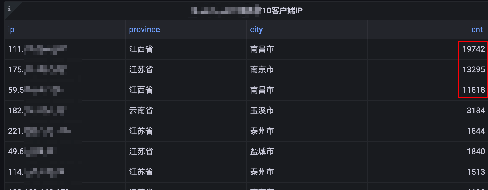
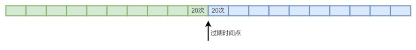
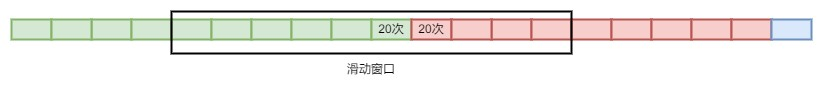

最近，一个未鉴权的业务接口持续受到攻击，攻击者使用不同的IP持续对接口进行调用，严重情况下已经影响到了接口的正常使用。虽然接口有基于**IP+接口**纬度的限频，但是在这种类似DDOS的攻击场景下已经失效。因为被攻击的是接口（非页面），无法使用**添加验证码**等增加复杂度来进行保护。那剩下有效的方法就是封禁，通过对请求IP进行封禁以此来**增加攻击者的成本**。



确定了解决方法那就要开始进行封禁了，那应该如何确认对哪个IP进行封禁呢？一般情况下我们手动封禁无非就是通过聚合一段时间内的请求日志，识别哪个IP请求量比较高，然后判断请求量大于多少的算是攻击，确认后就可以对IP进行封禁。将封禁步骤抽象出来基本上就是以下两个步骤：

1. 识别：识别攻击
2. 策略：惩罚攻击者

## 0x01 识别攻击

首先我们来看一下如何**识别**。对于此类攻击，其目的主要有两个：

1. 单纯攻击，通过大量请求耗尽资源。
2. 爬虫，通过接口获取一些社工信息等。

这两种情况均为通过大量请求来实现自身的目的，那我们识别的方式也就比较简单了，即在一定时间内某个IP（或者其它纬度，如帐号ID）请求量超过某个值，即认定为攻击。

这里需要注意的是实现算法，在M秒内请求量超过N次，这很容易想到计数法，但是计数法在临界范围内会出现限制不住的问题。例如下图场景，在10秒内请求超过20次会被判定为攻击。但因为计数器有过期时间的问题，可能会出现在前9秒内没有请求，但是第10秒和第11秒出现20次请求，而且均未被判定为攻击行为。



如何解决这个问题呢？滑动窗口是一个非常不错的算法。如下图，在第10秒的时候出现20次请求，由于在时间窗口内，因此会被计入总数，如果11秒再进来请求，因为时间窗口内的请求数量已经达到20，因此后续9秒的请求均会被计数，从而被判定为攻击。



## 0x02 惩罚策略

识别攻击后的下一步就是对攻击源进行惩罚。惩罚的方式包括封禁IP、账号或增加验证码等，以增加攻击者的攻击成本。在接口攻击中，直接使用封禁即可，但需要注意的是第一步的识别是否能100%确认调用者是攻击行为。举例来说，某个公司的许多员工共用一个出口IP，当他们一起访问接口时，可能会被错误地判断为攻击行为。但是，他们的请求量确实有可能导致接口出现问题，因此仍然需要进行封禁。然而，长期一直封禁也是不可取的，因此可以采取封禁一段时间（也称为关小黑屋）的方式来保护接口。当然，对于这种场景，可以采用强制登录才能访问的方式来验证非攻击行为。

当然，这个封禁时间长度需要根据业务特性自行决定，比如可以封禁10分钟，10分钟后再根据策略判定是否还存在攻击行为。

## 0x03 程序实现

来到了我们最重要的程序实现部分，根据以上分析，我们选择了可以支持滑动窗口算法并且性能比较高的分布式系统`Redis`作为存储，并选择`zset`数据结构以支持滑动窗口算法。

因为系统涉及到识别和封禁，如果将各个步骤分开，势必会涉及到到多次网络IO，这样会极大增加接口耗时。因此，使用`redis`支持的`lua`脚本，配合`EVAL`命令来实现识别和封禁。代码如下：

```lua
-- 攻击检测key
local key = KEYS[1]
-- 封禁key
local block_key = KEYS[2]
-- 当前时间戳
local timestamp = tonumber(ARGV[1])
-- 滑动窗口大小，单位秒
local win_size = tonumber(ARGV[2])
-- 请求ID（唯一）
local rid = ARGV[3]
-- 封禁阈值
local threshold = tonumber(ARGV[4])
-- 封禁时长
local block_ttl = ARGV[5]
-- 滑动窗口开始时间
local start_time = timestamp - win_size

-- 向zset中添加一个请求
redis.call("ZADD", key, timestamp, rid)
-- 对key添加一个超时时间，避免大量无用key占用内存
redis.call("EXPIRE", key, win_size*2)
-- 统计窗口内请求量
local val = redis.call("ZCOUNT", key, start_time, timestamp)
-- 删除非窗口内的值，减少内存占用
redis.call("ZREMRANGEBYSCORE", key, 0, start_time)
-- 是否封禁标识
local blocked = 0
if val and tonumber(val) >= threshold then
    -- 请求量超过阈值，封禁
    redis.call("SET", block_key, "", "NX", "EX", block_ttl)
    blocked = 1
else
    -- 判断封禁key是否存在，存在表示封禁中
    local ret = redis.call("EXISTS", block_key)
    if ret == 1 then
        blocked = 1
    end
end
-- 返回滑动窗口内请求量和是否封禁了
return { tonumber(val), blocked }
```

程序返回了请求量和是否封禁的标识。此时我们上层应用便可以使用返回的标识进行封禁逻辑。完整程序如下:

```go
package main

import (
	"context"
	"time"

	"github.com/redis/go-redis/v9"

	"github.com/bookiu/go-playground/utils/randutil"
)

const (
	redisAddr = "127.0.0.1:6379"
	redisPass = "123456"
)

var (
	rdb *redis.Client
)

func init() {
	rdb = redis.NewClient(&redis.Options{
		Addr:     redisAddr,
		Password: redisPass,
		DB:       0,
	})
}

// AutoBlock 自动封禁
// 客户端 clientIP 在 duration 秒内访问次数超过 threshold 次时，自动封禁客户端 blockTTL 秒
func AutoBlock(
	ctx context.Context,
	clientIP string,
	duration time.Duration,
	threshold int,
	blockTTL time.Duration,
) (bool, int, error) {
	checkKey := "attack_check#ip:" + clientIP
	blockKey := "attack_block#ip:" + clientIP
	timestamp := time.Now().Unix()
	windowSize := duration.Seconds()
	uniqueID := randutil.RandomString(10)
	ttl := blockTTL.Seconds()

	script := getScript()
	ret, err := rdb.
		Eval(ctx, script, []string{checkKey, blockKey}, timestamp, windowSize, uniqueID, threshold, ttl).
		Int64Slice()
	if err != nil {
		return false, 0, err
	}
	blocked := ret[1]
	reqCount := ret[0]
	// TODO: 将 reqCount 记录到日志中
	if blocked == 1 {
		return true, int(reqCount), nil
	}
	return false, int(reqCount), nil
}

func getScript() string {
	return `-- 攻击检测key
local key = KEYS[1]
-- 封禁key
local block_key = KEYS[2]
-- 当前时间戳
local timestamp = tonumber(ARGV[1])
-- 滑动窗口大小，单位秒
local win_size = tonumber(ARGV[2])
-- 请求ID（唯一）
local rid = ARGV[3]
-- 封禁阈值
local threshold = tonumber(ARGV[4])
-- 封禁时长
local block_ttl = ARGV[5]
local start_time = timestamp - win_size

--
redis.call("ZADD", key, timestamp, rid)
local val = redis.call("ZCOUNT", key, start_time, timestamp)
redis.call("ZREMRANGEBYSCORE", key, 0, start_time)
-- 是否封禁
local blocked = 0
if val and tonumber(val) >= threshold then
    -- 请求量超过阈值，封禁
    redis.call("SET", block_key, "", "NX", "EX", block_ttl)
    blocked = 1
else
    -- 判断封禁key是否存在，存在表示封禁中
    local ret = redis.call("EXISTS", block_key)
    if ret == 1 then
        blocked = 1
    end
end
-- 返回滑动窗口内请求量和是否封禁了
return { tonumber(val), blocked }`
}
```
