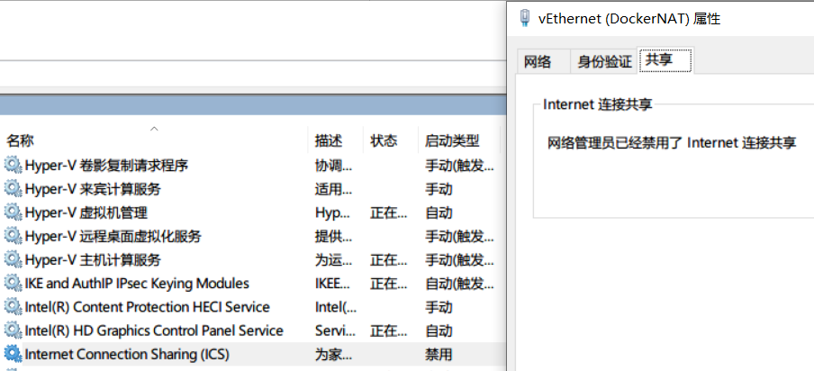

hyper-v作为windows10原生支持的虚拟机，安装使用起来是很方便的，但是它最大的问题就是网络不够傻瓜化，不像vmware提供了桥接、NAT、hostonly等多样的组网需求，hyper-v只提供了虚拟交换机这一种网络设备。如果想要虚拟机上外网，hyper-v提供了一种Internet连接共享的方案来实现（网上大部分教程都是使用这一方式）。而这个方案依赖ICS（Internet Connection Sharing）服务的支持，一旦改服务被禁用，那这个方式也将变得不可用，而很不幸的是，因为安全问题，我电脑的ICS服务被禁用了。



因此我们必须通过其它方式来解决上网问题，而我们首先需要弄懂hyper-v中的虚拟交换机可以提供什么能力，然后在此能力基础上需要增加什么能力。

## 0x01 虚拟网络交换机分类

hyper-v的虚拟交换机分为三类，分别是：

1. 内部虚拟交换机：类似一台交换机，所有接入该交换机的虚拟机网络互通，但是其下的虚拟机无法访问外网；
2. 外部虚拟交换机：内部虚拟交换机绑定到物理网卡上，变成一个拥有NAT能力的路由器，但是改能力依赖ICS服务；
3. 专用虚拟交换机：内部虚拟交换机，但是不可以绑定物理网卡；


我们常用的交换机类型是前两个，其区别就在于是否绑定了物理网卡。其网络架构类似于上图。

## **0x02 解决方案**

### 2.1**、绑定物理网卡方法**

这个我们开头就说了，hyper-v原生支持，但是需要ICS服务的支持，一旦ICS服务被禁用或关闭，那这个方法就无法使用了。

### 2.2**、创建NAT服务方法**

从图中看，我们已经拥有了一个同一网段（10.1.1.0/24）的互通网络，如果想要**虚拟机3**上网，那就需要一个将数据包从虚拟交换机转发到物理网卡的能力，并且由于我们的内部交换机网段与物理网卡的网段不同，因此该服务还需要有网址转换的能力。这就不禁让我们想起了[NAT](https://zh.wikipedia.org/wiki/%25E7%25BD%2591%25E7%25BB%259C%25E5%259C%25B0%25E5%259D%2580%25E8%25BD%25AC%25E6%258D%25A2)技术。

Google一下发现Windows10原生支持创建NAT服务，即powershell的`New-NetNat`命令（[https://docs.microsoft.com/en-us/powershell/module/netnat/new-netnat?view=win10-ps](https://docs.microsoft.com/en-us/powershell/module/netnat/new-netnat?view=win10-ps)）

```powershell
New-NetNat -Name HyperVNat -InternalIPInterfaceAddressPrefix 10.1.1.0/24
```

- Name：该参数为该Nat指定一个名称
- InternalIPInterfaceAddressPrefix: 该参数指定要进行Nat服务的内部网段

创建Nat服务后，内部交换机下的所有虚拟机均可正常访问外网。


聪明的你可能发现了，这个方法类似Linux下Docker container上网，只不过`New-NetNat`变成了`iptables`。其实这两种方法没有本质上的区别，都是通过添加Nat服务来实现内部隔离网络的上网。

### 2.3**、创建http/socks代理方法**

上面添加NAT服务方法已经足够简单（仅需一条命令），但如果你还想尝试一下其它的方法的话，可以试一下在主机搭建一个http/socks代理的方法，原理如下图：


在本机搭建一个监听内部虚拟交换机的HTTP代理服务（clash、HAProxy），如图中监听`8080`端口，然后在系统中设置http代理为`10.1.1.1:8080`，例如在命令行下可以设置：

```bash
# linux
export http_proxy=http://10.1.1.1:8080
export https_proxy=http://10.1.1.1:8080
# windows
set http_proxy=http://10.1.1.1:8080
set https_proxy=http://10.1.1.1:8080
```

但是缺陷是虚拟机本身是无法上网的，它依靠的只是主机中代理服务的转发，因此一些dns解析等能力它是缺失的。
