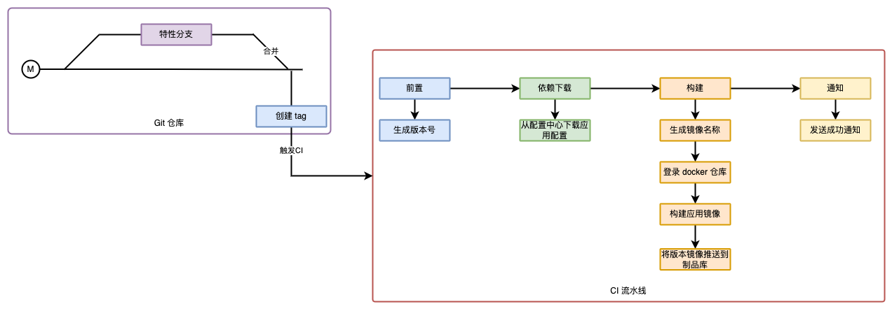

docker 诞生之初就提出一个理念： **Build once，Run anywhere**， 而支撑这个理念的最主要组件之一就是镜像。构建镜像很简单，一个 `Dockerfile` 即可完成，但是要构建一个好的镜像却不容易。下文将一步一步构建出一个好的镜像。

构建之前我们需要先制定几个原则：

1. 镜像要足够小，确保Pod启动时不会长时间注册在拉取镜像步骤。
2. 镜像要包含一些常用工具，方便现网问题定位。
3. 各个业务的镜像应该尽量复用相同的基础镜像。
4. 镜像要遵循[单应用](https://kdefan.net/posts/one-container-one-app.html)原则。

根据以上原则，我们简单分析一下，docker 镜像是分层的，既我们可以基于某个镜像构建其它镜像，利用这一特性我们可以构建一个全业务通用的基础镜像，然后各个业务在此基础之上构建各自的应用镜像。

## 0x01 分层构建镜像

### 1.1 基础镜像构建

首先我们来看一下业务通用基础镜像如何构建。第一个需要考虑的问题是发行版，这个其实没有太多的要求，自己（团队）熟悉那个就选择那个，当然尽量跟生产环境虚拟机的操作系统版本对其。这里我们就选择了`debian`，而且使用了最新版的 `slim` 版本，既`debian:bookworm-slim`。之所以选择 slim 版本，是因为它体积小，没有多余的包。

因为可能涉及到现网问题排查，如果临时安装可能会错过某些情况，也可能出现网络问题安装很慢或无法安装，因此一些常见的工具还是有必要安装的。这里整理了一些常见的网络和系统排查工具。

| **命令**   | **作用**                        |
| -------- | ----------------------------- |
| ps       | 查看系统进程。                       |
| ss       | 查看网络信息，`netstat` 升级版。         |
| ip       | 查看网络接口等信息。                    |
| ifconfig | 同 `ip` 命令，有时候可能会用到。           |
| nslookup | 查询域名解析结果。                     |
| dig      | 同 `nslookup`，但是功能更强大。         |
| tcpdump  | 抓包工具。                         |
| ngrep    | 抓包工具，可以抓取打印应用层包。              |
| telnet   | tcp 连通工具。                     |
| nc       | 网络测试工具。                       |
| vim      | 文本编辑工具。                       |
| nano     | 文本编辑工具，可以在 web shell 下替代 vim。 |
| rsync    | 同步命令。                         |
| curl     | http 协议测试工具。                  |
| mysql    | `mysql` 客户端。                  |
| rz       | `zmode` 接受文件命令。               |
| sz       | `zmode` 下载文件命令。               |
| perf     | 性能分析工具。                       |
| vmstat   | 查看系统信息。                       |
| top      | 查看系统信息。                       |
| iostat   | 查看 IO 信息。                     |
| pidstat  | 查看特定进程相关系统占用信息。               |

上述命令可以使用以下命令进行安装。

```bash
apt-get update
apt-get install -y procps iproute2 net-tools dnsutils tcpdump \
  ngrep netcat-openbsd vim nano rsync curl mariadb-client lrzsz perf sysstat
```

当然对于特定的语言还可以安装一些特定的工具，如 golang 可以安装 `dlv`等。如果有需要的命令但是不需要通过安装哪个包才能获得，可以访问[command-not-found.com](http://command-not-found.com) 网站获取。

因此业务通用基础镜像的构建 `Dockerfile` 如下：

```dockerfile
FROM debian:bookworm-slim

RUN apt-get update && \
    apt-get install -y procps iproute2 net-tools dnsutils tcpdump \
        ngrep netcat-openbsd vim nano rsync curl mariadb-client lrzsz perf sysstat && \
    rm -rf /var/lib/apt/lists/*
```

上述镜像构建后可以以`private.registry/teamName/debian:latest`和`private.registry/teamName/debian:v1.0.0`命名(版本镜像方便回溯)并推送到远程仓库。

```shell
docker buildx build --push --rm -t private.registry/teamName/debian:latest -t private.registry/teamName/debian:v1.0.0 .
```


### 1.2 runtime镜像构建

此步骤仅在`PHP`、`Python` 等这类需要 `runtime` 的语言才需要。该步骤主要作用是构建一个应用可用的 `runtime` 镜像，减少后续应用构建过程中重复安装`runtime`的时间，提升构建速度。

像这类需要 `runtime` 的应用，一般都会依赖外部库（如`python`的`requirements.txt`），因此可以在这一步将依赖也直接安装进镜像中，但也因此会导致 `runtime` 层无法被其它应用复用，这里建议如果有很多（大于5个）应用均使用相同的 `runtime` （如python3.9），那可以将 runtime 镜像拆分为两个，单纯 `runtime` 镜像和安装有依赖库的镜像（应用镜像的上一层）。我们这里选择将`runtime` 和依赖直接打包进一个镜像。

以 `Python` 为例：

```dockerfile
FROM private.registry/teamName/debian:latest

ENV PATH="/usr/local/python-venv/bin:$PATH"

RUN apt-get update && \
    apt-get install --no-install-recommends --no-install-suggests -y python3 python3-pip python3-venv && \
    rm -rf /var/lib/apt/lists/*

COPY requirements.txt /tmp/requirements.txt

RUN python3 -m venv /usr/local/python-venv && \
    /usr/local/python-venv/bin/pip3 install -r /tmp/requirements.txt
```

通过以下命令构建出版本镜像和 `latest`镜像。

```shell
docker buildx build --push --rm -t private.registry/teamName/demo-app-runtime:latest -t private.registry/teamName/demo-app-runtime:v0.0.1 .
```


### 1.3 应用镜像构建

基于 `runtime` 镜像或者基础镜像，便可以构建可以承载应用的镜像了。这一步比较简单，如果是 `Python`、`PHP` 这类的应用，可以直接`COPY` 源码到镜像即可。如果是 `Golang` 这类需要构建的语言，则稍微有点复杂，需要构建后将二进制 `COPY` 到镜像，各自的示例如下：

```dockerfile
# Python应用镜像构建示例
# https://github.com/bookiu/monorepo/blob/master/demo-app/Dockerfile
FROM docker.io/yaxin/demo-app-runtime:latest

COPY --chown=root:root . /app/

WORKDIR /app/

ENTRYPOINT ["/entrypoint.sh"]

CMD ["gunicorn", "-c", "gunicorn.conf.py", "app:app"]
```

```dockerfile
# Golang应用镜像构建
# https://github.com/bookiu/monorepo/blob/master/bookstore/Dockerfile
FROM golang:1.21-bookworm AS builder

ENV GOPROXY="https://goproxy.cn,direct"

WORKDIR /usr/src/app

COPY go.mod go.sum ./
RUN go env -w GO111MODULE=on && \
    go env -w GOPROXY="https://goproxy.cn,direct" &&  \
    go mod download && go mod verify

COPY . .

RUN go build -v -o /usr/src/app/bookstore-api ./cmd/bookstore


FROM docker.io/yaxin/debian

WORKDIR /app

COPY --from=builder /usr/src/app/bookstore-api /app/bookstore-api

CMD [ "/app/bookstore-api" ]
```

上面 `Golang` 应用镜像构建使用了[多级](https://docs.docker.com/build/building/multi-stage/)构建，目的是为了减少镜像体积，下文会有专门说明。构建命令如下：

```dockerfile
docker buildx build --push --rm -t private.registry/teamName/demo-app:v0.0.1 .
```

这里并没有构建 `latest` 版本，主要是为了防止生产环境部署 `latest` 版本，下文会有说明。

自此，一个轻量、简洁可用的应用镜像已经构建完成。


## 0x02 多级构建

关于多级构建（Multi-stage builds），docker 有专门的说明文档：[https://docs.docker.com/build/building/multi-stage/](https://docs.docker.com/build/building/multi-stage/)。其主要的目的是保持`Dockerfile`的可读性和可维护性，同时减小镜像体积。其使用场景主要是需要构建的应用，而构建过程中会产生很多额外的文件，这些文件对于应用运行没有任何用途，因此应该尽量避免出现这些文件，而多级构建可以完美规避这个问题。

因此，对于可能会产生对应用运行无用的文件，都可以使用多级构建来规避此问题。

## 0x03 镜像版本

生产环境应该**禁止**部署 `latest` 版本镜像，因为这会导致生产环境运行版本不可控。试想一下，先往部署运行了应用的 `latest` 的版本，这是，你构建了新的镜像版本，也是用 `latest` 版本标签，如果此时发布之后有 bug，你将无法回滚。或者如果 k8s 对 Pod 发生了调度，Pod 调度到了一个没有此镜像的 Node，那 Node 势必要拉取镜像，这就导致了被调度的 Pod 和其它 Pod 运行版本不同的问题。

因此，生产环境运行的镜像必须是有版本号的，例如：`v1.0.2`,该版本号**建议**与 git 仓库版本号相同，也在确定发布前，将分支代码合并入 `master` 后，对`master`打个 tag，tag 事件触发构建 CI 流水线，开始构建镜像。此部分会下下一节作介绍。


## 0x04 CI流水线

所有生产环境的镜像**禁止**开发在本地构建 push（减少人工操作带来的问题），应该由对应的CI流水线进行构建。构建触发事件建议由 master 分支的 tag 事件触发，这样可以将各个镜像应用内容与 git 仓库代码做一一匹配，方便问题回溯排查。一个典型的 CI 流水线从触发到执行应该如下图所示：



一个典型的 CI 构建配置应该如下（各个CI平台配置可能略有不同）：


## 0x05 总结

镜像作为应用的载体，最容易被大家忽视，其不仅要提供一个稳定的运行环境，而且更应该兼顾效率和可调试性。本文只是根据自己在工作中总结出来的构建镜像的一些实践点，如果有什么其它更好的建议，欢迎联系我讨论。

最后，上述镜像构建过程中涉及到的代码等可以在[https://github.com/bookiu/monorepo](https://github.com/bookiu/monorepo) 仓库中查看。
