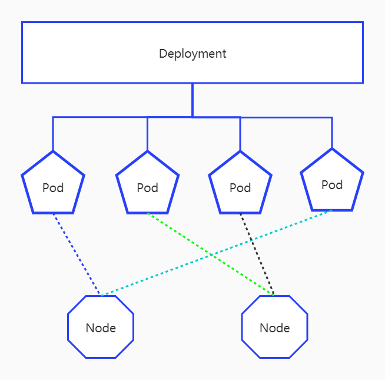

前面我们分享了集群的集群，现在我们来折腾一下应用的部署。k8s部署应用相对比较简单，一个yaml文件即可搞定。但是想要理解这个yaml文件，就需要先了解k8s中的两个概念：`deployment`和`pod`。

## 0x01 deployment和pod

我们先来看一下k8s官方文档（[https://kubernetes.io/zh/docs/concepts/workloads/controllers/deployment/](https://kubernetes.io/zh/docs/concepts/workloads/controllers/deployment/)）对于`deployment`和`pod`的定义以及一个简单的架构图：

1. Deployment

> 一个 Deployment 为 Pods 和 ReplicaSets 提供声明式的更新能力。
你负责描述 Deployment 中的 目标状态，而 Deployment 控制器（Controller） 以受控速率更改实际状态， 使其变为期望状态。你可以定义 Deployment 以创建新的 ReplicaSet，或删除现有 Deployment， 并通过新的 Deployment 收养其资源。
>

2. pod

> Pod 是可以在 Kubernetes 中创建和管理的、最小的可部署的计算单元。
Pod （就像在鲸鱼荚或者豌豆荚中）是一组（一个或多个） 容器； 这些容器共享存储、网络、以及怎样运行这些容器的声明。 Pod 中的内容总是并置（colocated）的并且一同调度，在共享的上下文中运行。 Pod 所建模的是特定于应用的“逻辑主机”，其中包含一个或多个应用容器， 这些容器是相对紧密的耦合在一起的。 在非云环境中，在相同的物理机或虚拟机上运行的应用类似于 在同一逻辑主机上运行的云应用。
>



从官方文档可以得出，`deployment`负责`pod`的创建、销毁等，而pod是一组共享存储、网络等的容器集合，且所有容器均运行在同一台服务器上（相当于一个pod就是一台主机）。有些人可能会有疑问，为什么会需要`deployment和pod`，这里先解释一下：

### 1.1 为什么需要`deployment`：

这个很简单，k8s关注的是应用部署本身，而一个应用可能包含很多组件，某些组件还需要对外暴漏服务等，如果某个组件挂了还需要被拉起来，而这个总的管理者就是`deployment`。对用户来说，我只关心我的`deployment`是如何写的，至于你如何按我的`deployment`去部署应用，那是`deployment`的事情。你可能会说这样的说deployment岂不是会功能太多、太复杂，对，如果这样做是很复杂，所以k8s有了`pod`、`ReplicaSet`（这里引入ReplicaSet，先不用管）等，让其协助管理更细节的东西。

### 1.2 为什么需要pod：

1. 某些情况下需要需要容器之间可以共享存储和网络，如应用程序容器和日志搜集程序容器需要共享日志存储空间；php-fpm和nginx需要在共享网络（loopback设备）。本质上还是某些应用需要在同一台电脑上，而如果没有pod这一层，想要在集群中让两个container在同一台主机上，必然需要引进其它限制条件，如增加标签，标签相同的容器运行在同一主机上等，而这就需要容器管理应用（专业词语是**container runtime**，如docker等）必须具备这样的能力，这就使系统变得有些复杂了。
2. docker仅仅是众多**container runtime**中的一个，还有很多其它的**container runtime**([https://kubernetes.io/docs/setup/production-environment/container-runtimes/](https://kubernetes.io/docs/setup/production-environment/container-runtimes/))，而这些**container runtime**在某些细节上可能有些不同，而为了给上层提供统一的API，就需要有一个适配层，这个在k8s中就是pod。

## 0x02 编写yaml文件

首先看一些最简单的事例，部署nginx:

```yaml
apiVersion: apps/v1
kind: Deployment
metadata:
  name: nginx-deployment
  labels:
    app: nginx-deploy
spec:
  selector:
    matchLabels:
      app: nginx-pod
  template:
    metadata:
      labels:
        app: nginx-pod
    spec:
      containers:
      - name: nginx
        image: ustc-edu-cn.mirror.aliyuncs.com/library/nginx:1.19-alpine
```

下面我们来解释说明一下各个键的作用：

1. apiVersion：标识api的版本，因为k8s的更新迭代比较频繁，api变更也比较频繁，各个版本间api参数可能不同，为了保证兼容性，所以有了`apiVersion`这个配置。
2. kind：用于说明资源类型，有`Deployment`、`Pod`、`DaemonSet`等。
3. metadata：用于说明该`Deployment`的一些信息，如`metadata.name`指定该`Deployment`的名称，`labels`用于给当前`Deployment`打标签，方便查询定位。
4. spec：改配置项下面的所有的配置都是用于对部署内容的说明。这个下面的内容是`Deployment`部署的核心，所以这里会展开说明一下。
5. spec.selector：该`spec.selector`是为了确定需要部署的`pod`，这里的`matchLabels`是在下面`spec.template`中指定的`labels`。
6. spec.template：改配置项用于说明需要创建的`pod`的信息，其下的`spec.template.metadata.labels`就是用于指定该pod的标签信息。而`spec.template.spec`则用于说明pod中要创建的容器的信息。

以上只是部分配置文件的值的说明，更多关于`Deployment`文件的说明，请参考：[https://kubernetes.io/docs/reference/generated/kubernetes-api/v1.19/#deployment-v1-apps](https://kubernetes.io/docs/reference/generated/kubernetes-api/v1.19/#deployment-v1-apps)

## 0x03 运行部署

将上面的yaml代码保存为文件，如`nginx.yml`，然后运行如下命令：

```bash
kubectl apply -f nginx.yml
```

然后使用`kubectl get deployments`命令查看部署状态，`kubectl get pods`命令查看所有创建的`pod`的状态信息，刚开始执行的时候，可以看到`pod`的`STATUS`为`ContainerCreating`，Deployment的的信息中`AVAILABLE`为0，但是果断时间再此查看，会发现`AVAILABLE`和`STATUS`已经正常。


通过`kubectl get events --sort-by=.metadata.creationTimestamp`可以看到具体的执行信息：


## 0x04 访问应用

暴漏k8s服务（端口）我们下一节介绍，但是我们现在需要验证服务，这就需要通过另外一种途径了。根据[docker php镜像文档](https://hub.docker.com/_/nginx)，我们可以知道，默认情况下，nginx监听80端口，那我们只需要知道容器的IP即可访问，想要知道容器的IP，只需要`describe pod`的详情即可：

```bash
kubectl get pods
kubectl describe pods <pod-name>
```


上图中获取的是`pod`的IP，但我们知道`pod`中所有的`container`共享同一网络，那`container`的IP也是`pod`的IP，即：10.244.3.4。然后我们直接在某一节点上（master节点也可以）`curl -v http://10.244.3.4`即可验证。


可以看到服务可以正常访问。至此部署应用的任务已经完成，下一节我们将介绍k8s如何对外暴漏服务。

PS：为什么从任何一个节点可以直接访问pod IP呢？回顾一下我们[搭建集群那篇文章](https://mp.weixin.qq.com/s/rxHfBb9nMQ6MWV6okk9JMg)，我们使用了`flannel`网络插件，这个插件会将k8s中每个节点生成的pod与改节点都都放在同一个网段下，即`10.244.x.0/24`，而每个节点都会有指向其它网络的路由表：


相当于所有pod和节点都在一张平面网络上（都在同一个网段`10.244.0.0/`16），所以可以直接访问。
