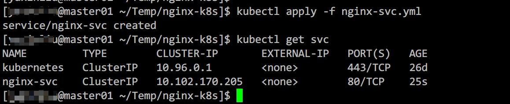

[应用搭建](https://mp.weixin.qq.com/s/ODqSn7wB8hLq3Y8ZlOPSjw)完成后，我们就要让其可以通过外部进行访问，而部分应用（如MySQL、Redis等）可能需要集群内部其它服务访问，这时候我们就需要引入k8s的**服务(Service)**资源来解决。

你可能会说，既然k8s中所有pod网络都在一个大的网段，直接用IP访问不就行了。可以是可以，这里存在两个问题：

1. 如果pod重启（应用崩溃等原因）会导致IP变动，之前的IP便无法访问到服务；

2. 如果一个应用需要部署多个pod，那每个pod都有一个IP，这是写死IP就无法满足需求了。而看**k8s Service**很好的解决了这些问题；

## 0x01 对集群其它服务暴露服务

以下的示例服务是以上一篇文章中的nginx服务为基础的，将以下代码保存为nginx-svc.yaml

```yaml
apiVersion: v1
kind: Service
metadata:
  name: nginx-svc
spec:
  selector:
    app: nginx-pod
  type: ClusterIP
  ports:
    - protocol: TCP
      port: 80
      targetPort: 80
```



使用`kubectl get svc`查看刚刚创建的服务，会发现多了一个`nginx-svc`的条目，然后再任意一个节点上用`curl`访问该IP均可以得到nginx的响应。


当然该集群IP不仅限于各个节点可以访问，集群中的pod（容器）也可以访问，我们可以使用`kubectl run`命令运行一个临时pod测试：


## 0x02 对外暴露服务

如果还想再对外暴露服务，需要将`spec.type`修改为`NodePort`，如果你想指定对外暴露端口，可以指定`spec.ports.N.nodePort`（默认**30000-32767**之间），如果不指定，将会随机生成一个可用：

```bash
apiVersion: v1
kind: Service
metadata:
  name: nginx-svc
spec:
  selector:
    app: nginx-pod
  type: NodePort
  ports:
    - protocol: TCP
      port: 80
      nodePort: 32080
      targetPort: 80
```

运行`kubectl apply -f nginx-svc.yaml`命令修改已有服务。这里需要注意默认情况下`nodePort`的范围只能在**30000-32767**之间（可以编辑`/etc/kubernetes/manifests/kube-apiserver.yaml`中的`-service-node-port-range`进行修改，修改后会自动生效），否则会报错：The Service "nginx-svc" is invalid: spec.ports[0].nodePort: Invalid value: 8123: provided port is not in the valid range. The range of valid ports is 30000-32767。

然后在可以访问master或者node节点的机器上用浏览器打开任何一个集群IP加32080端口，可以看到以下效果：


## 0x03 其它类型

k8s中除了`ClusterIP`（对集群内暴露服务）和`NodePort`（对集群外暴露服务）这两种类型外，还有一种`LoadBalancer`类型的服务，但是其工作需要云服务商（如：腾讯云、阿里云等）的负载均衡产品配合使用，但其本质上也是服务通过`NodePort`对外提供服务，然后负载均衡将请求转发到该`NodePort`上，下面是腾讯云TKE的`LoadBalancer`类型的服务以及其生成的负载均衡配置截图：


除了这三种常用的服务以外，还有一些不常用的服务类型，具体可以查看k8s官方文档了解：[https://kubernetes.io/zh/docs/concepts/services-networking/service/#publishing-services-service-types](https://kubernetes.io/zh/docs/concepts/services-networking/service/#publishing-services-service-types)

## 0x04 实现原理

先看一张来自k8s官方文档的图片，该图片展示了ClusterIP的实现原理，其实就是利用iptables的DNAT的能力：集群内部的请求发出后被iptables捕获，然后根据规则转发到相应的pod（pod IP）中。


我们随便找一个node，然后通过iptables命令查看一下具体配置信息：

首先使用`iptables -t nat -nvxL PREROUTING`查看`iptables nat`表的`PREROUTING`链：


可以看到，所有请求都会经过`KUBE-SERVICES`这个链处理，`iptables -t nat -nvxL KUBE-SERVICES`查看`KUBE-SERVICES`链：


之前为什么说集群IP是虚拟IP呢？首先你在集群的任何一个node或者pod中找不到这个IP，而且从这上图红框两条规则中可以看到，集群IP是iptables中配置的，一旦发现源IP为`10.102.170.205`（nginx-svc生成的集群IP），会转发给`KUBE-MARK-MASQ`和`KUBE-SVC-HL5LMXD5JFHQZ6LN`两条链处理，我们继续看这两条链都做了什么：


`KUBE-MARK-MASQ`这条链仅仅是对数据表打上了一个标志位，便于后续的iptables规则识别处理数据包（`filter`的`FORWARD`链和`nat`的`POSTROUTING`链等）。

`KUBE-SVC-HL5LMXD5JFHQZ6LN`链有三条规则，这个是为了验证多副本（后面会详细讲）下的转发策略而配置的，配置方式是使用`kubectl edit deploy nginx-deployment`命令修改`spec.replicas`配置项为3（默认为1），修改后通过`kubectl get pods`会看到三个`nginx-deployment`相关的pod，其实就相当于扩容了两台。


仔细观察`KUBE-SVC-HL5LMXD5JFHQZ6LN`链，会发现后面有个`random probability`的值，这个就是请求匹配该链的概率，基本上每条链匹配到的概率均为1/3。


上图展示了各个子链的规则，基本上都是相同的，只有最后的`to`目标地址不同，而这些目标地址即为各个pod的地址，可以通过`kubectl describe pods <pod-name>`来确认各个pod的IP。


以上仅是`ClusterIP`的原理分析，至于`NodePort`，可以参照`ClusterIP`的分析过程进行分析，基本上是一样的。
