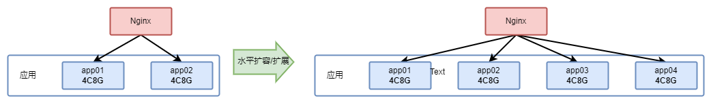
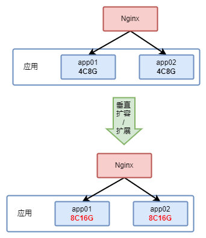
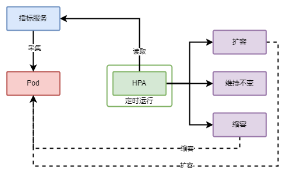

随着业务正常，请求量开始上涨，这导致业务服务器的 CPU 或内存使用率的增长或超过限制，引发业务接口出现问题，此时最好的办法就是增加服务器。k8s中可以将这一步骤简化为增加 Pod 数量，但是增加 Pod 也是需要手动进行操作的，是否有方法将这一行为自动化？答案就是HPA（Horizontal Pod Autoscaling）。

## 0x01 基础概念

在讲解 HPA 之前需要先介绍两个基础概念，便于后面的理解。

### 1.1 水平扩展/扩容

水平扩展是从架构层面来描述的，表示增加同一级别的组件的数量。因此对于一般应用来说，水平扩展就是增加副本数量（可以简单理解为加机器），而对于k8s来说水平扩展就是增加 Pod 数量。



### 1.2 垂直扩展/扩容

同样的，垂直扩展也是从架构层面来描述的，但是其并非增加副本数量，而是对原有的副本进行配置(包括CPU、内存、磁盘等资源)的升级。



## 0x02 HPA 工作原理

通过以上的描述，我们知道 HPA 是用于动态扩缩容 Pod 的，那它是如何工作的呢？

### 2.1 HPA 工作流程

HPA 通过采集 Pod 运行过程中的CPU、内存等指标，配合 HPA 的设置计算出是否需要扩缩容。其简单的工作流程如下：



1. #### 支持的指标类型

HPA 支持三类指标：

1. Pod 资源使用率相关指标：如CPU、内存使用率等，此指标通常是一个比例值。
2. Pod 自定义指标：如QPS、消息处理数等，此指标通常为一个数值。
3. Object 指标：此指标通常为一个数值，由Pod应用或者外部服务提供（如通过HTTP `/metrics` 提供），也因此，其可以提供更多维度的指标。

一般来说，我们直接使用第一类 **Pod 资源使用率相关指标** 即可，而且其也是内置支持的（需要安装metric server）。

2. #### 指标采集频率

k8s HPA 组件从指标服务中采集的频率默认为**15s**一次，你可以通过 `kube-controller-manager` 启动参数 `--horizontal-pod-autoscaler-sync-period` 来修改此配置。

### 2.2 扩缩容算法

HPA 计算期望副本数的算法很简单，就是一个简单的乘除运算：

```other
期望副本数 = 向上取整(当前副本数 * (当前指标值/期望指标值))
```

例如，当前有3个 Pod，使用率分别为：60%、90%、50%，HPA 配置的 CPU 使用率阈值为50%，那么期望副本数计算如下：

```other
3 * ((60+90+50)/50) = 4
```

因此，HPA 会将工作负载的副本数调整为4个。

虽然算法比较简单，但是其中涉及到一些复杂的细节，其中两个比较总要的点是：

1. 哪些 Pod 需要进入计算范围。
2. 如何避免频繁扩缩容。

接下来我们对这两个点进行详细说明。

1. #### Pod 的统计范围

HPA 会把以下状态的 Pod 认为是“异常”：

1. 正在被删除的 Pod（设置了删除时间戳的 Pod）。
2. 无法获取运行指标的 Pod。
3. 如果指标类型为 CPU 利用率，但是此时 Pod 正在启动，但是还未 Ready。

对于“异常”的 Pod，不同情况会有不同的处理方式。

第一种，如果是正在被删除的 Pod，则会被认为 Pod 不存在，不会参与计算。

第二种情况，如果是获取不到指标，则在计算“**期望副本数**”的时候不会被纳入分母，只有在确定最终副本数的时候才会纳入计算。例如，当前有5个 Pod，CPU 使用率分别为：60%、90%、50%、无法获取、无法获取，HPA 配置的 CPU 使用率阈值为50%，那么期望副本数应该为4，小于当前副本数5，则缩容为4个 Pod。

第三种情况的处理方式与第二种相同，这样最大程度避免过度扩缩容。

除了这三种情况外，HPA 对于在 Pod 启动之初是否采纳 CPU 指标有个配置项，因为 Pod 启动后，服务不一定就绪（某些应用需要花费一定时间初始化，但会消耗 CPU，而且可能比正常运行状态高），因此k8s提供了一个 `kube-controller-manager` 启动设置项 `--horizontal-pod-autoscaler-initial-readiness-delay` 来设置首次探测 Pod 是否 Ready 的延迟时间，默认 30s。另一个启动参数 `--horizontal-pod-autoscaler-cpu-initialization-period` 用于设置首次采集 Pod CPU 使用率的延迟时间，默认5分钟。

2. #### 规避“抖动”

默认 HPA 会每 15s 获取计算一次期望副本数，如果不加以控制，那工作负载的 Pod 数量会频繁变动，这也被称为“抖动”。抖动会影响业务的正常运行，为了解决这个问题，k8s引入了一个冷却时间，通过限制缩容时间间隔（上次缩容到现在必须大于一定时间），使缩容更平滑的进行，这个时间默认值是5分钟，该配置 `--horizontal-pod-autoscaler-downscale-stabilization` 作为 `kube-control-manager` 的启动配置项。

### 2.3 多个指标

如果对 HPA 设置了多个指标扩容阈值，那么系统会分别计算每个指标的“期望副本数”，然后选择最大的副本数进行扩容。例如，当前有3个 Pod，CPU 使用率分别为：60%、90%、50%，QPS 分别为：1000、2000、800，HPA 设置的 CPU 阈值为50%，QPS 阈值为800，那计算出来的期望副本数分别为：4和4.75（向上取整后是5），那最终的期望副本数就为5。

## 0x04 HPA 配置示例

HPA 可以通过 `kubectl` 命令启用配置，或则也可以通过声明式配置启用配置。

```shell
kubectl autoscale rs app-name --min=2 --max=5 --cpu-percent=80
```

上述命令会创建一个 HPA 配置，将 ReplicaSet 为 app-name 的目标 CPU 利用率设置为 `80%`，副本数在 2 到 5 之间。下面的代码会创建一个拥有多个目标值的 HPA。

```yaml
apiVersion: autoscaling/v2
kind: HorizontalPodAutoscaler
metadata:
  name: myapp-hpa
spec:
  # 选择目标负载
  scaleTargetRef:
    apiVersion: apps/v1
    kind: Deployment
    name: myapp
  # 最小副本数
  minReplicas: 1
  # 最大副本数
  maxReplicas: 3
  metrics:
    # Pod 资源使用率指标
    - type: Resource
      resource:
        name: cpu
        target:
          type: Utilization
          averageUtilization: 50
    # Pod 自定义指标
    - type: Pods
      pods:
        metric:
          name: packets-per-second
        targetAverageValue: 1k
    # Object 指标
    - type: Object
      object:
        metric:
          name: requests-per-second
      target:
        averageValue: 10k
        type: Value
      describedObject:
        apiVersion: extensions/v1beta1
        kind: Ingress
        name: myapp-ingress
```

## 0x03 总结

本文简单分析了k8s中提供的 HPA 自动扩缩容特性，建议对现网所部署的应用启用 HPA，并至少设置 CPU 使用率以便应对突发流量。如果想学习更过关于 HPA 的知识，可以翻阅“kubernetes权威指南”这本书。

## 0x04 参考资料

1. [Horizontal Pod Autoscaling](https://kubernetes.io/docs/tasks/run-application/horizontal-pod-autoscale/)
2. [HorizontalPodAutoscaler Walkthrough](https://kubernetes.io/docs/tasks/run-application/horizontal-pod-autoscale-walkthrough/)
3. Kubernetes权威指南

