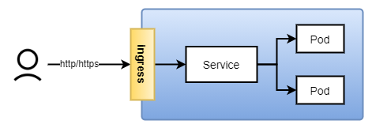

上一节，我们分享了如何对外[暴露服务](https://mp.weixin.qq.com/s/aDp1iBzZCgXFRXhPqXjjvw)，今天我们再来看另外一种对外暴露服务的方式：`ingress`。那什么是ingress呢？它跟我们之前接触的暴露服务又有什么不同？

## 0x01 什么是ingress

一般情况下，我们的主机或者集群会对外服务多个站点（如a.com和b.com同时由一个集群对外提供服务），这个在web server中叫虚拟主机。这种情况在k8s中，如果用之前说的service服务来做的话，对于不同的服务只能通过暴露不同的`NodePort`，如*a.com:32000*和*b.com:32001*，也就是说你必须通过**域名带端口**的方式访问站点服务。这个显然是无法满足我们要求的。你可能会说，那我为什么不创建一个`nginx deployment`，然后在nginx中配置规则，将不同域名转发给不同的服务/pod呢？恭喜你，`ingress`就是做这个事情的。而且`ingress`简化了规则的配置，通过`ingress`对外提供的API即可实现对web server的配置转发。



## 0x02 ingress部署

有很多实现ingress的方案，如nginx、kong等，可以去[k8s官方文档](https://kubernetes.io/zh/docs/concepts/services-networking/ingress-controllers/)查看更多的方案，我们这里选择了[Traefik](https://doc.traefik.io/traefik/providers/kubernetes-ingress/#ingressendpoint)，选用Traefik的原因之一就是部署简单，当然你也可以选用更大众的nginx（[https://kubernetes.github.io/ingress-nginx/deploy/#bare-metal](https://kubernetes.github.io/ingress-nginx/deploy/#bare-metal)）。部署`Traefik ingress`一个`yaml`文件即可，但为了方便理解，我们将整个部署文件分为几部分分别解释：

首先我们需要创建一个`ingress`使用过程中需要使用到的权限的账号，由于k8s使用基于角色（Role）的访问控制（RBAC），所以它的创建过程跟我们通常的账号创建授权不同，其需要创建服务账号和角色，角色拥有特定权限，然后将服务账号与角色绑定，这样服务账号即可拥有特定权限。

```yaml
--- 创建一个服务账号
apiVersion: v1
kind: ServiceAccount
metadata:
  namespace: kube-system
  name: ingress-controller-account

--- 创建一个角色，改角色拥有ingress需要的所有权限
kind: ClusterRole
apiVersion: rbac.authorization.k8s.io/v1
metadata:
  name: ingress-controller-role
  namespace: kube-system
rules:
  - apiGroups:
      - ""
    resources:
      - services
      - endpoints
      - secrets
    verbs:
      - get
      - list
      - watch
  - apiGroups:
      - extensions
      - networking.k8s.io
    resources:
      - ingresses
      - ingressclasses
    verbs:
      - get
      - list
      - watch
  - apiGroups:
    - extensions
    resources:
    - ingresses/status
    verbs:
    - update

--- 将服务账号与角色绑定，这样服务账号就拥有了角色中定义的权限
kind: ClusterRoleBinding
apiVersion: rbac.authorization.k8s.io/v1
metadata:
  namespace: kube-system
  name: ingress-controller-role-binding
roleRef:
  apiGroup: rbac.authorization.k8s.io
  kind: ClusterRole
  name: ingress-controller-role
subjects:
  - kind: ServiceAccount
    namespace: kube-system
    name: ingress-controller-account
```

创建服务角色后，就开始创建应用（`ingress controller`）部署文件，这里没有使用`Deployment`部署，而使用了`DaemonSet`，两者基本上相同，唯一的不同是调度策略，`DaemonSet`会保证每个`worker`节点上有且只有一个`pod`。在端口对外暴露上，我们使用了容器本身提供的端口映射能力，而没有使用`NodePort`对外暴露服务，因为`NodePort`有范围限制，虽然可以修改k8s配置实现，但这样做本身不符合规范。

```yaml
kind: DaemonSet
apiVersion: apps/v1
metadata:
  namespace: kube-system
  name: traefik-ingress-controller-daemon-set
  labels:
    k8s-app: traefik-ingress-controller
spec:
  selector:
    matchLabels:
      k8s-app: traefik-ingress-controller
  template:
    metadata:
      labels:
        k8s-app: traefik-ingress-controller
    spec:
      serviceAccountName: ingress-controller-account
      terminationGracePeriodSeconds: 60
      containers:
      - image: ustc-edu-cn.mirror.aliyuncs.com/library/traefik:v2.4
        name: ingress-controller
        ports:
        - name: http
          containerPort: 80
          hostPort: 80
        - name: https
          containerPort: 443
          hostPort: 443
        - name: admin
          containerPort: 8080
          hostPort: 8080
        securityContext:
          capabilities:
            drop:
            - ALL
            add:
            - NET_BIND_SERVICE
        args:
        # Enable the dashboard without requiring a password. Not recommended
        # for production.
        - --api.insecure
        - --api.dashboard

        # Specify that we want to use Traefik as an Ingress Controller.
        - --providers.kubernetesingress

        # Define two entrypoint ports, and setup a redirect from HTTP to HTTPS.
        - --entryPoints.web.address=:80
        - --entryPoints.websecure.address=:443
        #- --entrypoints.web.http.redirections.entryPoint.to=websecure
        #- --entrypoints.web.http.redirections.entryPoint.scheme=https

        # Enable debug logging. Useful to work out why something might not be
        # working. Fetch logs of the pod.
        - --log.level=info
```

将以上两部分代码保存为一个文件，然后执行`kubectl apply -f traefik-ingress.yml`即可完成ingress的部署：


通过`kubectl -n kube-system get daemonset`命令可以查看部署情况：


## 0x03 ingress使用

我们以上节[暴露服务](https://mp.weixin.qq.com/s/aDp1iBzZCgXFRXhPqXjjvw)为基础，使`nginx-deployment`可以通过`ingress`对外提供服务。创建ingress也比较简单，主要内容大致如下面的`yaml`，这里需要注意两点，第一是这里的`spec.rules.0.host`的值（nginx-ingress.local）是我自定义的不存在的域名，你可以换成你自己可以解析的域名，后期如果访问，需要配置hosts。第二`spec.rules.0.http.paths.0.backend.service.name`是上一节[暴露服务](https://mp.weixin.qq.com/s/aDp1iBzZCgXFRXhPqXjjvw)中我们创建的服务名称，可以通过`kubectl get svc`查看。


```yaml
apiVersion: networking.k8s.io/v1
kind: Ingress
metadata:
  name: nginx-deployment-ingress
spec:
  rules:
    - host: nginx-ingress.local
      http:
        paths:
          - path: /
            pathType: Prefix
            backend:
              service:
                name: nginx-svc
                port:
                  number: 80
```

将以上的`yaml`代码保存为`nginx-deployment-ingress.yml`，然后执行`kubectl apply -f nginx-deployment-ingress.yml`即可完成ingress的创建。


在hosts（windows位于`C:\Windows\System32\drivers\etc\hosts`，linux和mac位于`/etc/hosts`）中添加`9.134.115.93 nginx-ingress.local`并保存，其中，**这里的IP可以选择worker节点中的任意一个，我选择了worker2 9.134.115.93**，然后打开浏览器访问**http://nginx-ingress.local**即可看到效果。


traefik包含了一个dashboard，通过workerip:8080即可查看所有配置的规则，建议不要在现网打开或做严格的限制和校验。


