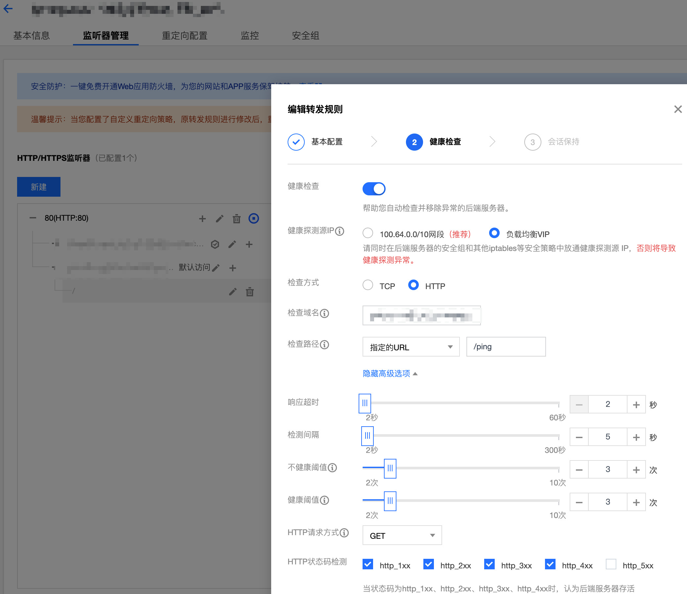
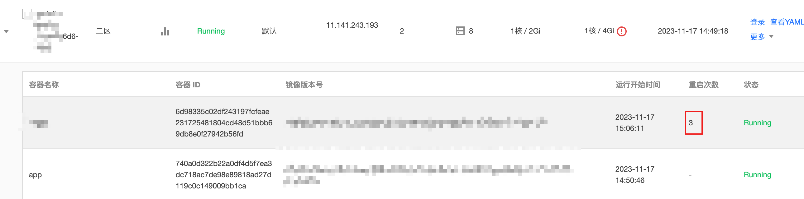
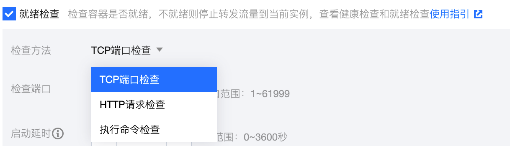

最近生产环境k8s部署的应用出现了因未启用存活和就绪检测而导致的接口成功率下降的问题，这里记录分享一下。

问题原因很简单，就是应用未配置就绪检测（readiness）导致未正常启动的应用被分配到流量而产生502错误。解决方案虽然很简单，但是还是有必要梳理清楚k8s中的存活和就绪检测，以及他们应该何时被启用。

虽然官方给了[存活和就绪检测的文档](https://kubernetes.io/docs/tasks/configure-pod-container/configure-liveness-readiness-startup-probes/)说明，但更多是如何配置，对于是否应该启用，哪些场景下启用并未给出详细解释，下面我们就对这两个选项做详细解释。

## 0x01 就绪检测

`readiness`字面意思是**准备就绪**（ready的进行时状态），因此就绪检测本质上是探测应用是否运行正常，以决定是否将负载加入`service`中并为其分配流量。

与之相似的有负载均衡中的**健康检测**概念，当配置健康检测后，负载均衡会定时调用健康检测配置的地址进行探测，以便确认应用是否存活，一旦发现异常，则会将后端RS（服务）设置为异常，并不在向该RS转发任何流量。与此同时，负载均衡还会不断向后端RS发出健康检测的请求，来探测应用是否恢复正常，如果探测发现应用已经恢复正常，则将后端RS设置为正常，并恢复流量转发。




因此，对于一个生产环境运行的服务，**必须**要配置`liveness`存活检测（健康检测），避免在服务未启动完成或服务进程出现异常时，依然有请求进来而导致错误响应（或者不响应）。

## 0x02 存活检测

存活检测属于应用运行中的一种检测，当它发现应用异常时，会尝试重启容器，在超过一定时间后（`terminationGracePeriodSeconds`，默认30s）时间，服务依然异常，会尝试重启Pod来达到自愈的效果。

类比非容器部署，一般我们会在机器上部署一个脚本，脚本会监控服务进程、端口或者健康检测接口来判定服务是否异常，如果异常，脚本会尝试重启服务恢复服务正常。

相比于就绪检测只能剔除Pod流量，存活检测可以通过尝试重启来实现服务的自愈，一般服务推荐增加此配置，避免大量Pod异常流量被调度走而导致剩下Pod负载过高产生雪崩。当然，如果服务是有状态的，并且不能简单暴力重启，那就需要斟酌一下是否启用该配置。




## 0x03 如何配置

就绪检测和存活检测配置相同，支持**TCP端口检测**、**HTTP请求检测**以及**执行命令检测**的方式。



三种方式的说明如下：

1. TCP端口检测：通过探测端口是否可以联通（TCP三次握手成功）来判断服务是否正常，适用于纯TCP服务。
2. HTTP请求检测：通过发送一个HTTP GET请求（可以指定请求的host、path和header，但是指定请求method），然后通过响应状态码来判定，状态码在200到400之间表示服务正常。
3. 执行命令检测：通过在容器内执行一个命令，命令返回状态码为0表示服务正常。

对于web服务，一般推荐使用**HTTP请求检测**，并且应用本身最好添加一个健康检测路由（如：`/ping`或`/healthz`等），例如Golang可以指定一下路由：

```go
http.HandleFunc("/ping", func(w http.ResponseWriter, r *http.Request) {
	w.WriteHeader(200)
	w.Write([]byte("pong"))
}
```

详细的配置选项，[官方文档](https://kubernetes.io/docs/tasks/configure-pod-container/configure-liveness-readiness-startup-probes/#define-a-liveness-http-request)中有详细说明，下面分别是**TCP端口检测**和**HTTP请求检测**示例：

```yaml
-- TCP端口检测示例
apiVersion: v1
kind: Pod
metadata:
  name: goproxy
  labels:
    app: goproxy
spec:
  containers:
  - name: goproxy
    image: registry.k8s.io/goproxy:0.1
    ports:
    - containerPort: 8080
    readinessProbe:
      tcpSocket:
        port: 8080
      initialDelaySeconds: 10
      periodSeconds: 3
      successThreshold: 1
      timeoutSeconds: 2
      failureThreshold: 3
    livenessProbe:
      tcpSocket:
        port: 8080
      initialDelaySeconds: 10
      periodSeconds: 3
      successThreshold: 1
      timeoutSeconds: 2
      failureThreshold: 6
```

```yaml
-- HTTP请求检测示例
apiVersion: v1
kind: Pod
metadata:
  name: goproxy
  labels:
    app: goproxy
spec:
  containers:
  - name: goproxy
    image: registry.k8s.io/goproxy:0.1
    ports:
    - containerPort: 8080
    readinessProbe:
      httpGet:
        path: /ping
        port: 8080
        httpHeaders:
        - name: Custom-Header
          value: Awesome
      initialDelaySeconds: 10
      periodSeconds: 3
      successThreshold: 1
      timeoutSeconds: 2
      failureThreshold: 3
    livenessProbe:
      httpGet:
        path: /ping
        port: 8080
        httpHeaders:
        - name: Custom-Header
          value: Awesome
      initialDelaySeconds: 10
      periodSeconds: 3
      successThreshold: 1
      timeoutSeconds: 2
      failureThreshold: 6
```

这里需要注意的点是一定要指定`initialDelaySeconds`（启动延迟）、`periodSeconds`（间隔时间）以及`failureThreshold`（不健康阈值）这些配置选项到一个合理的值。通过指定`initialDelaySeconds`保证应用已经启动，而`periodSeconds`值不可设置太大，避免故障时间过长。`failureThreshold`的值需要合理设置，设置过大会导致异常服务长时间在线，过小则会误判，导致服务频繁剔除，建议设置为3。

另外一点需要注意的是，同时启用**就绪检测**和**存活检测的**时候，建议将**存活检测**中的`failureThreshold`（不健康阈值）设置稍大一些，这样在应用异常时，可以由**就绪检测**先剔除流量，然后再由**存活检测**重启容器和Pod。

最后再总结一下：

| **检测类型** | **说明**                            | **失败动作**                                    |
| -------- | --------------------------------- | ------------------------------------------- |
| 就绪检测     | 类似健康检测，将Pod设置为异常，从而从Service中剔除流量。 | 剔除Pod流量                                     |
| 存活检测     | 类似服务存活检测脚本，帮助服务自动愈合。              | 重启故障容器，`terminationGracePeriodSeconds`重启Pod |
