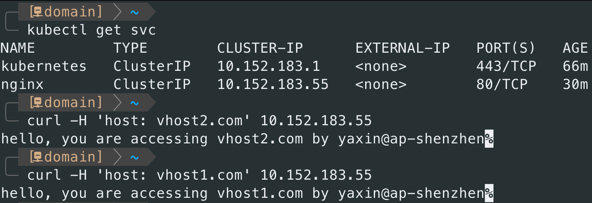
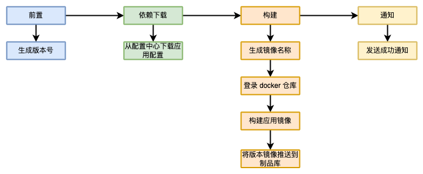

在虚拟机时代，应用配置可以直接通过上传文件到指定目录进行管理（不太合规，但可以使用），但是在容器时代，这样做只会带来灾难，因为对运行中的容器内容进行修改，容器重启后，所有的改动将会丢失，这个是容器特性所决定的。也因此，配置的管理不能再按照虚拟机时代进行，需要一个更便捷合理的方式进行。

对于k8s 应用配置的管理方案，基本上有三种：

1. 通过 `ConfigMap` 进行管理。
2. 将配置与应用一同打包进镜像。
3. 使用 `Sidercar` 模式，将配置注入进去。

下面对这三种方式一一做解释说明。

## 0x01 通过 ConfigMap 管理配置

`ConfigMap` 是 k8s 原生的配置管理工具，它的基本原理就是将`ConfigMap`中的内容映射（挂载）为容器内的文件或环境变量供应用读取。

其使用方式也比较简单，创建 `ConfigMap`，在工作负载中使用`volumeMounts` 挂载 `ConfigMap` 中的配置项到指定容器路径，或者使用`configMapRef` 导入为容器的环境变量，一个简单的示例如下：

```yaml
---
# 创建一个文件类型的配置
apiVersion: v1
kind: ConfigMap
metadata:
  name: nginx-vhost
data:
  vhost1.com.conf.template: |
    server {
        listen 80;
        server_name vhost1.com;
        location / {
            return 200 "hello, you are accessing vhost1.com by ${AUTHOR}@${REGION}";
        }
    }
  vhost2.com.conf.template: |
    server {
        listen 80;
        server_name vhost2.com;
        location / {
            return 200 "hello, you are accessing vhost2.com by ${AUTHOR}@${REGION}";
        }
    }


---
# 创建一个环境变量类型的配置
apiVersion: v1
kind: ConfigMap
metadata:
  name: env-from-config
data:
  APP_NAME: nginx
  APP_VER: latest
  REGION: ap-shenzhen
  AUTHOR: yaxin


---
apiVersion: apps/v1
kind: Deployment
metadata:
  name: nginx
spec:
  selector:
    matchLabels:
      app: nginx
  template:
    metadata:
      labels:
        app: nginx
    spec:
      containers:
        - name: nginx
          image: nginx:alpine
          envFrom:
            # 将配置以环境变量形式注入到容器中
            - configMapRef:
                name: env-from-config
          # 将配置以文件形式挂载到/etc/nginx/templates/路径下
          volumeMounts:
            - mountPath: /etc/nginx/templates/
              name: vhosts-template
      volumes:
        - configMap:
            defaultMode: 420
            name: nginx-vhost
          name: vhosts-template

---
# 这里创建一个ClusterIP的服务，方便后续测试访问
apiVersion: v1
kind: Service
metadata:
  name: nginx
spec:
  selector:
    app: nginx
  ports:
    - port: 80
      targetPort: 80
```

测试效果如下，可以看到配置文件和环境变量均生效。



此方法 k8s 原生支持，并且可以使用 k8s 提供的版本做到快速回滚，并且可回滚到任何版本。在可迁移性上，因为有 k8s 提供的声明式yaml配置，因此可以做到快速多集群部署和迁移。但是在配置变更后，需要重启容器以便让配置重新挂载为最新版本。

但也因为此方法是 k8s 原生的，如果你们已经有了成熟的配置发布系统系统，并且还未与k8s 打通，那这种方式就不太方便使用。

## 0x02 配置文件打包入镜像

此方法相对比较简单，就是将依赖的配置，在构建镜像过程中将其一起打包进镜像。其中配置下载、镜像构建过程一般发生在 CI 构建过程，一个典型的生产环境 CI 构建过程如下：



这种方式比较简单，镜像下载后直接启动即可完成服务的部署，其可迁移性和兼容性是最好的（甚至可以直接用docker启动运行），并且在灰度过程中发现配置问题可以通过镜像版本回滚的方式实现快速回滚。但是这种方案最大的缺点就是配置变更需要重新走构建和发布流程，因此也就不存在热加载等特性。这种方案特别适用于应用配置不常变化的场景。

## 0x03 Sidecar 方案

如果你们有独立的配置发布平台，并且有单独的客户端可以做到实时下发、回滚配置，那么此场景就比较适合你。它的原理是在一个 Pod 中增加一个配置下发的客户端容器，并且该容器通过临时目录（emptyDir）实现与应用容器共享同一个目录，从而实现配置下发变动后应用容器可以读取到。

示例容器配置如下：

```yaml
apiVersion: apps/v1
kind: Deployment
metadata:
  name: nginx
spec:
  selector:
    matchLabels:
      app: nginx
  template:
    metadata:
      labels:
        app: nginx
    spec:
      containers:
        - name: nginx
          image: nginx:alpine
          volumeMounts:
            - mountPath: /etc/nginx/config.d/
              name: config-volume
        - name: config-client
          image: config-client:1.0
          volumeMounts:
            - mountPath: /data/config-client
              name: config-volume
      volumes:
        - name: config-volume
          emptyDir:
            sizeLimit: 10Mi
```

当配置下发后，会通过 `config-client` 容器写入到`/data/config-client` 中，由于`nginx`容器的路径`/etc/nginx/config.d/`与`config-client` 容器的`/data/config-client` 是同一个目录，因此在 `nginx` 容器中也能读取到最新的配置。

此方法局限性很大，但是其可以做到实时下发、回滚等（依赖配置平台的实现），在很多场景下也大有用武之地。

## 0x04 总结

综上，如果应用配置修改不频繁，那么推荐使用第二种将配置打包入镜像的方式来实现配置的管理，这种方式不管从易用性还是可部署性上都是非常优秀的。即使对多地域部署（每个地域配置不同）的场景，也可以使用此方案将所有地域配置打包到镜像，并配合环境变量的方式加载指定地域的配置。这也是我们生产环境在用的方案。

`Sidecar` 的方案对于有配置热加载的应用场景非常有效，当然也可以配合第二种将配置打包入镜像的方案一起使用，这样既有兜底，又有 `Sidecar` 的热加载、热更新等特性。

`ConfigMap` 方案对于没有统一配置中心还是比较友好的，但是当团队模块多了的时候，配置会分散在各个 `namespace` 的 `ConfigMap` 中，不利于管理，建议前期可以使用 ConfigMap 方案，当模块开始逐渐增多的时候，就要考虑统一管理（可以使用git托管的方式）。

最后再总结一下：

| **方法**     | **可迁移**         | **可回滚**                | **多集群部署**         | **配置变更**                   | **可灰度**         |
| ---------- | --------------- | ---------------------- | ----------------- | -------------------------- | --------------- |
| ConfigMap  | 通过声明式配置可实现快速迁移。 | 利用k8s 的版本列表，可做到任意版本回退。 | 依靠声明式配置进行多集群快速部署。 | 配置变更需要修改声明式配置文件，然后重启容器以生效。 | 无法做到灰度发布配置。     |
| 配置打包入镜像    | 镜像启动后服务可正常运行。   | 通过镜像版本回滚。              | 可以实现。             | 无法实时变更配置。                  | 可以通过镜像版本做到灰度发布。 |
| Sidecar 方案 | 通过声明式配置可实现快速迁移。 | 使用配置平台的回滚能力。           | 可以实现。             | 可以做到实时变更。                  | 配置平台的灰度能力。      |
