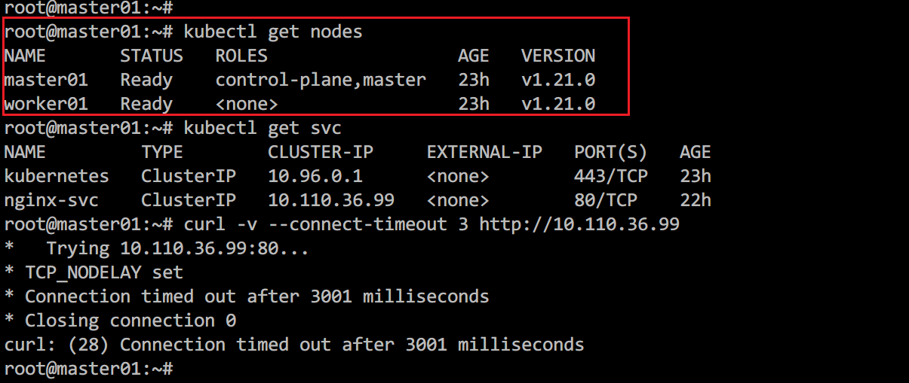

k8s集群创建service（服务）后，集群内pod所在节点可以访问该服务，但其它节点无法正常访问该服务，调试解决后，觉得过程挺有意义，遂记录下整个调试解决过程。

## 0x01 故障及集群信息

这里先说明一下k8s集群的情况，集群包含一个master（节点A）一个worker（节点B），他们的IP信息如下：

|机器标识|机器作用|内网IP|公网IP|
| ---- | ---- | ---- | ---- |
|节点A|master节点|10.200.200.7|129.226.176.163|
|节点B|worker节点|172.19.0.13|43.129.71.69|

节点A和节点B并不在同一内网，他们直接通过公网IP进行数据传输。

故障的表现主要是，部署一个nginx服务并创建对应的service后，在master节点无法通过ClusterIP访问服务，但是在worker节点可以正常访问该服务。



图1.1、主节点无法访问服务


图1.2、worker节点可以访问服务

## 0x02 kubernetes网络模型

理解k8s的网络模型对于故障的分析解决很有必要，所以这里先提前讲解说明，这里使用的网络插件为`flannel`，其它插件基本上也是大同小异。

k8s网络的基础就是两种类型的IP，一个是`ClusterIP`（集群内部IP），另一个是`PodIP`（Pod的IP）。我们下面一个一个分析。

### 2.1 ClusterIP

先说ClusterIP，之前说过，ClusterIP是一个虚拟IP，那何为虚拟IP呢？也就是这个IP不绑定任何一个网卡（包括虚拟网卡）并且不拥有任何一条路由规则，你可以查看所有节点的IP或者所有Pod的IP以及路由信息，不会发现任何与ClusterIP相关的信息。ClusterIP能正常工作，完全依赖于`iptables`提供的DNAT能力，数据包在经过iptables的`OUTPUT`链时，其目的端口和地址会按照k8s定义的规则修改为指定的PodIP的端口和地址，然后数据包会被转发到指定的pod上。而这也决定了外部网络是无法通过ClusterIP访问到具体服务（请求路由不到该集群且k8s并未兼容外部请求DNAT）。

### 2.2 PodIP

下面再来说说PodIP，PodIP是k8s分配给pod的IP，每个pod各不相同，到都在一个大的网段内，各个pod可以互通互联，并且集群的节点也可以通过PodIP访问到各个pod的服务。为了理解它的原理，我们先看下面这张图：


上图中，cni0和flannel.1网络设备都是flannel网络插件生成的虚拟网络设备，使用cni0是一个**bridge设备**，flannel.1是一个**vxlan设备**，cni0连接着该节点上的各个pod以及flannel.1。而flannel.1的另一头连着flanneld进程，所有进入flannel.1的流量都会交给flanneld进程进行处理，而flanneld会把数据包3层（IP层）及以上的包封装到一个udp包中，然后查找系统配置，找到数据包需要发送到的节点的IP，然后发送给对端节点的指定udp端口(5678)，这个技术就是vxlan，可以将非同一网段的设备通过公网组成同一网段（内网）。


图2.2、设备类型

我们还是通过网络流向图来具体说明，节点A中的pod-1向节点B的pod-3发出一个请求，数据包首先会查询pod-1中的路由表，通过默认路由数据包到达cni0，随后转发给flannel.1设备，然后经由flanneld进程处理后以udp数据包的形式发送给节点B的5678端口，节点B的flanneld收到数据后并解包数据，然后丢给节点B的flannel.1设备，进而请求转发到节点B的cni0设备，通过查找arp表，确定目的pod-3，最后数据包顺利到达pod-3。而如果请求是在节点A上直接发出的，那一开始会查询节点A的路由表，然后通过路由表确定数据包转发给flannel.1设备，后面的过程跟上面相同。

明白了上面两类IP以及转发规则后，我们来看具体遇到的问题。

## 0x03 故障分析

首先匹配到`nat`表的`OUTPUT`链（Chain），可以看到，请求被转到`KUBE-SERVICES`链


查看`KUBE-SERVICES`链，根据目标IP（**10.110.36.99**）和端口（**80**），请求被转到`KUBE-SVC-HL5LMXD5JFHQZ6LN`链


查看`KUBE-SVC-HL5LMXD5JFHQZ6LN`链得知请求被转到`KUBE-SEP-SADCJIHRQW7RJ62U`链，然后查看`KUBE-SEP-SADCJIHRQW7RJ62U`链的详情，可以看到，请求被以`DNAT`的方式转到了`10.244.1.2:80`。


通过上面的分析，我们知道请求最终被转到`10.244.1.2`的`80`端口，那`10.244.1.2`这个IP又是谁的呢？

其实这个IP是服务关联的容器的IP，通过`kubectl get pods`查询`deployment`创建的pod，然后使用`kubectl describe pods nginx-6fd9b8bcc7-ln2ws`查询pod详情可以看到pod的IP。


那么我们现在的问题就转换成了在master节点中访问`10.244.1.2`的服务，这个也是不通的。


通过上一节的分析，我们知道数据包首先是到flannel.1设备，然后flanneld进程进而eth0网卡。直接上抓包工具对flannel.1抓包，结果如下：


上图抓包结果显示，数据包确实到达了flannel.1，但是只有去的SYN包，没有回包。那数据包应该是在某一个阶段丢了。我们先放一放这个，继续到下一收到包的配备看。由于flanneld是进程，不到万不得已，先不动它。flanneld的下一个设备是eth0，具备抓包条件，直接在eth0上抓端口为8472的udp包：


这里就发现了端倪，数据包虽然是发给节点B的，但使用的目的IP却是节点B的内网IP，而节点A和B并不在同一内网，并无法直接访问，这就导致了数据包中途丢包而无法连接。

找到了问题的原因，下一步就是分析是什么造成了这种情况。通过上面的分析我们知道，错误目的地址的数据包是节点A的flanneld进程发送的。此时我们的排查方向就转到了flanneld上，在查看了flannel部署信息及master和worker上flannel容器的配置文件后依然没有任何头绪。遂查看flannel文档（[https://github.com/flannel-io/flannel/blob/master/Documentation/kubernetes.md#annotations](https://github.com/flannel-io/flannel/blob/master/Documentation/kubernetes.md#annotations)）发现了`flannel.alpha.coreos.com/public-ip-overwrite`注解，该注解可以重写节点对外的IP，我们可以使用`kubectl describe nodes worker01`查看节点详情。


通过查看节点详情，我们发现当前节点的注解`flannel.alpha.coreos.com/public-ip`值为`worker01`的内网IP，这也是上面数据包目的地址错误的原因。执行下面的命令对`worker01`节点打上`flannel.alpha.coreos.com/public-ip-overwrite`注解，值为`worker01`的外网IP。

```bash
# Set annotation
kubectl annotate node worker01 flannel.alpha.coreos.com/public-ip-overwrite=43.129.71.69 --overwrite
# Get flannel pod on worker01
kubectl -n kube-system get pods --field-selector spec.nodeName=worker01 | grep flannel
# Restart flannel
kubectl -n kube-system get pod kube-flannel-ds-xq7b9 -o yaml | kubectl replace --force -f -
```


修改后需要重启`worker01`的flannel pod以生效，然后重新在master上执行`curl 10.244.1.2`


## 0x04 总结

此类问题产生的原因是不在同一内网且机器的公网IP并未显示的绑定在机器网卡上（典型的云主机），而通常情况下我们都是在同一内网搭建k8s集群，因此很少会遇到。而解决这个问题的过程可以让我们更好的理解k8s的网络通信原理。

至于不再同一内网且公网IP未显示绑定在网卡上的机器如何搭建集群，后面我会单独写一篇文章。

PS


