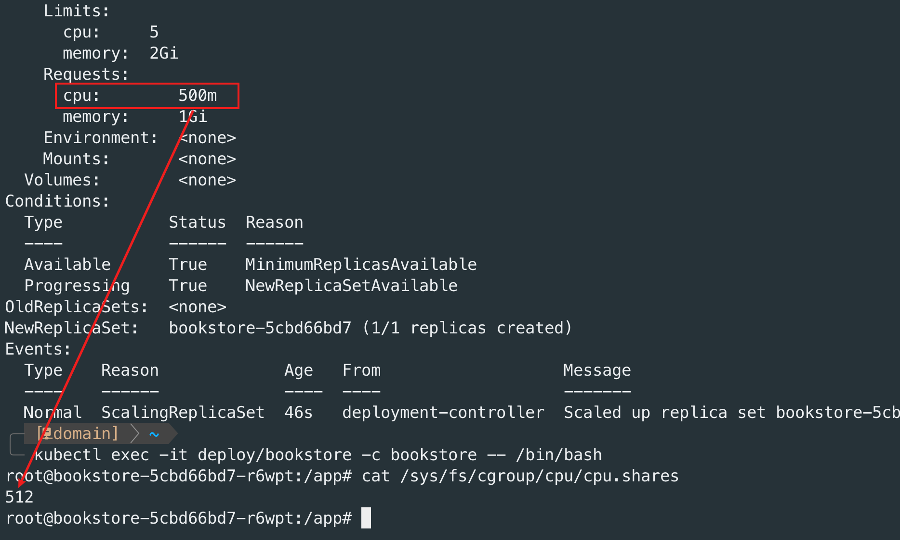

k8s 中有个配置项（`resources`）可以对容器使用资源进行限制，它们的作用是什么？应该如何设置？本文将深入探讨这个问题。

这里先同步一下结论：

1. `requests` 设置作用于Pod调度，越小的值越有利调度。
2. `limits` 设置用于限制容器资源占用。

下面我们对**CPU计算资源**和**内存资源**分别做详细讨论。

## 0x01 CPU计算资源限制

k8s 对于CPU 资源的限制主要体现在两个方面：

1. 限制容器对 CPU 资源的最大使用量。
2. 在 Node CPU 资源紧张的时候，对容器 CPU 使用的权重管理以及对 Pod 的驱逐（出Node）可能性大小。

这两个限制分别对应`requests` 和 `limits`设置。

### 1.1 requests配置

`requests` 配置并不会限制容器的CPU 资源的使用，它的作用主要有两点：

1. k8s 调度 Pod 的主要指标。
2. 设置 CPU 调度的优先级。

k8s 调度Pod 的过程中，会获取 `requests` 值，然后匹配哪个 Node 剩余 CPU 容量可以承载 `requests` 需求的 CPU 量。但如果 `requests` 值过大，超过所有 Node 可用 CPU 量，那Pod 将无法被调度到任何一个 Node 上。

而从容器运行时的角度看，设置该参数后，容器启动时会设置[`cpu-shares`](https://docs.docker.com/config/containers/resource_constraints/#configure-the-default-cfs-scheduler) 运行参数，该参数会体现在容器`cgroup` 的 `cpu.shares` 参数值上。该限制仅在 CPU资源不足时，会优先调度值高的容器，CPU资源充足时，没有任何影响，属于软限制。

### 1.2 limits配置

`limits` 配置后会直接限制容器使用的 CPU 计算资源量，避免因波动造成的 Node 的 CPU 资源耗尽，影响其它 Pod 的使用。

但是这里需要注意的是，即使容器占用非常高的 CPU 计算资源，也不会被容器运行时终止，这点与内存有所不同。

## 0x02 内存资源限制

k8s 对于内存资源的限制跟 CPU 大体相同，也是包含 `requests` 和 `limits` ，但是在一些细节处理上还是有所不同。

### 2.1 requests 配置

内存资源的 `requests` 限制不会变更容器的 `cgroup` 配置，其仅会被用作 Pod 调度指标。与 CPU 资源一样，k8s 在调度的时候也会同时匹配 Node，看哪个 Node 的剩余内存资源可以满足 Pod 的 requests 值。因此越小的 `requests` 值越容易被调度。过大的 `requests` 值也可能导致无法被调度。

### 2.2 limits配置

`limits` 配置后会直接限制容器内存内存使用量（通过设置`cgroup`的`memory.limit_in_bytes`），如果容器申请内存超过该值，会导致触发系统 OOM，导致容器内尝试申请内存的进程杀死。并且如果该进程号为 1，并且容器被标记为可重启，k8s 会重启容器。

还有一种情况是如果容器内存占用超过了其申请，并且 Pod 所在的机器节点内存也不足，则该 Pod 很有可能会被驱逐。

这里还有一个需要注意的点，`tmpfs` 类型的 `emptyDir` 存储占用的空间也会被算作容器的内存占用量。

## 0x03 零值情况

这里的零值包含两种情况：

1. 未指定`requests` 或 `limits`值。
2. 将 `requests` 或 `limits` 值设置为 0。

对于部分未指定的情况，如果仅指定`limits`，没有指定`requests`，并且系统没有特别指定默认值（比如通过`namespace`指定），那么，`requests`会被设置为`limits`值。

如果完全没有指定，那么容器将不受 CPU 资源和内存资源的限制（可以使用所有CPU资源和内存资源）。但是带来的风险就是容器进程非常容易因 OOM 被系统杀死，或者因 CPU 资源紧张，Pod 被调度出当前 Node。

将 `requests` 或 `limits` 值设置为 0 的情况，官方文档并没有专门说明，但是在 k8s GitHub 仓库的一个 issue 中找到了一个开发者的解答：[https://github.com/kubernetes/kubernetes/issues/86244#issuecomment-565624012](https://github.com/kubernetes/kubernetes/issues/86244#issuecomment-565624012)。根据开发者的解答，设置为0与空值效果相同，虽然不会受资源限制，但是比较容易被驱逐或者杀死。

## 0x04 总结

通过以上分析，`requests`主要用于调度，而`limits`则用于对容器使用资源做限制。对容器设置 `requests` 和 `limits` 资源限制是一个比较好的习惯，正确设置资源限制对于优化容器调度和避免资源耗尽具有重要意义。

## 0x05 参考文档

1. [Resource Management for Pods and Containers](https://kubernetes.io/docs/concepts/configuration/manage-resources-containers/)
2. [Assign Memory Resources to Containers and Pods](https://kubernetes.io/docs/tasks/configure-pod-container/assign-memory-resource/)
3. [Assign CPU Resources to Containers and Pods](https://kubernetes.io/docs/tasks/configure-pod-container/assign-cpu-resource/)
4. [Kubernetes issue: Create pod with spec.containers[0].resources.limits.cpu = 0](https://github.com/kubernetes/kubernetes/issues/86244#issuecomment-565624012)
