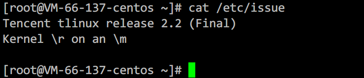

最近在学习研究kubernetes，在跟着[kubernetes交互式文档](https://kubernetes.io/docs/tutorials/kubernetes-basics/)学习完基本概念等知识后，想着自己也搭建一个集群，加深一下对其的理解。下面是整个搭建过程的记录。

## 0x01 系统和机器信息

我这里使用的系统是**Tlinux2.2（腾讯云自有Linux镜像）**，一个基于CentOS7的系统。如果你使用Ubuntu，除了docker和Kubernetes安装步骤不一样（设置repo和安装命令）外，其它命令和步骤基本相同。



我这里一共使用了三台机器，机器的IP及用户如下表：


|IP|用途|
| ---- | ---- |
|9.134.66.137	|作为master机器|
|9.134.111.254	|作为worker机器|
|9.134.115.93	|作为worker机器|

当然，你也可以只使用两台机器，一台master一台worker，不建议只使用一台机器，毕竟要搭建就搭建最真实的集群环境。

## 0x02 系统配置

### 2.1 关闭swap

k8s要求系统关闭swap，否则会无法安装启动，使用下面的命令关闭swap

```bash
swapoff -a
sysctl -w vm.swappiness=0
```

编辑`/etc/fstab`，确保其中没有swap的配置启用，如果有使用#注释或者直接删除，这样可以保证机器重启后swap也是关闭的。


### 2.2 设置主机名

因为使用`kubectl get nodes`默认看到的node名称均为主机名，所以为了方便识别这里分别对两台主机的主机名做配置。

|主机|IP|主机名|
| ---- | ---- | ---- |
|master	|9.134.66.137	|master01|
|worker01|	9.134.111.254|	worker01|
|worker02	|9.134.115.93	|worker02|

配置主机名直接使用`hostnamectl`命令：

```bash
hostnamectl set-hostname master01
hostnamectl set-hostname worker01
```

设置完成后需要将主机名加入hosts，否则在初始化或者加入集群的时候会告警主机无法访问：


```bash
cat <<EOF >> /etc/hosts
# kubernetes
9.134.66.137 master01
9.134.111.254 worker01
9.134.115.93 worker02
EOF
```

## 0x03 安装配置docker

k8s只是容器管理和编排工具，底层还是需要docker支持，因此需要先安装docker，docker需要在**master**和**worker**机器上都安装。

```bash
yum install -y yum-utils
yum-config-manager \
    --add-repo \
    https://mirrors.aliyun.com/docker-ce/linux/centos/docker-ce.repo
yum install -y docker-ce-19.03.9 docker-ce-cli-19.03.9 containerd.io
```

注意，此处需要安装版本为**19.03.9**的docker，否则k8s初始化时会告警。


如果是ubuntu系统，请参考[https://docs.docker.com/engine/install/ubuntu/](https://docs.docker.com/engine/install/ubuntu/)。


接下来配置docker：

```bash
cat <<EOF > /etc/docker/daemon.json
{
  "exec-opts": ["native.cgroupdriver=systemd"],
  "log-driver": "json-file",
  "log-opts": {
    "max-size": "100m"
  },
  "storage-driver": "overlay2",
  "registry-mirrors": [
    "https://dockerhub.azk8s.cn",
    "https://ustc-edu-cn.mirror.aliyuncs.com"
  ]
}
EOF
```

因为k8s初始化过程中需要从google拉取镜像，所以可能会比较慢，如果有代理可以按以下方式配置：

```bash
mkdir -p /etc/systemd/system/docker.service.d
cat <<EOF > /etc/systemd/system/docker.service.d/http-proxy.conf
[Service]
Environment="HTTP_PROXY=http://127.0.0.1:12345" "HTTPS_PROXY=http://127.0.0.1:12345" "NO_PROXY=dockerhub.azk8s.cn,ustc-edu-cn.mirror.aliyuncs.com,10.*.*.*,localhost,127.0.0.1"
EOF
```

将docker设置为开机自启，然后重启docker：

```bash
systemctl enable docker
systemctl restart docker
```

## 0x04 安装kubernetes

**该步骤需要在两台机器上分别部署。**

kubernetes包含三个组件，分别是：

- kubelet：运行在所有节点上，负责启动pod和容器。
- kubeadm：用于初始化集群。
- kubectl：是k8s的命令行工具。通过kubectl命令可以部署和管理应用等。

```bash
cat <<EOF | sudo tee /etc/yum.repos.d/kubernetes.repo
[kubernetes]
name=Kubernetes
baseurl=https://mirrors.aliyun.com/kubernetes/yum/repos/kubernetes-el7-x86_64
enabled=1
gpgcheck=1
repo_gpgcheck=1
gpgkey=https://mirrors.aliyun.com/kubernetes/yum/doc/yum-key.gpg https://packages.cloud.google.com/yum/doc/rpm-package-key.gpg
exclude=kubelet kubeadm kubectl
EOF

# 关闭selinux
setenforce 0
sed -i 's/^SELINUX=enforcing$/SELINUX=permissive/' /etc/selinux/config

# 安装kubelet kubeadm kubectl
yum install -y kubelet kubeadm kubectl --disableexcludes=kubernetes
# 设置kubetlet开机自启
systemctl enable --now kubelet
```

如果是其它系统（如ubuntu），请参考：[https://kubernetes.io/docs/setup/production-environment/tools/kubeadm/install-kubeadm/#installing-kubeadm-kubelet-and-kubectl](https://kubernetes.io/docs/setup/production-environment/tools/kubeadm/install-kubeadm/#installing-kubeadm-kubelet-and-kubectl)

## 0x05 初始化master

**该步骤仅需在master机器上操作。**

```bash
# 初始化
kubeadm init --pod-network-cidr=10.244.0.0/16 --apiserver-bind-port=8443
```

因为kubeadm init命令可能会访问k8s.io（[https://dl.k8s.io/release/stable-1.txt](https://dl.k8s.io/release/stable-1.txt)），因为网络原因可能会很慢，所以，如果需要代理，可以先设置代理：

```bash
# 先设置代理
export http_proxy=http://127.0.0.1:12345
export https_proxy=http://127.0.0.1:12345
export no_proxy="dockerhub.azk8s.cn,ustc-edu-cn.mirror.aliyuncs.com,10.*.*.*,localhost,127.0.0.1"
# 再初始化
kubeadm init --pod-network-cidr=10.244.0.0/16 --apiserver-bind-port=8443
```

当然，init参数还有很多，常用的参数有：

- —kubernetes-version: 指定Kubenetes版本，如果不指定该参数，会从google网站下载最新的版本信息。
- —pod-network-cidr: 指定pod网络的IP地址范围，它的值取决于你在下一步选择的哪个网络网络插件，这里设置为10.244.0.0/16，因为我们后面会使用flannel网络方案。
- —apiserver-advertise-address: 指定master使用哪个inteface与node节点通信，如果有多个interface建议指明，如果不指定，则会自动选择默认网关的interface。我们这里因为只有一块网卡，所以就不指定了。
- -apiserver-bind-port：指定apiserver对外提供服务的端口

我这里指定了apiserver对外端口为：8443（默认6443）


init之后输出的最后一行需要复制保存，用于worker节点加入集群使用。

然后创建kubectl命令的配置，其默认配置位于当前用户家目录的.kube文件夹下。如果你之后要使用一个普通用户（非root）来执行kubectl命令，那么你可以切换成普通用户然后再执行下面的命令，之后所有kubectl命令都需要用该用户执行。

```bash
mkdir -p $HOME/.kube
sudo cp -i /etc/kubernetes/admin.conf $HOME/.kube/config
sudo chown $(id -u):$(id -g) $HOME/.kube/config
```

创建好kubectl的配置文件之后，使用下面的命令安装网络插件（flannel）。

```bash
kubectl apply -f https://raw.githubusercontent.com/coreos/flannel/master/Documentation/kube-flannel.yml
```

之后再使用下面的命令就可以看到所有系统所启动pods，如果状态不全是RUNNING的话，需要稍等片刻，等所有的pod全部启动完毕。

```bash
kubectl get pods --all-namespaces
```

下图是所有pod全部正常后的输出，此时表明master节点已经部署完毕。


## 0x06 配置node加入集群

**该步骤仅需在node机器上操作。**

使用上一步中`kubeadm init`最后输出命令行，在需要配置为node的机器上执行。

```bash
kubeadm join 9.134.66.137:8443 --token 0sczhx.mvr28o0zvc5ohi9p \
    --discovery-token-ca-cert-hash sha256:602e4f9750c0153c91001877af74a80befaa501e988c77c6212f2b3af4cdb4fe
```


执行完毕后去master节点上执行`kubectl get node`，这时应该可以看到已经出现了一个状态为NotReady的node节点。之所以还未ready，是因为node节点正在拉取镜像并部署启动pods。


你可以在node节点的机器上使用`docker ps`来查看。


等node上的pods部署完之后，在master上执行`kubectl get nodes`，应该可以看到一个Ready状态的node。


上步中查询得到的node的ROLES显示为`<none>`，需要我们手动指定其为worker。

```bash
kubectl label node worker01 node-role.kubernetes.io/worker=worker
```


至此一个集群（一个master一个worker）已经搭建完成，另一个worker（worker02）执行相同命令即可加入集群。

## 0x07 总结

自此我们就完成了一个k8s集群的搭建，总结起来整个过程就是安装docker、kubelet、kubeadm、kubectl等工具的过程。其中dokcer是最终应用所运行的环境，包括k8s系统本身也是在docker中运行；而kubelet作为一个daemon（systemd管理），负责启动pod和容器，这也是k8s中唯一一个以在宿主机中启动的后台进程；kubeadm用于初始化集群，部署完成之后就不会再用了。而kubectl是k8s的命令行工具，是我们之后使用的主要命令行工具，包括管理pod、service等。

**PS: 重新生成加入集群的token**

某些情况下，如果不小心忘了加入集群的命令token，可以使用以下方式生成新的token和命令：

```bash
kubeadm token generate
kubeadm token create xxxxx --print-join-command
```


