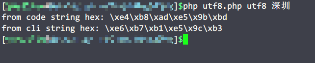
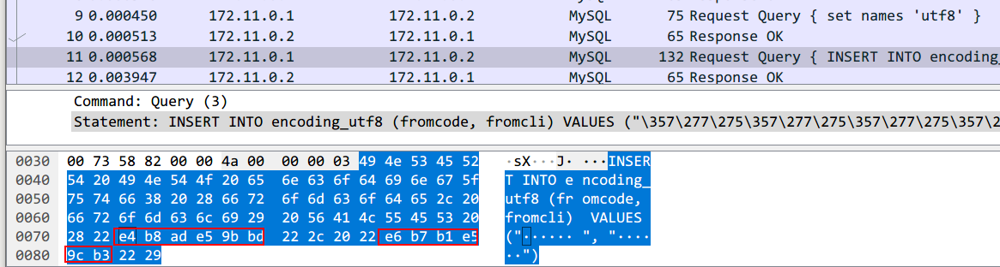

以往聊MySQL编码都是基于文档分析，虽然全面，但很慢让我们去理解，今天我们用一种更直观的方式来展示分析MySQL编码（乱码）的问题：抓包。通过抓包，我们可以更直观的看到MySQL乱码的原因。

# 0x01 分析及测试

MySQL编码的问题中主要涉及四个地方的编码：

1. 程序编码
2. tcp数据包传输编码
3. mysql客户端指定编码（set names）
4. 创建数据库执行的数据库编码

我们可以通过编写不同编码的程序（这里使用utf-8和gbk编码PHP源码），然后抓包查看传输过程中字符使用的编码，最后通过mysql cli名称配合其`hex` 确认数据库中保存数据的真实编码，以此来`猜测`理解整个编码解码过程。

测试过程中需要使用到的程序和命令如下：

1. PHP程序如下：

```php
<?php
const DB_HOST = "127.0.0.1";
const DB_PORT = 3306;
const DB_USER = "root";
const DB_PASSWD = "mysql";
const DB_NAME = "test";

if ($argc < 3) {
    exit(1);
}

$charset = $argv[1];
$str = '中国';
$clistr = $argv[2];

function str2hex($str) {
    $result = [];
    for ($i = 0; $i < strlen($str); $i++) {
        $result[] = '\x' . dechex(ord($str[$i]));
    }
    return implode('', $result);
}

echo 'from code string hex: ' . str2hex($str) . "\n";
echo 'from cli string hex: ' . str2hex($clistr) . "\n";

$conn = new PDO(sprintf('mysql:host=%s;port=%s;dbname=%s;charset=%s', DB_HOST, DB_PORT, DB_NAME, $charset), DB_USER, DB_PASSWD);
$conn->exec("set names '" . $charset . "'");
$conn->exec('INSERT INTO encoding_utf8 (fromcode, fromcli) VALUES ("' . $str . '", "' . $clistr . '")');
```

将源码分别保存为`utf-8`和`gbk`两种编码（utf8.php和gbk.php）。

然后使用命令行执行两个脚本：

```bash
php utf8.php <connection_charset> 深圳
```

**注意：这里我的ssh客户端和系统的locale均设置为utf-8编码，这样就保证了脚本获取到的`深圳`两个字永远是utf-8编码。**

2. 抓包命令如下，抓包后生成的pcap，在本地用wireshark分析：

```bash
tcpdump -i br-d90987ec57e5 port 3306 -s0 -w /path/to/data.pcap
```

3. mysql客户端连接查询命令如下：

```bash
mysql --default-character-set=utf8 -h 127.0.0.1 -P 3306 -u root -p
```

这里使用`--default-character-set`指定了客户端链接使用的编码，相当于登录mysql后使用`set names` 。

4. 测试中文字符如下：

> **字符“中国”**
1. utf-8编码：\xe4\xb8\xad\xe5\x9b\xbd
2. gbk编码：\xd6\xd0\xb9\xfa
**字符“深圳”**
1. utf-8编码：\xe6\xb7\xb1\xe5\x9c\xb3
2. gbk编码：\xc9\xee\xdb\xda
> 

另外还有两个名词，编码和解码。其中编码是将字符编码为utf-8/gbk等，而解码则是将utf-8/gbk等解码为字符。

上面说的4个条件组合起来就是16种，其实完全没有必要每一种测试都做，我这里只按照以代码的编码方式为主要维度，分别测试两种客户端编码设置（`set names`），相当于4种测试。

# 0x02 代码为utf-8编码

我们首先来测试utf-8编码的PHP代码在MySQL客户端编码设置为`utf8`和`gbk`时的表现。

## 2.1 MySQL客户端设置为utf8

执行脚本插入数据：



抓包结果如下：



mysql 客户端查询结果如下：


这里简单的分析一下结果，php脚本是utf-8编码，这就保证了“中国”两个字也是utf-8编码，之前说过，“深圳”这两个从命令行参数传进去的字符永远是utf-8编码。而且脚本打印出的字符的16进制值也符合预取。再看抓包传输的数据，均为utf-8编码，而且通过mysql查询出的结果也显示保存在数据库中的也是utf-8编码。

## 2.2 MySQL客户端设置为gbk

执行程序如下：


抓包结果：


但是插入并未成功：


我们用Python的`encode`和`decode`进行验证：


PHP代码的编码和传输过程中的编码均为utf-8，从这里我们可以得出，**传输过程中的编码不受MySQL客户端编码设置（`set names`）的影响**。而传输编码和MySQL客户端编码不同导致了插入失败，从报错结果来看，是utf-8编码的“中国”以`gbk`解码（MySQL客户端设置的编码）是错误而导致的。**也就是说，数据传递到MySQL服务器后，MySQL会先按MySQL客户端设置的编码（set names）对数据进行解码。**

# 0x03 代码为gbk编码

我们再来测试代码为gbk编码的时候，两种情况各自的表现。

## 3.1 MySQL客户端设置为utf8

程序执行结果


抓包结果：


不出所料的MySQL报错：


我们来分析一下这次的测试结果：首先PHP脚本获取到的“中国”变成了gbk编码（因为脚本为gbk编码），而“深圳”还是utf-8编码，并且传输过程跟脚本获取的字符编码相同，符合我们上面总结的结论。而最后的报错也符合我们的预期，因为“中国”按gbk编码（传输过程的编码）再按utf-8解码（MySQL客户端设置的编码）确实会报错。这条测试印证了我们上面的结论。

## 3.2 MySQL客户端设置为gbk

下面来做最后一个测试，这个结果信息量有点大，首先是运行脚本：


抓包结果：


数据竟然正常插入了，通过mysql cli查询，不出所料，乱码了：


我们来分析结果：抓包和PHP脚本编码不用解释了，主要看最终的MySQL查询出（存储）的结果，**我们上面分析过，传输的数据会先被MySQL解码，也就是说“深圳”经过utf-8编码后经tcp传到MySQL服务器后，MySQL服务会先使用gbk解码成字符**，我们用python3来看一下“深圳”这个字符串按utf-8编码后gbk解码后的结果是什么：


utf-8编码的“深圳”按gbk解码后就变成了“娣卞湷”了，然后MySQL再按数据表的编码，将“娣卞湷”按utf-8编码后保存到了数据库。

# 0x04 总结

总结起来整个过程大致如下：


我这里只分析了向MySQL传递数据的过程，从MySQL查询数据的过程大致相同：


首先代码的编码方式影响的是传输的过程中字符的编码，也就是代码指定sql查询语句中的编码是什么，tcp传输的便是什么，不受MySQL配置的影响。

数据传输到MySQL服务器后，MySQL会按照你设定的client/connection（set names）编码方式对传入的数据进行解码，解码为字符后再按你指定的表的编码方式进行编码保存。

所以：

1. **硬盘保存的数据的编码永远是你创建表的时候指定的编码方式**
2. **MySQL查询匹配过程中永远是字符（可以看作为unicode）**
3. **程序与MySQL传输过程中的编码受程序编码方式（向MySQL执行查询的语句）和MySQL客户端编码方式（MySQL返回结果）**

综上，把`代码编码`和`set names` 设置为一样就行了。

**注意：MySQL中的latin并不能算一种编码方式，对于它来说，不管什么编码一概不管，都认为是ascii码处理。**
