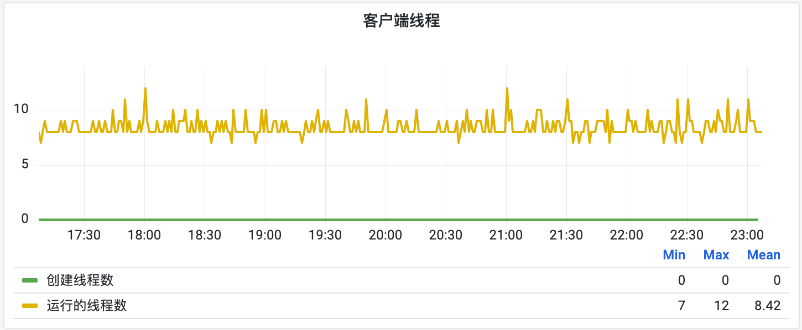

MySQL监控及优化中，线程相关指标是一个比较重要参数，可以反映出MySQL的性能及负载等情况。其中涉及到以下几个指标项（`show global status`）：

| 指标名 | 官方说明 |
| --- | --- |
| https://dev.mysql.com/doc/refman/8.0/en/server-status-variables.html#statvar_Threads_cached | The number of threads in the thread cache. |
| https://dev.mysql.com/doc/refman/8.0/en/server-status-variables.html#statvar_Threads_connected | The number of currently open connections. |
| https://dev.mysql.com/doc/refman/8.0/en/server-status-variables.html#statvar_Threads_running | The number of threads that are not sleeping. |
| https://dev.mysql.com/doc/refman/8.0/en/server-status-variables.html#statvar_Threads_created | The number of threads created to handle connections. If https://dev.mysql.com/doc/refman/8.0/en/server-status-variables.html#statvar_Threads_created
 is big, you may want to increase the https://dev.mysql.com/doc/refman/8.0/en/server-system-variables.html#sysvar_thread_cache_size
 value. The cache miss rate can be calculated as https://dev.mysql.com/doc/refman/8.0/en/server-status-variables.html#statvar_Threads_created
/https://dev.mysql.com/doc/refman/8.0/en/server-status-variables.html#statvar_Connections |
| https://dev.mysql.com/doc/refman/8.0/en/server-status-variables.html#statvar_Connections | The number of connection attempts (successful or not) to the MySQL server. |
| https://dev.mysql.com/doc/refman/8.0/en/server-status-variables.html#statvar_Max_used_connections | The maximum number of connections that have been in use simultaneously since the server started. |

以上指标值可以通过`show global status` 语句获取：

下面我们会对这些指标做详细说明解释，以及通过这些指标可以反映出系统的哪些状况。

## 0x01 指标说明

### 1. Threads_connected 指标

首先，我们需要明确MySQL的一个特性，就是它会为每个客户端连接分配一个线程，这个指标体现为：`Threads_connected`，即`Threads_connected`的数量体现了有多少个客户端正连接到MySQL服务，在系统上可以体现为TCP连接数。

### 2. Threads_cached 指标

当客户端断开连接后，线程会被销毁，`Threads_connected`也会相应减1。如果客户端是短连接，将会造成大量的线程创建和销毁，这将会有不小的系统消耗。为了避免线程创建、销毁带来的消耗，MySQL会将断开的连接的线程缓存起来，以便于下次分配给新的客户端连接使用。因此，即使客户端断开连接，线程也不会退出，而是被系统缓存起来，以备下次使用。这个缓存的数量会体现在`Threads_cached`指标上。需要注意的是，`Threads_cached`的值受到`thread_cache_size`配置项的限制。

因此`Threads_connected`和`Threads_cached`相加就是MySQL当前为客户端分配的线程数。

如上图，MySQL为客户端共分配了453+497=950个线程。

### 3. Threads_created 指标

`Threads_created`指标表示从MySQL启动到现在一共创建了多少个线程。如果`Threads_cached`为0（没有可用的缓存的客户端线程），此时又新的客户端连接，MySQL会创建一个新的线程用于为客户端提供服务，而`Threads_created`指标值也会相应增加1。

### 4. Threads_running 指标

`Threads_running`指标表示当前正在运行的线程数。这些线程可以是用户线程，也可以是系统线程。一般客户端连接MySQL后如果没有执行查询或者没有慢查询出现，那此线程大部分状态为`Sleep`。但如果系统负载比较大，或者有慢查询出现，会产生`Query`等非`Sleep`状态的线程。可以使用`show processlist`查询所有的连接的状态。

### 5. Connections 指标

`Connections` 指标描述的是MySQL从启动至今所有的连接数，包括成功和失败的连接。之所以把这个指标拿出来说，是因为它与`Threads_created`指标联动可以确定是否需要对线程缓存配置进行优化。

## 0x02 指标监控

结合上述对各项指标的说明，我们在数据库监控和排查分析中可以通过关注以下几个复合指标来发现和定位问题。

### 1. 运行线程数

正常情况下，一个SQL查询应该很快完成，因此运行线程数应该不会很多。但是如果系统繁忙、网络拥堵或者出现满查询等，则线程一直在等待SQL查询返回或发送数据，从而导致慢查询的出现。如果出现大量此类线程，则会导致CPU、内存或磁盘IO被占满，从而导致服务不可用或者正常SQL响应变慢。

因此需要对`Threads_running`的值做一个监控，避免其值过高及过快增长。

### 2. 线程创建频率

如果线程频繁创建，则表明客户端连接增长过快或者线程缓存未被合理设置，导致线程被频繁创建和销毁。因此有必要对线程创建频率（每秒创建线程数）进行一个监控，但是MySQL并未提供原生的指标，但可以通过对`Threads_created`指标聚合计算得出。或者MySQL提供了另外一个思路，那就是对`Threads_created`指标与`Connections`连接数指标的比例进行监控，正常情况下，这个比例应该很小并且成下降趋势。如果其指比较大，或者下降趋势放缓，则说明系统在频繁创建线程。

除了监控，还需要对配置项`[**thread_cache_size](https://dev.mysql.com/doc/refman/8.0/en/server-system-variables.html#sysvar_thread_cache_size)`的**值进行优化，将其提升到一个合理的值，以便系统可以缓存更多的线程供下次连接使用。

### 3. 客户端连接数

客户端连接数（`Threads_connected`）可以体现出客户端连接数量的变化，如果连接数徒增，可能是有大量的查询进来，此时需要重点关注数据库是否可以承受，必要时可以通过`kill`链接来降低负载。另外通过配置项：**`[max_connections](https://dev.mysql.com/doc/refman/8.0/en/server-system-variables.html#sysvar_max_connections)`**可以限制客户端最大连接数。

### 4. 总线程数

上面分析过，可以通过`Threads_connected`和`Threads_cached`这两个指标的总和来获取总线程数。虽然线程很轻量，但是过多的线程数也会对机器造成一定的负担，因此需要对总线程数进行限制，以避免过多线程数引起的问题。MySQL提供了一个配置项：**`[max_connections](https://dev.mysql.com/doc/refman/8.0/en/server-system-variables.html#sysvar_max_connections)`**，可以通过设置该项来限制`Threads_connected`的数量，并从而间接地限制总线程数。

## 总结

本文只是对MySQL Thread线程相关的指标进行了解读并且给出了一些可以监控和优化的点供大家参考，但是相关指标的最佳值还是需要大家根据实际情况来设置相关配置和监控阈值。

最后，总结一下相关指标的监控项和监控点：

| 名称 | 监控项 |
| --- | --- |
| 运行线程数 | 运行线程数的数量和增长率。 |
| 线程创建频率 | 线程创建频率。 |
| 客户端连接数 | 客户端连接数和其增长率。 |
| 总线程数 | 总线程数的数量和增长率。 |
