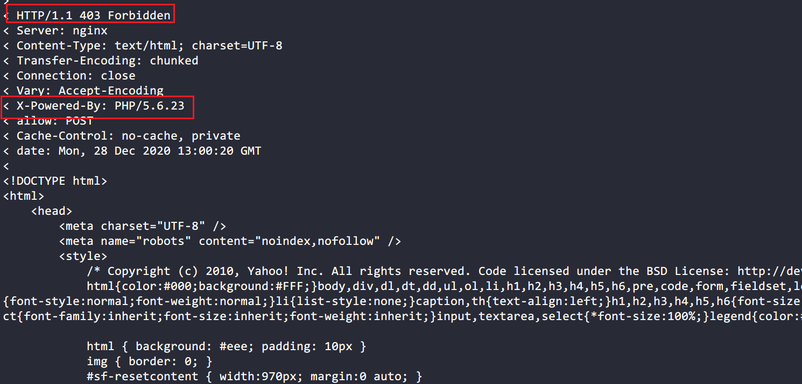

最近现网一个内部接口受到了”攻击“，导致后端的PHP服务无法响应，从而影响到其它接口的正常服务。为了先恢复其它接口（比较重要）的正常运行，想从Nginx层面先禁用掉接口调用（为什么不直接禁用IP，因为”攻击“者也是内网服务，而且使用了内部代理），其中主要的配置如下：

```bash
server {
    ...
    try_files $uri $uri/ /index.php;
    location /the/api {
        return 403;
    }
    location ~*\.php$ {
        fastcgi_pass 127.0.0.1:9000;
        ....
    }
    ....
}
```

但是，配置重新加载后，nginx并未按预期将接口请求阻止，请求依然到达了PHP-FPM的9000端口，但奇怪的是接口的请求返回状态码是403。



## 问题解决

遇事不决，先查日志。查看日志发现，error日志中有大量的针对改接口连接9000端口（PHP-FPM）超时日志，说明Nginx真的在不断转发请求到Nginx，那猜测问题应该是出在`return`指令上：`return`在重写

想到`return`还有第二个参数，参数的作用是Nginx直接返回参数的内容给请求方。

> Syntax:	return code [text];
return code URL;
return URL;
Default:	—
Context:	server, location, if
......
Starting from version 0.8.42, it is possible to specify either a redirect URL (for codes 301, 302, 303, 307, and 308) or the response body text (for other codes).
> 

配置后重启Nginx，重新请求接口，发现一切正常，Nginx不但返回403状态码，而且内容也是return指令的第二个参数值。


## 原因分析

在分析问题的原因之前，我们需要先理解Nginx中的一个概念：内部跳转。所谓**跳转**就是从一个uri调转到另外一个uri，而**内部跳转**则只发生在nginx内部，对外是无感知的（相对于301、302等跳转）。为什么需要内部跳转呢？就拿我们非常熟悉的nginx+php的配置：

```bash
# 判断请求是否能匹配到服务器上的文件
# 不能则将请求转给php处理
# 并且指定处理入口文件为index.php
if (! -f $request_filename) {
    rewrite .* /index.php;
}
location ~* \.php$ {
    ...
}
```

上面rewrite指令会触发一次内部跳转，此时nginx内部变量`$request_uri`会变为/index.php，并且nginx会重新匹配规则（相当于nginx接收到的请求为/index.php）。所以内部跳转是nginx可以在多条规则中可以匹配最优规则的一种途径。

现在基本可以确认直接使用`return 403`会引起上面的问题，但为什么呢？查看nginx主配置文件，发现有这么一项配置：

```bash
error_page 400 403 405 408 /40x.html;
```

`error_page`的作用是定义错误码默认展示的页面。当nginx发现返回`403`并且配置了403状态码的error_page，nginx便会生成一次内部跳转，然后匹配到了`try_files`指令，由于`/40x.html`文件在项目根目录下并不存在，因此，`/index.php`作为`try_files`的最后一个参数被匹配到，随后nginx再经过几次内部跳转最终匹配到`location ~*\.php`规则，请求被转发到php-fpm进程，php处理后，nginx又将状态码改为`403`后返回。

下图是在[nginx开启debug](https://docs.nginx.com/nginx/admin-guide/monitoring/debugging/)模式后日志中截图，通过日志可以看到实际情况确实如我们说分析：


return 403导致内部跳转


nginx经过try_files和内部跳转最终匹配到php规则

回到问题本身，解决方法也很简单：

1. `return`指令添加第二个参数，直接返回内容；
2. 项目根路径下创建`40x.html`文件，避免`try_files`匹配到`/index.php`；
3. 删除`error_page`关于`403`状态码的定义，此时会返回nginx内置403错误页面；
