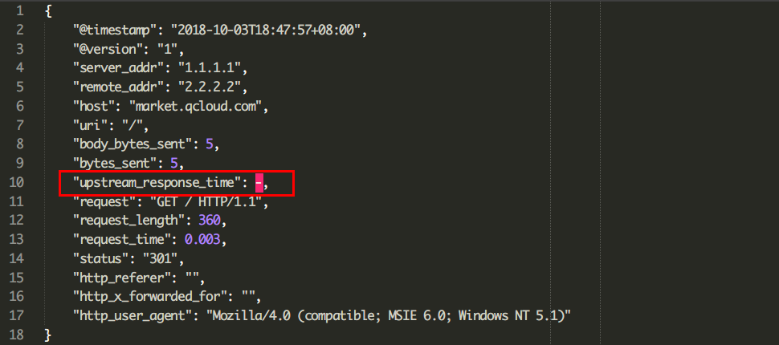

为了配合nginx日志分析，需要将Nginx的日志转为json格式，这个本身并不是很难，配置一个`log_format`即可，但在具体操作中却遇到了很多意想不到的问题。

根据实际需求，将记录的字段以json格式创建一个命名的日志，下面是我创建的一个示例：

```bash
log_format json '{"@timestamp":"$time_iso8601",'
            '"@version":"1",'
            '"server_addr":"$server_addr",'
            '"remote_addr":"$remote_addr",'
            '"host":"$host",'
            '"uri":"$uri",'
            '"body_bytes_sent":$body_bytes_sent,'
            '"bytes_sent":$body_bytes_sent,'
            '"upstream_response_time":$upstream_response_time,'
            '"request":"$request",'
            '"request_length":$request_length,'
            '"request_time":$request_time,'
            '"status":"$status",'
            '"http_referer":"$http_referer",'
            '"http_x_forwarded_for":"$http_x_forwarded_for",'
            '"http_user_agent":"$http_user_agent"'
            '}';
```

发布到线上之后发现部分json字符串不能正常解析，主要体现在**非法json值**和**未转义字符串**的问题。

## **0x01 非法json值处理**



非法json值

json中key为`upstream_response_time`的value为`-`，这很明显不是一个json字符串，而且这种情况大多出现在**301**的响应中。通过排查发现是在Nginx中配置了301跳转，也就是说Nginx自己处理了这个请求，不再将请求向后端转发，这直接导致`upstream_response_time`的值为空，写入日志后，Nginx将空值替换为了`-`，从而导致了惨案的发生。

那如何处理呢？Google之后发现Nginx有个`[map](http://nginx.org/en/docs/http/ngx_http_map_module.html#map)`的指令，该指令的作用是创建一个变量，而这个变量由其它变量通过一个映射表置换得来，跟Python中的`map`很像，但是Nginx的`map`值支持正则等。

根据描述，我们在配置文件中添加一个入下的`map`，在`$upstream_response_time`为空的时候返回为0，将该值赋值给新变量`$upstream_response_timer`，添加之后该问题得到了处理，但是接着出现了另外一个问题。

```bash
map $upstream_response_time $upstream_response_timer {
    default $upstream_response_time;
    ""        0;
}
```

## **0x02 未转义字符串问题**

运行一段时间后，发现依然后很多请求未解析，查找发现日志中充斥了大量如下图的字符：


特殊字符

很显然这是“恶意”扫描的请求，这类请求的特点是可能会包含如双引号（“）、反斜杠等在json字符串中被认为非法的字符，处理这类问题的最直接手段就是转义，那Nginx下如何处理呢？

通过查询nginx日志，发现`[log\_format](http://nginx.org/ru/docs/http/ngx_http_log_module.html#log_format)`本身就可以对字符串进行转义，这个参数的名称是`escape`，这个参数本身也需要指定一个值，可以是`default`、`json`或`none`，很明显，我们需要指定为`json`。

```bash
log_format json escape=json '{"@timestamp":"$time_iso8601",'
...
```

配置之后，所有json字符串格式的非法字符都会被转义处理。

## **0x03 结论**

总结起来，对于Nginx输出json格式日志需要添加如下配置来保证json格式的正确性：

```bash
map $upstream_response_time $upstream_response_timer {
    default $upstream_response_time;
    ""        0;
}
log_format json escape=json '{"@timestamp":"$time_iso8601",'
            '"@version":"1",'
            '"server_addr":"$server_addr",'
            '"remote_addr":"$remote_addr",'
            '"host":"$host",'
            '"uri":"$uri",'
            '"body_bytes_sent":$body_bytes_sent,'
            '"bytes_sent":$body_bytes_sent,'
            '"upstream_response_time":$upstream_response_timer,'
            '"request":"$request",'
            '"request_length":$request_length,'
            '"request_time":$request_time,'
            '"status":"$status",'
            '"http_referer":"$http_referer",'
            '"http_x_forwarded_for":"$http_x_forwarded_for",'
            '"http_user_agent":"$http_user_agent"'
            '}';
            
server {
    ...
    access_log /path/to/access.log json;
}
```
