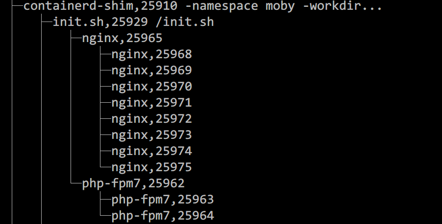

容器技术为我们的应用部署带来了很大的便捷性，让我们更专注于程序的开发。但有时候由于我们对容器的理解不够深入，误把容器当成虚拟机使用，便会出现以下一些错误的使用情况：

1. PHP程序需要使用到Nginx web服务，所以将Nginx和PHP-FPM打包到一个镜像中，其中Nginx进程在脚本中以daemon的形式启动；
2. 程序（如golang程序）产生的日志需要被filebeat程序搜集上报，所以将程序和filebeat打包进一个镜像中；

类似的例子还有很多，他们都有一个共同特点，那就是一个容器中运行了超过一个应用。那为什么不推荐一个容器中运行多个应用呢？其实最主要的原因是：**容器运行时（docker等）无法监控到容器内所有应用的运行状态。**

## 0x01 为什么需要监控应用状态

试想这样一个场景，容器内的应用崩溃导致进程退出，但容器对外状态还在运行中，这不但会造成使用者的困惑，而且对进程的监控也不方便。因此，容器作为应用运行的载体，感知应用的运行状态是非常合理且必要的。

并且容器获知应用运行状态也给容器运行是提供了保证容器状态的一种能力，在docker中，这个选项是`[--restart](https://docs.docker.com/engine/reference/run/#restart-policies---restart)`(https://docs.docker.com/engine/reference/run/#restart-policies---restart)，指定这个选项后容器将会在应用退出时做出相应动作。

## 0x02 如何监控应用状态

我们从一个示例来理解应用状态的监控/感知，首先运行如下命令启动一个容器（镜像的构建方法放在最后）：

```bash
docker run --name multi-app-container -d yaxin/multi-app-test
```

然后使用`pstree -ap`定位到容器中的进程树：



然后执行`sudo kill 25962`结束掉`php-fpm`进程，之所以结束`php-fpm`进程是因为该进程并不是容器主进程


这时候你会发现，容器还是运行状态，但`php-fpm`进程确实已经不存在了，如果此时你再执行`sudo kill 25965`，然后查看容器状态（需要添加`-a`参数，即`docker ps -a`），已经变为**Exited**了。


为什么会这样呢？首先运行`docker restart multi-app-container`重启一下退出的容器，然后运行`docker exec -it multi-app-container /bin/sh`进入容器后执行`ps -o pid,ppid,args`查看容器中的进程


其实这个进程跟上面在主机上用`pstree -ap`看到进程树是相同的，只不过这个是在容器中看到的。观察一下，`nginx`和`php-fpm`都是`init.sh`的子进程，而`init.sh`脚本之所以阻塞，是因为`nginx`是以非后台进程的方式运行，而一旦nginx进程结束`init.sh`脚本也就结束，也就说，`init.sh`是容器中的主进程（pid为1），而`init.sh`阻塞时因为`nginx`阻塞，一旦`nginx`结束，那`init.sh`也会结束，进而被容器运行时（docker）监控到，从而导致容器进程退出。`php-fpm`结束并不会影响主进程的状态，所以它的状态也就不会被容器运行时监控到。

## 0x03 运行多个应用的方案

总有一些情况我们需要一个容器内运行多个应用的情况，如开发环境下将nginx和php-fpm打包到同一个镜像，减少复杂度或者将应用使用到的所有软件打包到一个镜像，方便部署（gitlab、nextcloud等），那这种情况应该如何有效的管理应用呢？答案是第三方进程管理管理软件，如`supervisord`、`pm2`等，这些软件会根据配置规则重启异常进程，从而恢复应用的正常运行，但你需要在容器中先安装这类软件，才能正常使用。

附：镜像构建文件

**Dockerfile:**

```docker
FROM alpine

RUN sed -i 's#dl-cdn.alpinelinux.org#mirrors.aliyun.com#g' /etc/apk/repositories \
    && apk add --no-cache nginx php-fpm \
    && mkdir -p /run/nginx

COPY init.sh /
RUN chmod +x /init.sh

CMD ["/init.sh"]
```

**init.sh**

```bash
#!/bin/sh

echo "Starting php-fpm..."
php-fpm7 -D

echo "Starting php-fpm..."
nginx -g 'daemon off;'
```
