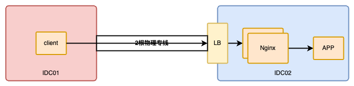
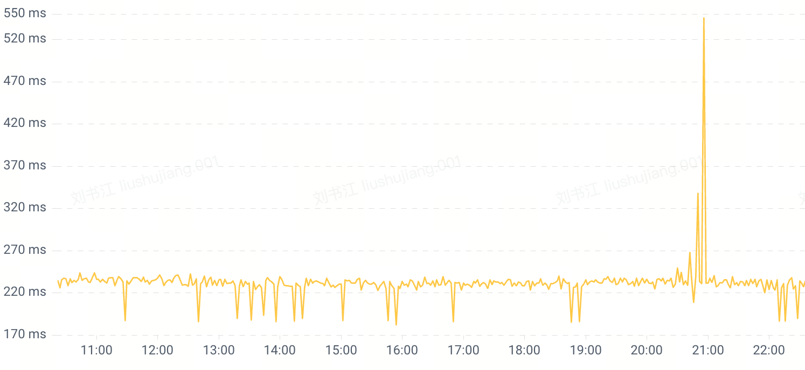
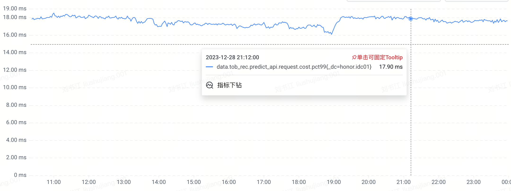
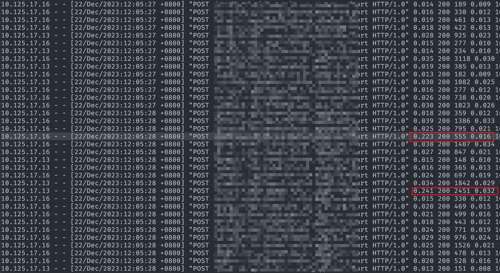
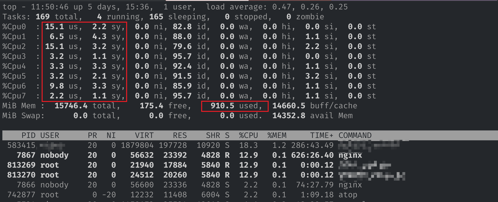
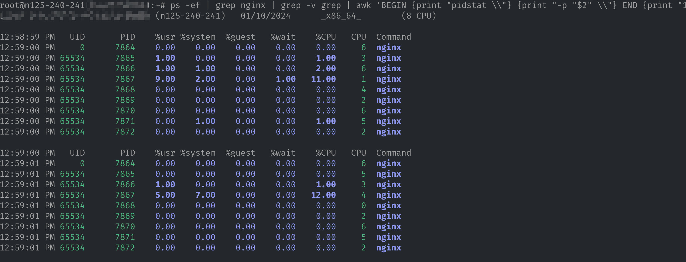
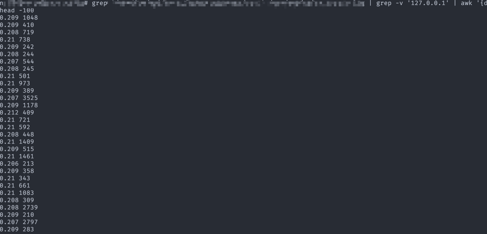
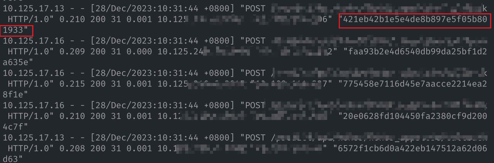
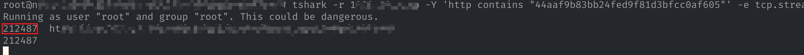
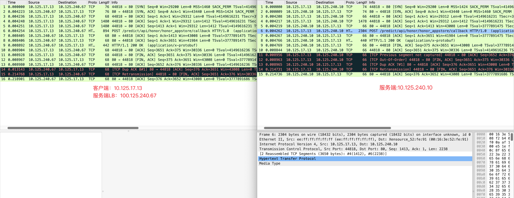

最近生产环境 Nginx 遇到了部分请求延迟增加200ms的情况，深入排查解决后觉得挺有意义的（包括排查过程），所以这里记录分享一下。

## 0x01 现象

生产环境有 Nginx 网关，网关上游（upstream）是业务应用。统计发现 Nginx 的 P99 延迟比上游应用统计的 P99 延迟要多大约 100 多毫秒（不同接口时间可能不同）。







## 0x02 200ms 的来源

Nginx 中是通过内置 `$request_time` 变量来获取的单个请求的延迟，在生产环境开启日志记录，发现部分请求延迟超过 200ms，但是上游响应时间只有 20 毫秒左右（下图红圈中依次为：`$request_time`、`$status` 、`$body_bytes_sent`、`$upstream_response_time`）。也就是说这些请求在 Nginx 内部处理了超过 200ms，显然这不正常。



## 0x03 深入排查

通过日志确定了是 Nginx 的原因，那就从 Nginx 上查起。既然偶现延迟，那就先看是否是系统资源不足导致的问题。

### 3.1 系统资源

系统资源的排查比较简单，登陆 Nginx 所在的机器，使用 `top` 等命令（或者使用监控）分析 `CPU`、`内存`等资源。



也可以通过 `pidstat` 命令指定查看 Nginx 进程的资源占用信息。

```bash
ps -ef | grep nginx | grep -v grep | awk 'BEGIN {print "pidstat \\"} {print "-p "$2" \\"} END {print "1"}' | bash
```



通过排查，并未发现系统资源不足的情况。

### 3.2 通过日志排查原因

系统资源充足，只能从其它维度入手进行排查，既然延迟产生的频率不高，那有没有可能跟某一个其它指标相关联呢，如：上游服务、请求包大小等。这个可以通过日志入手，配合 `awk` 等命令进行统计。

```bash
# $12 为 $upstream_response_time
# $9 为 $request_time
# $11 为 $body_bytes_sent
awk '{duration=$9-$12; if (duration > 0.1) {print duration " " $11}}' /path/to/nginx/access.log
```



上图表明，延迟跟请求包大小没有关联，使用相同的办法统计延迟与上游服务、响应包大小等的关联数据，同样没有发现有任何关联关系。

### 3.3 抓包

一些简单、直接的排查方案没法确定问题，那就只能上大杀器：`tcpdump` 抓包了。其实 Nginx 延迟再高，也不至于超过 200ms，能让 Nginx 出现有如此高的延迟基本上也只有网络了。如果一开始就直接上抓包也是没有太大问题的。

直接在客户端和服务端使用 tcpdump 命令进行抓包：

```bash
# -s 指定抓取数据包中的字节数，0表示不限制
tcpdump -i eth0 -s0 '(host 1.2.3.4 or host 2.3.4.5)' -w /tmp/serverside.pcap
```

由于抓取到的是所有的请求包，要定位到某一个特定的请求会比较困难，好在请求 header 头中有一个 `Request-Id` 的头，在 Nginx 日志添加变量 `$http_request_id` 的输出，这样可以通过日志快速定位到某个请求：



拿到请求ID，使用 `tshark` 命令过滤出包含请求ID的 TCP 连接。

```bash
tshark -r 1228_10.pcap -Y 'http contains "44aaf9b83bb24fed9f81d3bfcc0af605"' -e tcp.stream -e http.request.full_uri -T fields
```



随后在 wireshark 中使用 `tcp.stream==212487` 即可过滤出对应的 TCP 连接。最终的抓包（左边客户端、右边服务端）如下：



我们分析一下右边服务端的抓包，主要问题在于 11 号和 12 号包顺序乱了，于是内核丢掉了两个包，并且发送了 13 号 ACK 包，告知客户端 6 号包之后的包没收到，客户端在等待 200ms 后重传 14 号 FIN 包。

<aside>
💡 这里补充一个更详细的分析说明：6 号包是客户端传输到服务端的最后一个数据包，Seq=1413，Len=2238，那下一个传输包的 Seq 期望为：1413+2238=3651，可以看到 10 号 ACK 包（8号包的 ACK 包）Seq 为 3651，符合预期。但是 11 号包的 Seq 为 3652，多了1，不符合预期，12 号包 Seq 为 3651，两个包顺序交换后符合预期。内核在收到乱序的包后直接丢掉了11、12号包，然后 ACK 确认了 6 号包，让客户端重传6号包后面的包。客户端在等待 200ms 后依然未收到服务端发送的 FIN 包的 ACK 包，于是重传。

</aside>

为什么这里没有触发 TCP 的快速重传（客户端快速重传）机制呢？因为快速重传要求收到三次冗余 ACK 才重传，但是 FIN 包属于客户端发的最后一个包了，后续不会再有包传过来，服务端也就不可能返回 ACK 包了。

## 0x04 根因及解决方案

定位到 200ms 延迟的原因，就要找是什么导致了包的乱序？这里就不卖关子了，通过拉网络和底层等同事的协同抓包排查，最终发现是服务端（虚拟机）的宿主机上的一个特性导致的，该特性为了加速网络包的处理，会将数据包和 ACK 包等使用硬件加速处理，但是 FIN 包等还是会走软件层处理，这就导致了交给上层虚拟机的顺序产生了变化。

那为什么只有部分包会出现这种情况呢？这是因为只有 FIN 包和 ACK 包几乎同时到达宿主机，才会因为处理设备的不同出现乱序，这种概率本身就比较低。

找到根因了应该如何处理呢？有两种方案：

1. 更换没有此特性宿主机下的虚拟机。
2. 在服务端 Nginx 配置中增加 `lingering_close off` 设置。

第一种比较好理解，第二种是什么方案呢？回到图 10 的服务端抓包，其实服务端在 8 号包（HTTP 响应）发送完毕之后已经完成了数据的发送（最后一个字节已经发送并 ACK 确认），按理说上层统计时长应该按照这个时间来统计，不应该等 TCP 断开后再统计时间。这个就涉及到 Nginx 的关闭方式了，它使用的是 `shutdown` 而非 `close` 来关闭 socket 的，两个区别如下：

1. `shutdown` 表示单端关闭，TCP 为全双工，两端的收发互相对应，`shutdown` 可以选择一端关闭；如果关闭的发送端，内核的行为其实就是一个 FIN（暂不考虑linger关闭），关闭接收端其实就啥也没做。此时，socket 其实还是被进程持有的，进程仍然可以从 socket 中读取队列中缓存的包，**但是此时不能再发了。**
2. `close` 是双端关闭，即已经收到的缓存包（未被APP读取的）也不要了。对应的 socket 连接，进程也不再关注了，后面的 FIN_WAIT/TIME_WAIT 都统统交给内核处理了，socket 可以认为是orphan socket 了。

也就是虽然 Nginx 关闭了连接，但是它依然持有此 socket，必须要等待此 socket 完全确认关闭才算关闭。而 `lingering_close off` 设置可以让 Nginx 使用 `close` 来关闭 socket 连接。带来的影响就是假如 10 号包之后，客户端还有数据包发送，Nginx 不会再接收处理了（Nginx 单方面关闭接收）。

为了减少影响，我们最终选择更换虚拟机。

## 0x05 总结

虽然之前曾解决过一些网络的问题，并且也熟悉 TCP 的 ACK 机制，但是始终浮于表面，在刚开始拿到抓包结果的时候，因为有 `wireshark` 的高亮提示，知道是乱序重传，但是为什么重传始终没有搞清楚。后面在整理复盘整个过程的中，重新审视抓包，认真对 Seq 和 Ack 的序号做了比对才终于理解为啥重传了，这也是我第三部份抓包图下补充的详细分析。后面学习还是要多多实践，不可纸上谈兵。
