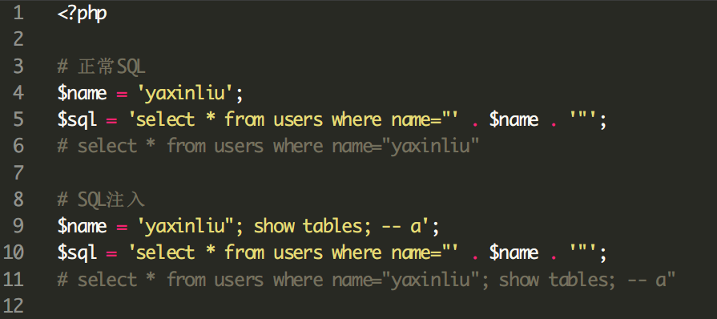
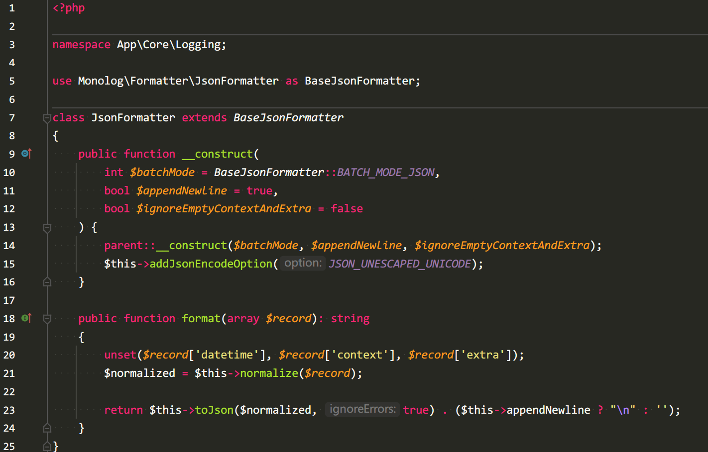

## 一、**概览**

之前在团队内部做过一个系统安全加固的分享，主要是为了避免开发人员在开发过程中踩坑，这里脱敏分享一下。

## 二、**安全加固实施细则**

~~删除~~

## 三、**漏洞及防御措施**

下面对各个漏洞做简单解释及成因分析，并且给出了防御实施方案。实施方案使用尽量简短的语言对接口安全检测做出建议和要求，对每个漏洞防御措施实施力度会使用以下三个词语进行限定：

1. **禁止：禁止业务逻辑中出现此种行为**
2. **必须：逻辑上必须使用给出的方案进行实施**
3. **推荐：建议业务逻辑使用给出的方案进行处理**

### **3.1 SSRF漏洞**

SSRF全称Server-side Request Forgery（服务器端请求伪造），主要发生场景为**服务端请求外部接口**。

**i、 漏洞成因**

SSRF漏洞发生在后端服务请求外部接口的场景，外部恶意接口跳转到内部地址/IP或者解析为某个内部IP，进而导致后端服务最终调用返回内部接口信息，导致内部服务信息泄露。


**ⅱ、漏洞防御**

后端逻辑在请求外部接口（外部url），尤其是在该接口url可以由外部指定的情况下，一定要做如下限制：

1. **禁止**http客户端跟随跳转（301、302等）
2. **禁止**直接对外部接口发起HTTP请求，请求前需要先对URL中的域名进行DNS解析，确保解析后的IP不是内网IP，并且后续请求过程中使用解析的IP进行请求

另外，如果一定需要支持跳转，则需要手动处理跳转，并对每一次跳转的url的host做DNS解析并判断IP是否合法。

### **3.2 SQL注入**

**i、漏洞成因**

SQL注入是一种典型的注入攻击，攻击者可以通过提交非法参数实现恶意SQL查询。SQL注入的成因是**字符串拼接SQL语句导致的**。



**ⅱ、漏洞防御**

SQL注入的防御方式如下：

1. **禁止拼接SQL语句**
2. **必须**使用占位符加参数绑定的方式来处理sql查询


参数绑定抓包


### **3.3 CSRF漏洞**

**i、漏洞成因**

CSRF，全称 Cross Site Request Forgery，跨站请求伪造，是一种劫持受信任用户向服务器发送非预期请求的攻击方式。攻击者诱导受害者进入第三方网站，在第三方网站中，向被攻击网站发送跨站请求。利用受害者在被攻击网站已经获取的注册凭证，达到冒充用户对被攻击的网站执行某项操作的目的。

通常情况下，CSRF 攻击是攻击者借助受害者的 Cookie 骗取服务器的信任，可以在受害者毫不知情的情况下以受害者名义伪造请求发送给受攻击服务器，从而在并未授权的情况下执行在权限保护之下的操作。

CSRF 通常从第三方网站发起，被攻击的网站无法防止攻击发生，只能通过增强自己网站针对 CSRF 的防护能力来提升安全性。

**ⅱ、漏洞防御**

1. **禁止**出现响应header头中*Access-Control-Allow-Origin为*的接口
2. 使用cookie校验登录态的接口，后台接口**必须**做CSRF校验
3. 小程序、App等**推荐**使用Token（Authorization头）进行鉴权

### **3.4 XSS漏洞**

**i、漏洞成因**

跨站脚本攻击（Cross-site scripting，XSS）是一种安全漏洞，攻击者可以利用这种漏洞在网站上注入恶意的客户端代码。当被攻击者登陆网站时就会自动运行这些恶意代码，从而，攻击者可以突破网站的访问权限，冒充受害者。

在以下2种情况下，容易发生 XSS 攻击：

1. 数据从一个不可靠的链接进入到一个 Web 应用
2. 没有过滤掉恶意代码的内容被提交给Web应用

XSS 攻击可以分为3类：存储型（持久型）、反射型（非持久型）、DOM 型。

**存储型 XSS**注入型脚本永久存储在目标服务器上。当浏览器请求数据时，脚本从服务器上传回并执行。

**反射型 XSS**当用户点击一个恶意链接，或者提交一个表单，或者进入一个恶意网站时，注入脚本进入被攻击者的网站。Web服务器将注入脚本，比如一个错误信息，搜索结果等 返回到用户的浏览器上。由于浏览器认为这个响应来自"可信任"的服务器，所以会执行这段脚本。

**DOM型XSS**通过修改原始的客户端代码，受害者浏览器的 DOM 环境改变，导致有效载荷的执行。也就是说，页面本身并没有变化，但由于DOM环境被恶意修改，有客户端代码被包含进了页面，并且意外执行。

**ⅱ、漏洞防御**

1. 非富文本支持字段，渲染时**必须**进行转义，主要对html标签进行转义
2. 需要富文本支持的字段，后端**必须**对提交的html标签和属性等进行白名单（仅允许部分标签和属性）的方式过滤，对于PHP语言，可以使用htmlpurifier（http://htmlpurifier.org/）库

**其他防御措施**：

1. 前端在做了字符转义的react和vue等库中，慎用dangerouslySetInnerHTML和v-html
2. 前端使用HTML5 postMessage时限制来源：
    1. targetOrigin参数禁止使用 *
    2. 限制接收数据event.origin，仅使用信任域

3. cookie设置：

1. HttpOnly，防止脚本读取cookie
2. Secure，仅允许加密链接使用cookie
3. Domain设置，无必要不使用二级域名而是限定在子域名内
1. 在HTTP Header中使用Content Security Policy

基础示例：

```
Content-Security-Policy: script-src *.qq.com *.gtimg.cn;
```

即告诉浏览器：该页面只允许加载qq.com和gtimg.cn子域下的js文件，其他域名的js内容以及任何内敛脚本都会被浏览器阻止。设置项较多，根据业务需要设置。

### **3.5 越权漏洞**

**i、漏洞成因**

接口对操作资源未作归属验证，从而引发的安全漏洞。

**ⅱ、漏洞防御**

1. 对外开放的接口，**建议**在middleware中对操作资源进行归属校验
2. 在所有查询和更新函数中，**建议**添加一个可选的账号参数，对外的接口调用时将参数赋值为真实账号ID

### **3.6 未鉴权漏洞**

**i、漏洞成因**

对开放的接口未做登录态校验，导致外部匿名客户可以随便调用接口，造成信息泄露等。

**ⅱ、漏洞防御**

1. **建议**将鉴权做为middleware，对所有需要鉴权的接口引用改middleware


### **3.7 文件上传漏洞**

**i、漏洞成因**

用户绕过限制上传了一个可执行脚本文件，并通过某种方式触发执行从而引起的安全问题。一定要注意，即使做了扩展名校验，依然可能出现文件上传漏洞，

**ⅱ、漏洞防御**

1. **禁止**存储上传文件到本地服务器，如果需要存储可以使用cos作为文件存储平台
2. 上传后文件名**必须**随机

上传文件到COS可以通过文件上传到服务器临时文件夹后立即写入COS并删除或者通过COS的预签名URL（https://cloud.tencent.com/document/product/436/36121）进行直接上传（浏览器直接上传到COS，不经过服务端）

### **3.8 敏感文件泄露**

**i、漏洞成因**

代码打包构建时未过滤`.git .DS_Store`等敏感文件夹，导致信息泄露。

**ⅱ、漏洞防御**

1. **禁止**现网运行的代码或镜像通过本地打包方式上传
2. CI/CD中使用tar打包代码时，**必须**指定打包目录或文件，**禁止**使用--exclude黑名单形式
3. CI/CD构建镜像时，**必须**使用ingore文件进行过滤，过滤文件应**必须**使用白名单的方式


### **3.9 COS相关安全漏洞**

**i、漏洞成因**

COS配置不合理导致文件夹被遍历或者对象被猜到。

**ⅱ、漏洞防御**

1. 非必要情况**禁止**使用公有读的目录或者bucket
2. 为平台子账号授权bucket或子目录**必须**使用”**Policy权限设置**“，且操作中需要明确**禁止**列出目录权限（读操作(不含列出对象列表)）
3. 写入COS的文件名**必须**随机，避免被猜出文件名导致文件泄露


### **3.10 PHP相关安全漏洞（进针对后端）**

**i、漏洞成因**

接收用户输入（直接或间接）作为PHP中文件包含函数路劲的一部分，从而导致PHP包含系统文件，引发系统信息泄露或代码泄露等


**ⅱ、漏洞防御**

1. **禁止include**、**require**等文件包含函数的参数中包含变量，尤其是客户输入变量
2. **禁止include**、**require**等文件包含函数的参数中包含远程文件（如http://a.com/x.php）

如果确实需要用到类似逻辑的，尽量使用switch、if等语句判断后包含确定的文件


**千万不要存在侥幸心理以为过滤了外部输入数据便可放心直接使用，因为攻击手段在不断提升，你永远无法做到完美过滤。**

### **3.11 代码执行漏洞**

**i、漏洞成因**

系统命令执行函数中的命令可以由用户输入（直接输入或间接）控制，导致的非预期的系统命令执行，从而引发的高危安全漏洞。

**ⅱ、漏洞防御**

1. **禁止**代码中出现系统命令执行函数，如**system**、**exec**以及**`**等
2. **禁止**代码中出现代码执行函数，如**eval**等
3. 对于 nodejs **禁止**使用exec，推荐使用execFile执行命令

**千万不要存在侥幸心理以为过滤了外部输入数据便可放心直接使用，因为攻击手段在不断提升，你永远无法做到完美过滤。**

### **3.12 URL重定向漏洞（仅前端）**

**i、漏洞成因**

URL重定向漏洞（URL redirection vulnerability），是一种常见的Web安全漏洞，由于网站URL重定向功能设计不当，没有验证跳转的目标URL是否合法，用户可通过此漏洞跳转到任意网站，这会导致可通过该网站跳转到存在木马、病毒的网站或者钓鱼网站，损害网站用户权利、网站名誉。

**ⅱ、漏洞防御**

1. 不应从用户请求或填写的内容中获取跳转的目标URL，应在后端设定跳转URL。
2. 对需要跳转的目标URL进行验证，如果跳转的URL不是所允许的，则**禁止**跳转。
3. 进行URL时提示用户并显示跳转的目标URL地址并询问是否跳转。

## 四、**安全核查**

### **4.1 运行权限核查**

**i、核查背景**

因应用漏洞导致系统出现命令/代码执行漏洞，且因为进程以root用户执行，导致恶意代码/命令也拥有root运行权限，从而导致更大的系统问题出现。

**ⅱ、核查项目**

1. **禁止**应用（php-fpm、nginx、node）以root权限启动（检查命令 ps -ef | grep nginx）。

### **4.2 数据脱敏**

**i、核查背景**

API接口或HTTP服务如果没有对敏感信息进行脱敏输出，可能会被嗅探收集、批量爬取，泄漏客户敏感数据而导致合规性出现问题。

**ⅱ、核查项目**

1. 尽量**避免**接口中出现用户实名认证信息，如业务需要，**必须**要以打码的形式提供，如姓名、身份证号、银行卡号、出生日期、营业执照号等
2. 尽量**避免**接口出现不必要的客户信息，如业务需要，**必须**要以打码的形式提供，如邮箱、手机号、性别等

## 五、**接口限频**

攻击的形式有多钟，以上我们只是总结类安全漏洞相关的防御措施，但是还有另外一种攻击同样可以造成我们的系统不可用，那就是DDOS。DDOS全称Distributed Denial of Service，拒绝服务攻击，通过大量合理的请求是服务资源造成过载，从而导致服务不可用。为了应对这类攻击，我们能做的最直接的防御就是限频。

### **5.1 限频策略**

限频的策略有多种，包括接口限频，账号限频和接口加账号限频等策略。对于各个限频策略的要求如下：

1. 业务对内和对外的每个接口**必须**添加接口限频
2. **推荐**对于单个账号做限频

对于各个限频策略的初始限频值，可以根据各个业务自身特点结合压测数据来定制。对于之前没有限频的接口，可以结合最近三个月的Nginx和应用请求日志分析出一个合理的限频值，尽量避免对业务造成影响。

### **5.2 限频技术方案**

常见的限频技术方案一般有两种：时间窗口计数器和令牌桶方案，因为每次接口调用都要检测是否超过限频域值，因此，为了减小对系统性能造成的影响，一般会结合redis缓存数据库开发。

1. 时间窗口计数器

该方案相对简单，在一定时间范围内（1s）对请求数量进行计数，判断这个时间范围内请求数量是否超过限制。一个简单的示例如下：


1. 令牌桶

令牌桶的主要思想是每次请求被处理前都需要先获得一个令牌，如果没有没有获取到，则认为频率超过了限制，令牌是通过一个容量一定的令牌桶获取的，令牌桶中的令牌是通过一定速率放入的。

### **5.3 示例代码**

接口限频需要在中间件进行实现，


## 六、**监控预警**

监控预警的存在是为了做到提前发现并告警攻击行为，对于降低业务风险、减小攻击影响有很大的帮助。

由于要对外部攻击行为做分析，因此需要获取到攻击者的以下信息：

1. 攻击者使用的IP地址
2. 攻击者使用的账号ID
3. 被攻击的接口名称
4. 攻击时使用的请求信息（请求header、请求方法、请求body）
5. 响应内容（攻击行为是否成功）

通过对以上信息汇总分析便可以得知是否存在攻击行为，若想要获取这些信息，最直接的方式就是应用日志，但是当前开发输出的日志主要作用时用于开发调试和现网问题分析，格式上比较随意而且缺少很多请求信息，这对于监控和后续的分析非常不利，因此为了做到更好的分析监控和统一的告警，有必要对应用日志做格式统一。

### **6.1 日志格式规范**

对于每行日志的格式，并不做强制要求，只要可以方便反序列化即可，但是推荐最好输出json格式的日志，以方便json格式的日志可以将多行日志格式化为一行，方便后续读取分析，另一方面，当前业内很多日志分析上报工具大多都是兼容json的。


### **6.2 日志字段规范**

根据上述分析，对于日志做出如下规范

| 字段名 | 示例 | 描述 |
| --- | --- | --- |
| time | 2021-11-12 12:23:34.121 | 日志时间，精确到毫秒 |
| client_ip | 2.3.12.3 | 客户真实IP |
| caller_ip | 10.2.3.4 | 调用放IP地址，用于标识云API的调用放 |
| level_name | INFO | 日志级别 |
| level_no | 400 | 日志级别对应的数字 |
| request_id | d0d32288-817d-444c-b4ae-e703f5ab1f2f | 请求ID，用于标识一次请求全过程，推荐使用uuidv4。 |
| trace_id | asd3wrsa-817d-444c-b4ae-e703f5ab1f2f | 跟踪ID，用于记录前端传递过来的请求ID，可以记录页面关联的请求链。 |
| uin | 123234 | 客户的账号ID |
| subuin | 343432 | 客户子账号ID |
| channel | app | 用于标识日志类型，可选 |
| interface | DescribeDomains | 请求接口名称，如果时uri形式，则直接为请求路径，如：/api/v1/domains |
| message | Rcv request | 简短的描述，重点是要通过该字符串可以定位到某一类请求，如：Send Response、Query price、Call UpdateDomainInfo failed |
| ctx |  | 用于补全message操作上下文信息，如更新域名是的域名和更新的信息等 |

请求示例


响应示例


### **6.3 示例代码**

这里以PHP的lumen框架（使用Monolog）为例，其它语言如golang，可以使用zaplog。

1. 配置中指定log handler


1. 对各个handler添加formatter和processor


1. jsonformatter和processor




1. 调用

```php
Log::error('This is an error message.', array('foo' => 'bar'));
// 输出
// {"message":"This is an error message.","level":400,"level_name":"ERROR","channel":"testing","interface":"/","client_ip":"0.0.0.0","request_id":"eefb6077-f960-47e4-b040-c0d25dfaa222","time":"2021-11-20 12:13:18.478020","level_no":400,"uin":"1851618159","subuin":"1851618159","ctx":{"foo":"bar"}}

```

1. 请求和响应日志

通过lumen的中间件，可以直接实现记录请求和响应


## 七、**自动化方案**

~~删除~~
