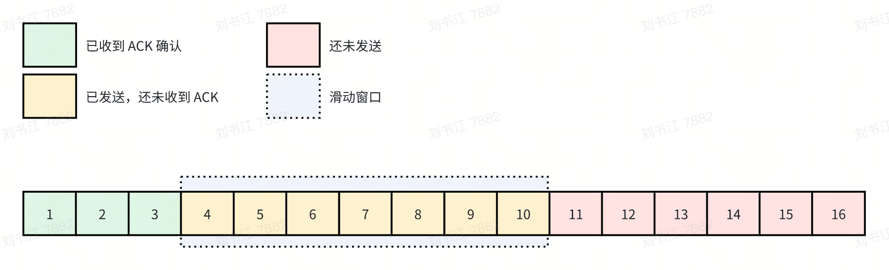
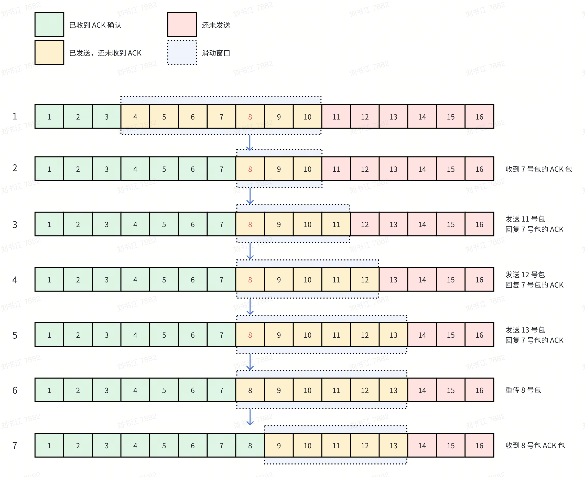
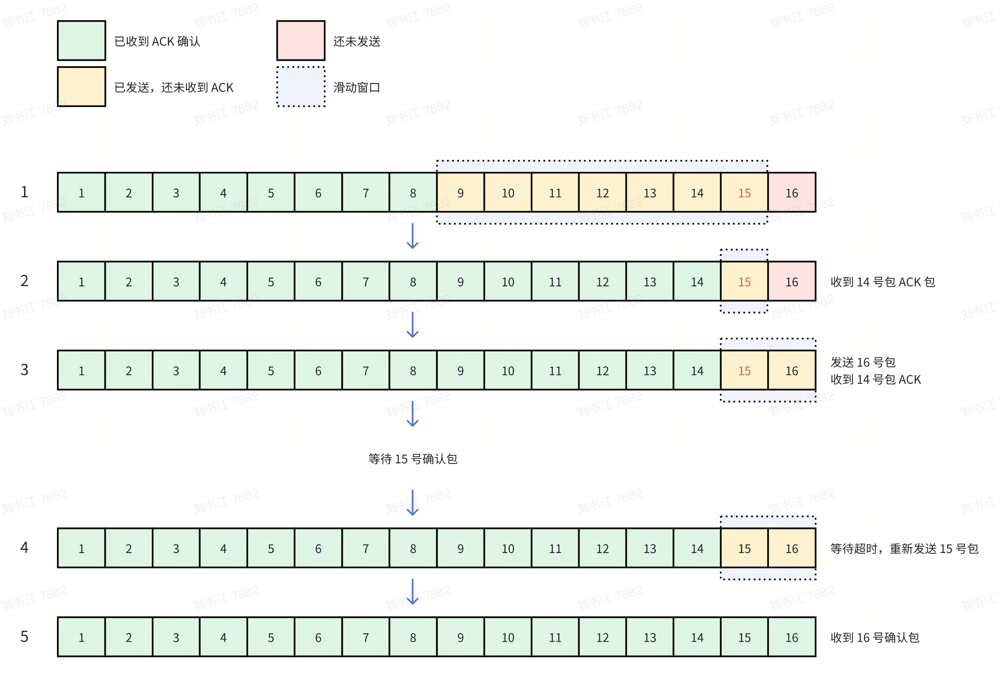
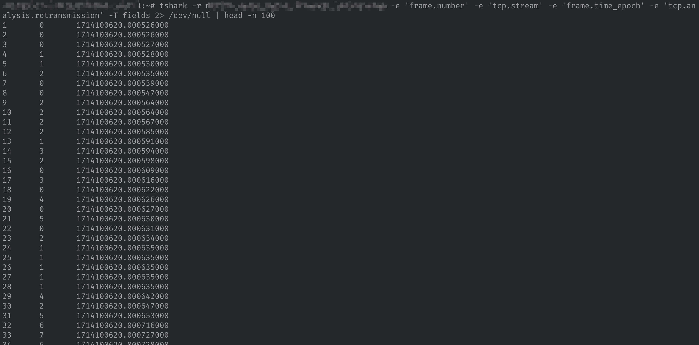
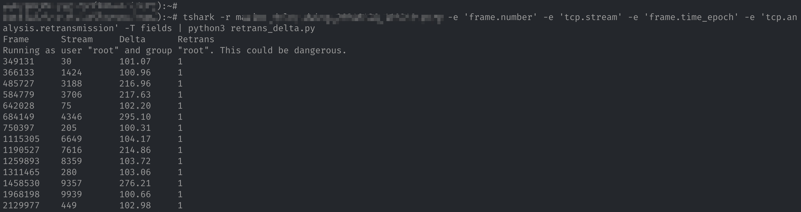
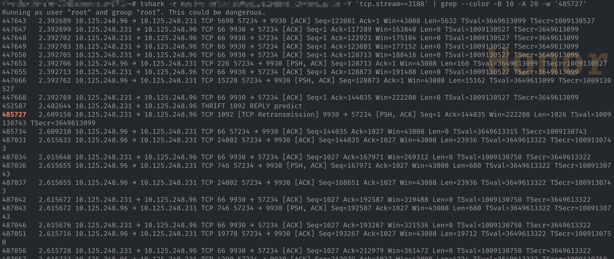

TCP 重传是有害的，但因为快速重传、选择性重传等的存在，其不一定会对应用延迟造成很大影响，但是其它的重传，如超时重传等会极大的增加应用的延迟，在排查定位时我们也是需要定位到会对延迟影响大的重传。但是如何在众多数据包中快速定位到这些包呢？

## 0x01 如何计算重传延迟

既然需要定位到对延迟影响大的重传，那就需要可以量化重传带来的延迟然后进行过滤查询。我们结合滑动窗口，对两个常见的重传场景进行分析，量化其延迟。



### 1.1 快速重传

假如 8 号包在传输过程中丢失，那么按照顺序依次会发生以下情况：

1. 发送端发送 4～10 号包。
2. 接收端收到 4、5、6、7、9、10 号包，返回收到的最大的连续包 7 号包的 ACK 确认包。
3. 因为 4～7 号这 4 个包已经被确认，滑动窗口空出 4 个位置，客户端发送 11 号包。接收端收到 11 号包后，因为当前接收端滑动窗口中连续最大包依然是 7 号包，于是回复 7 号包的 ACK 确认包。
4. 发送端端因为滑动窗口没有满，继续发送 12 号包，接收端收到 12 号包后继续回复 7 号包的 ACK 确认包。
5. 发送端继续发送 13 号包，接收端收到 13 号包后依旧返回 7 号包的 ACK 确认包。
6. 此时发送端已经**连续 3 次收到** 7 号包的确认包，触发快速重传机制。重传 8 号包。



我们来分析一下快速重传对于延迟的影响，如果单看 8 号包自身的延迟，其应该等于 11 号包 + 12 号包+ 13 号包来回延迟再加上自己重传单程的延迟，即 `3*RTT+RTT`。但是 11、12、13 号包可能是同时发出的，因此其自身的延迟约为 `RTT+RTT`。

以上只是这个包自身到达对端的延迟，但对于应用来说，一个请求由多个包组成，而因为有滑动窗口的存在，包的发送是并发的，不会阻塞在等待 8 号包上，因此其对应用的延迟影响非常有限，可以忽略。

### 1.2 超时重传



我们再来看超时重传的场景，假如 15 号包丢失，那后续的流程为：

1. 发送端发送 9～15 号包。
2. 接收端收到 9～14 号包，返回 14 包的 ACK 包。
3. 因为滑动窗口清除了 6 个位置，紧接着发送了剩下的 16 号包。接收端收到 16 号包，因为目前收到的连续最大包为 14 号包，因此返回 14 号包的 ACK 包。
4. 此时发送端

我们分析一下超时重传对于延迟的影响。还是先看包本身，其延迟等于 `16 号包传输+后续超时等待时间+重传时间`，即 `RTT + 后续超时时间 +RTT`。

对于应用来说，因为其中涉及一段超时等待的时间，而且一般也比较长（可以达到200ms），因此其对应用延迟影响比较大。其延迟等于 `后续超时等待时间+重传时间`，而后续超时时间一般都是远大于重传时间的，因此也约等于 `后续超时等待时间`。

通过以上分析，在重传影响延迟的问题中，我们主要需要关注超时重传，而超时重传对应用造成的延迟可以使用 `后续超时等待时间` 来量化，结合滑动窗口可以看出，这个时间就等于**重传包与上个包之间的时间差**。因此我们后续的查找也是要基于这个指标来确认。

## 0x02 如何快速

通过以上的分析，我们分析出可以通过获取重传包与其上个包之间的时间差来计算重传的延迟。但具体需要如何自动获取呢？最好的办法是解析并分析 pcap 每一个包，但比较重，有个更轻量的方法是使用tshark然后结合python进行分析。

tshark 可以单独输出每个包的发送时间、是否为重传包以及 TCP 连接的标识。基于这些信息我们可以计算出重传包的重传耗时。其命令如下：

```bash
tshark -r /path/to/pcap_file.pcap -e 'frame.number' -e 'tcp.stream' -e 'frame.time_epoch' -e 'tcp.analysis.retransmission' -T fields
```



命令中 `-e` 参数是输出列的名称，其中各个列含义如下：

1. `frame.number`：包的序列号，从 1 开始。
2. `tcp.stream`：tshark 为每一个 TCP 连接分配的序列号。
3. `frame.time_epoch`：数据包的发送时间。
4. `tcp.analysis.retransmission`：标记该包是否为重传包，如果是的话为 1，不是的话为空。

为了获取重传包与当前连接中上个包之间的时间差，需要首先区分 TCP 连接，这个可以通过 `[tcp.stream](http://tcp.stream)` 获取，然后判断当前包是否为重传包，如果是的话，则计算与相同 `tcp.stream` 的上一个包的时间差。Python 的实现如下：

```python
#!/usr/bin/env python3
import sys

last_stream_time_map = {}

print("{:<10} {:<10} {:<10} {:<3}".format("Frame", "Stream", "Delta", "Retrans"))
for line in sys.stdin:
    parts = line.split()
    if len(parts) < 3:
        continue

    frame_number = int(parts[0])
    stream = int(parts[1])
    time_epoch = float(parts[2])
    retrans = False
    if len(parts) > 3 and parts[3] == "1":
        retrans = True

    if stream not in last_stream_time_map:
        last_stream_time_map[stream] = time_epoch
        continue

    delta_ms = (time_epoch - last_stream_time_map[stream]) * 1000
    if delta_ms <= 100:
        # 过滤掉小于 100ms 的重传
        continue
    last_stream_time_map[stream] = time_epoch
    if not retrans:
        continue
    print("{:<10} {:<10} {:<10.2f} {:<3}".format(frame_number, stream, delta_ms, 1 if retrans else 0))

```

然后使用如下命令将 tshark 结果输出到上面脚本中，

```python
tshark -r /path/to/pcap_file.pcap -e 'frame.number' -e 'tcp.stream' -e 'frame.time_epoch' -e 'tcp.analysis.retransmission' -T fields | python3 retrans_delta.py
```



然后通过 tshark 直接找出重传前后包，随后可以做详细分析。

```shell
tshark -r /path/to/pcap_file.pcap -Y 'tcp.stream==3188' | grep --color -B 10 -A 20 -w '485727'
```



## 0x03 总结

在排查网络引起的延迟问题过程中，一般会涉及到抓包，但对于大流量的服务，即使抓包时间很短，依然会抓取到大量数据包（1GB/s），这对分析定位带来了很大的难度。之前我尝试过通过解析 pcap 文件，然后计算每个请求的时间，来获取延迟较大的程序，但因为抓包过程中存在未抓到等情况，会出现大量误报，并没有缓解多少工作量。后面配合应用日志中的请求 ID，使用 wireshark 的搜索功能定位问题重传包，这种方式比较有效，但并不是所有应用都有对应请求 ID 记录的。本文的方法相当于一种更通用的定位问题重传包的方法，后面我也会分享一个基于此的一个实际案例。
