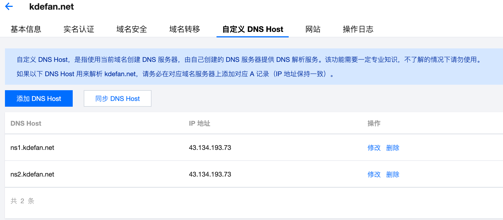
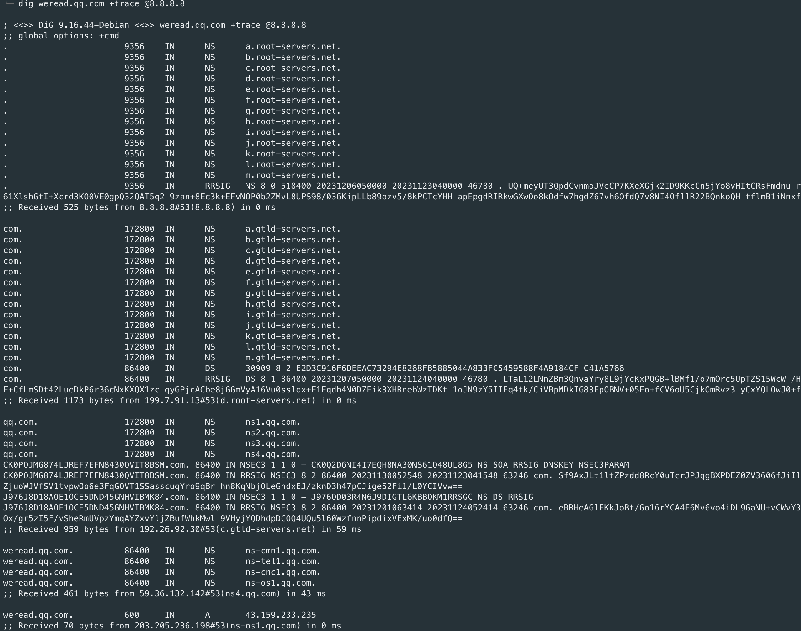
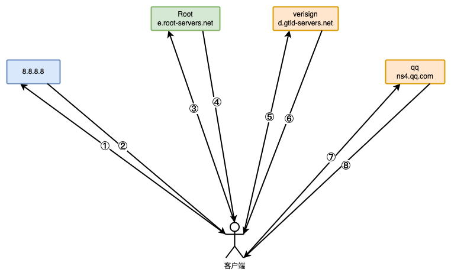
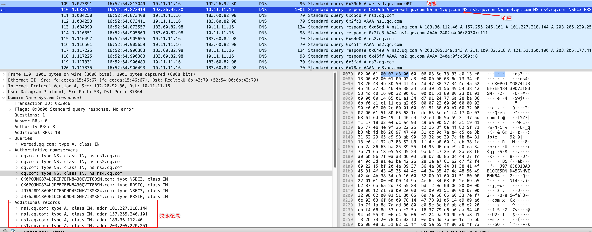
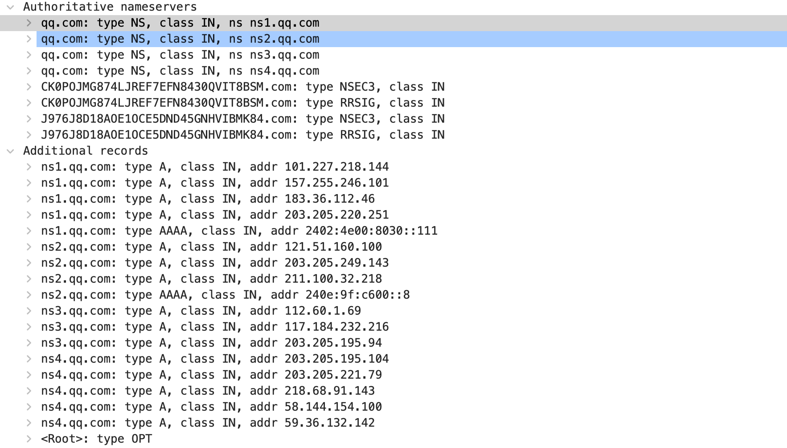
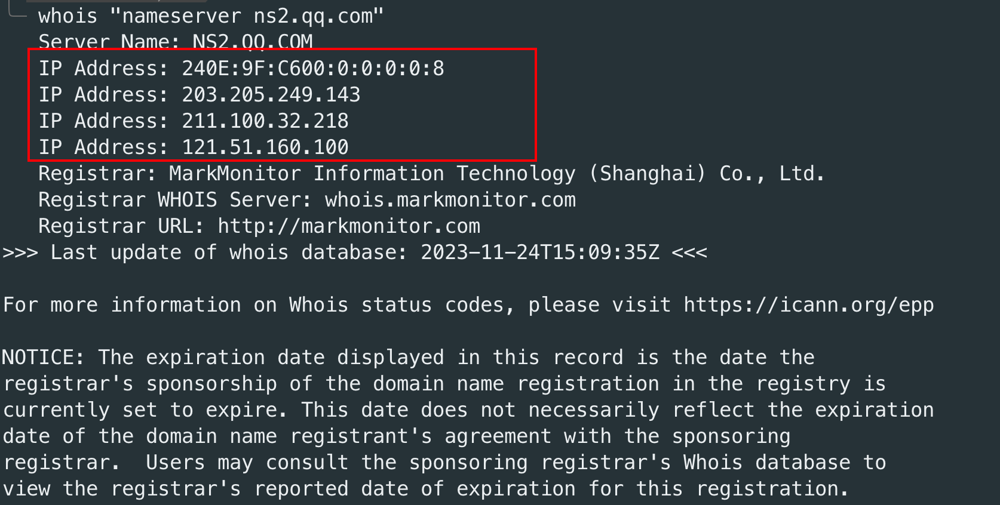
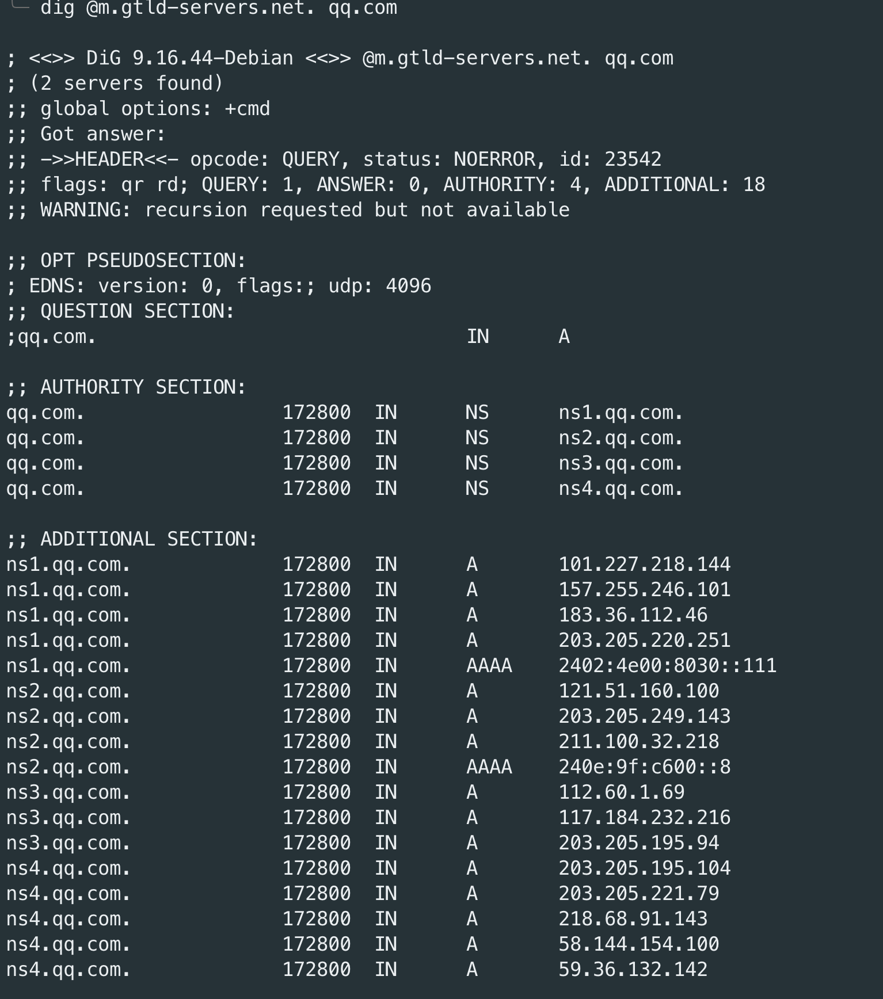

在注册域名后，会在域名管理控制台有一个 **自定义 DNS Host** 的功能，它的主要作用是设置胶水记录，那胶水记录有什么用？在什么场景下需要设置？本文将对其进行逐步分析说明。



## 0x01 什么是胶水记录

胶水记录最主要的作用是为了解决域名解析过程中的一个循环依赖的问题，为了便于理解，我们还是从域名迭代查询说起。

### 1.1 从域名迭代查询说起

为了模拟迭代查询，我们使用 `dig` 命令来查询`weread.qq.com` 域名。



整个解析过程大致的流程图如下，接下来我们对整个流程涉及到的步骤做详细解释。



1. 客户端先去指定的 DNS 服务器（`8.8.8.8`，如果不指定，则使用系统配置的localdns）获取根服务器，`8.8.8.8`返回根服务器的域名列表（`a.root-servers.net`、`b.root-servers.net`等13个域名）。上图中的 1、2 步骤分别是获取根服务器的请求和响应。
2. 客户端从第2 步响应的根服务器列表中选取一个根服务器，向根服务器发送请求，请求内容为**查询域名`weread.qq.com` 的 A 记录**。根服务器当然没有这条记录（否则数据量会大到无法承受），但是根服务器知道 `com` 的DNS服务器（而且它只知道这些顶级域名的DNS服务器），于是返回给客户端`com` 的DNS服务器列表（`a.gtld-servers.net`、`b.gtld-servers.net`等13个域名），让客户端去`com` 的DNS服务器问一下。这就是上图中的 3、4 步骤。
3. 客户端从第 4 步的响应中选取一个 DNS 服务器（`c.gtld-servers.net`），然后向其询问**域名`weread.qq.com` 的 A 记录**。`com` 的DNS服务器也没有这条记录，于是返回 `qq.com` 的 DNS 服务器列表（是的，`com`那里只记录后缀为`com`的二级域名。列表为`ns1.qq.com`、`ns2.qq.com`等4个），让客户端去`qq.com` 的 DNS 服务器询问一下。这对应了上图的5、6 步骤。
4. 最后客户端拿着第6步中返回的DNS服务器中的一个（`ns4.qq.com`）向其发起请求，询问**域名`weread.qq.com` 的 A 记录**。而`ns4.qq.com`就是域名`qq.com`的权威DNS，它上面有记录`weread.qq.com`的A记录，因此它直接返回了期望域名的A记录值`43.159.233.225`。

以上流程是域名迭代查询的整个流程。但是这里面有个问题，第 6 步中因为 `com` DNS 服务器 `c.gtld-servers.net` 返回的 `qq.com` 的 DNS 服务器是域名列表（`ns4.qq.com`、`ns3.qq.com` 等），我们知道，互联网寻址是靠 IP 的，那就必须要把选中的 `ns4.qq.com` 服务器域名解析 IP，那此时流程就需要进入到解析 `ns4.qq.com` 的 IP 上了，流程还是上面的流程，只是 `weread.qq.com` 换成 `ns4.qq.com`。按照迭代流程走到第6步， `com` DNS 服务器 `c.gtld-servers.net` 返回 `qq.com` DNS 服务器列表，为`ns4.qq.com`、`ns3.qq.com` 等 4 个域名，然后从中选择一个使用，比如选中 `ns1.qq.com` ，因为也是域名，需要解析为 IP，然后再次迭代查询。有没有发现已经死循环了，不管你循环多少次，都是在解析`ns1.qq.com`、`ns2.qq.com` 等 4 个域名，而且还得不到结果。那该如何解决呢？

### 1.2 解决死循环的胶水记录

我们先看一下第 6 步中，`c.gtld-servers.net` 的响应内容。



从抓包中可以看到响应中除了返回了 `Authoritative nameservers` 外还返回了`Additional records`，这些响应是对`Authoritative nameservers` 中的域名做补充，主要是补充了这些域名的IP地址，这样在第 7 步发起之前，就不需要再次解析 `ns4.qq.com` 的获取IP，从而避免了死循环的发生，而这些记录就是胶水记录。



### 1.3 什么是胶水记录

通过上面的分析，我们可以总结一下，胶水记录是对域名子记录设置的特殊解析记录，通过在**域名上一级DNS服务器中登记其解析IP**，并在解析过程中通过`Additional records`返回，避免迭代查询陷入死循环。需要注意的是域名设置的胶水记录IP 值与该域名解析出来的 IP 有可能不同，因为两个的数据来源不同，但是建议最好设置为相同。

### 1.4 什么时候需要设置胶水记录

那什么时候需要设置胶水记录呢？就是当你需要将域名设置 作为 DNS 服务器的域名时，举例来说，如果你想将 `example.com` 的 DNS 服务器修改为`ns1.example.com` 和 `ns2.example.com` 那么你需要在 example.com 的注册商的自定义DNS处添加`ns1.example.com` 和 `ns2.example.com` 及其对应的 IP，否则会修改不成功。

## 0x02 如何查询胶水记录

有多种方法可以查询域名是否设置了胶水记录，以及其对应的 IP。

### 2.1 whois查询

whois 协议除了支持查询域名的信息外，还支持查询域名的胶水记录，但是这种方法**只能查询到在注册局登记的胶水记录**。查询命令如下：

```shell
whois "nameserver ns1.qq.com"
```



返回信息中包含了域名胶水记录、注册商等相关信息，因为此信息是注册局返回的，因此是绝对可信的。

### 2.2 dig 查询

通过上面抓包我们可以看到，胶水记录就放在响应的 `Additional records` 中，我们只需要从里面提取即可，好在 `dig` 命令已经实现了此能力，以刚刚的`qq.com` 域名为例。

```shell
dig @m.gtld-servers.net. qq.com
```



因为胶水记录是由上一级 DNS 服务器返回的，因此 `dig` 时使用的 DNS 服务器需要是上一级的，`qq.com` 的上一级是注册局，因此需要指定注册局的 DNS 服务器地址`m.gtld-servers.net`。

## 0x03 总结

本文通过一个实例回顾了域名递归解析的流程，并基于此说明了为什么需要胶水记录，以及什么是胶水记录，对于普通使用者，添加的最快捷方式就是通过域名注册商的**自定义 DNS Host** 功能。
