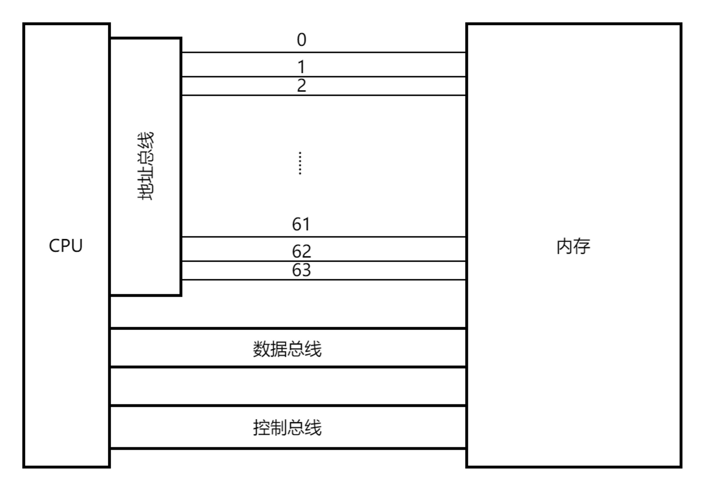

要解答这个问题需要先了解CPU如何从内存中读取数据。

上图展示了CPU和内存之间存在的3条系统总线，分别是`数据总线`、`地址总线`和`控制总线`，分别用于传输内存数据、传输内存地址以及控制内存读写。当CPU需要从内存（某个地址）中读取数据时，会分别经历以下几个流程：

1. **寻址阶段**：首先，CPU的地址寄存器存储目标内存地址。这个地址通常来自程序代码中的某个指令，例如加载指令（如x86中的 **`MOV`**、ARM中的 **`LDR`** 等）。
1. **发起请求**：CPU发出一个内存读取请求。为此，CPU将内存地址放在地址总线上，然后在控制总线上设置一个读信号，指示内存访问单元（如北桥或直接内存控制器等）进行读操作。
2. **总线传输**：控制总线传输一个读信号，地址总线传输内存地址。这个过程可能涉及到某种计算机内的内存映射、地址翻译（例如虚拟地址到物理地址）等步骤。
3. **内存响应**：内存控制器定位需要访问的内存单元，读取数据，并将数据放到数据总线上。
4. **数据放置到寄存器**：CPU从数据总线上获取数据，并将其保存到对应的寄存器中。在这个过程中，数据通过CPU的缓存（如L1，L2，L3等缓存）传输。操作完成后，数据将保存在CPU寄存器中，并可供后面的指令使用。

简化一下就是，CPU需要读取`0xc000108000`地址的数据，它先将地址通过MMU单元转换为真实的内存地址，然后再将地址通过地址总线传输给内存，同时通过控制总线发送一个读取信号，表示要读取这个地址的数据。内存读取数据后，将数据通过数据总线传回内存。

上面读取内存数据的流程涉及到内存地址的传输，而内存地址传输需要地址总线，但地址总线位宽是有限的（每次能传输的数据有限），N位的每次最多能传输N bit数据，也就是0~2N-1。当N等于32时，2N-1正好等于4G。

举个例子，假如一个村庄的所有房间都需要通过门牌号才能定位到房间位置，那如果只有100个门牌号，即使村庄建了101间房，因为第101间房无法分配到门牌号致使它无法被定位，也就无人知道有这间房，从而变成了“鬼屋”。

## 扩展阅读

计算机中有一个概念叫`machine word`（机器字），在32位系统下，它的长度为4个字节，64位下为8个字节。操作系统可以原子的读写一个机器字，利用这个特性可以实现很多原子操作，我在后面的文章中会逐步分享。
