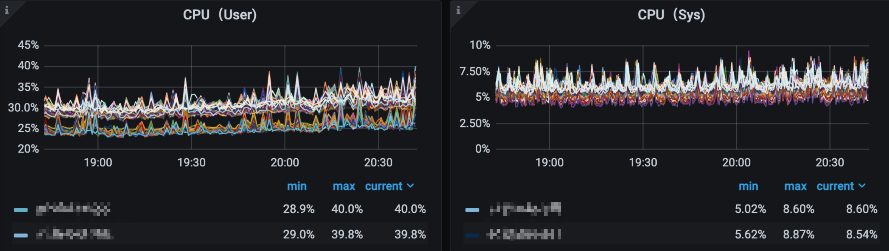
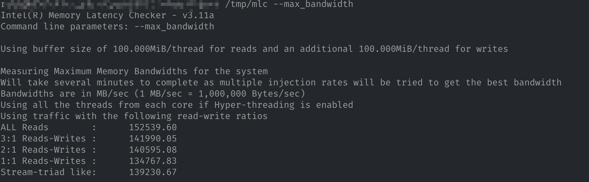

最近解决了一个生产环境中某个应用集群 CPU 利用不同的问题，虽然最后排查出来的结论比较简单，但是中间排查过程还是学到了不少知识，值得记录下来。

## 0x01 问题描述

集群中机器的 CPU 利用率被分为两批，这两批机器利用率相差约 10% 左右，但是整个集群中机器的 CPU 核数完全相同，部署的应用也完全相同，流量也是一样的，理论上 CPU 利用率应该相同。


## 0x02 排查过程

### 2.1 监控指标异常确认

最简单的办法是确认一下基础指标是否有明显异常。


深入查看 CPU 详情，发现是用户态 CPU 利用率差距比较到。



再次查看网络流量，发现没有什么流量没有出现分层的情况，通过找开发同学确认，调用方请求也是轮询，不会存在流量不均衡的情况。


后续排查中断、上下文指标等也未发现任何异常。

### 2.2 硬件信息排查

首先要确认的就是 CPU 的方方面面是否相同，包括 CPU、CPU 频率、L1 cache、L2 cache等。通过 `lscpu` 命令可以获取 CPU 的详细信息。


通过统计所有机器的 CPU 信息，确认它们配置全部相同，包括 CPU 型号等均为相同。

### 2.3 程序信息及配置

1. 程序版本

虽然运行的程序相同，但是如果程序版本不同，可能造成利用率的不同（例如程序做了优化）。对所有机器的程序做sha256，发现程序的哈希值相同，说明程序都是相同的。

 2. 程序进程（线程）数量

程序开启的进程、线程的数量也会影响到 CPU 的利用率，因此需要进行确认。线程详情我们可以通过 `ps` 名称的 `-T` 参数获取，统计后发现服务在所有机器上的进程、线程数相同。

```bash
ps -efT | grep <service_prog> | wc -l
```


### 2.4 绑核确认

上面的 CPU 信息确认中可以看到机器有 2 个 numa 节点，为了提升程序性能（减少跨 numa 节点调度访问带来的性能下降），每台机器上会开 2 个进程，并进行绑核操作。通过 `taskset` 和 `numactl` 命令获取所有机器绑核信息和 numa 节点信息，确认所有机器绑核信息相同。


自此，能排查的点都已经排查、确认了，并且都确认没有问题。

### 2.5 perf 分析

能确认的信息都确认了，只能尝试使用 `perf` 去追踪两批机器中程序的性能信息并渲染为火焰图分析，两批机器出来的火焰图差别不是非常大，基本上也没有太大收获。排查一时陷入了停滞。


## 0x03 柳暗花明

偶然间，我在 **Brendan Gregg** 的博客上看到了一篇关于 IPC（Instructions-per-cycle） 的文章：[The PMCs of EC2: Measuring IPC](https://www.brendangregg.com/blog/2017-05-04/the-pmcs-of-ec2.html)，文章分析了内存对 CPU 效率的影响，然后我想到了这个未解决的问题，抱着试一试的心态尝试去排查确认一下，结果真的发现了一些不同。

### 3.1 内存信息

通过 `lshw`  命令可以获取机器所有内存条的信息。

```bash
lshw -short -C memory | grep DDR
```

如下，机器中有 8 条 32G 2933 MHz的 DDR4 内存，相当于此机器内存为 8*32G=256G 内存。


然后统计所有机器的内存信息，并结合机器的 CPU 利用率，发现单条内存的配置相同，但是不同机器内存条数量不同，CPU 利用率跟内存条数量有直接的关联。


其实这一点在一开始统计机器配置的时候就应该发现的，但因为 CPU 利用率的问题忽略了对内存信息的确认。

### 3.2 IPC 指标确认

为什么内存大小会跟 CPU 利用率联系上呢？根据 Brendan Gregg 在文章 [The PMCs of EC2: Measuring IPC](https://www.brendangregg.com/blog/2017-05-04/the-pmcs-of-ec2.html) 中的说明，可能跟内存 IO 有关，可以通过 IPC 进一步确认。

想要获取进程的 IPC 指标，可以使用 perf 工具，相关命令如下：

```bash
perf stat -a -p $(pidof <service_prog> | tr ' ' ,) -- sleep 30
```

但是只统计一台的肯定看不出什么问题，需要将集群所有该程序的 IPC 统计出来进行分析，同时为了分析 IPC 与利用率的关系，最好将此时间段的 CPU 利用率也统计出来，脚本我就不放出来了，相对比较简单。

获取所有机器 IPC 数据和利用率数据后，将结果中的 IPC 指标抽取出来，但此时获取的 IPC 指标是 0.58～0.7 之间的数值，虽然可以看出差距，但是为了更加便于区分，我们将 IPC 值标从高到底排序并取最大值及其对应的 CPU 利用率，然后对比其它行与这两个指标的波动比率。结果统计如下：


从上图可以很清楚的看到内存大小与 CPU 的利用率及 IPC 都有非常强的关联。自此基本上可以确定 CPU 利用率的不同就是内存导致的，但是为什么呢？

## 0x04 原因分析

根据 Brendan Gregg 的解释，应该是 CPU 在等待内存IO的响应导致的，但系统没有相关衡量内存 IO 及延迟的指标，不过我们可以测量内存带宽，看两个带宽是否相同。通过 Google 发现 intel 提供了一款名为 mlc（[memory latency checker](https://www.intel.com/content/www/us/en/developer/articles/tool/intelr-memory-latency-checker.html)）的工具，对两批机器的测量结果，发现两批机器的带宽存在较大差距，符合之前的猜测。




回到最初的问题，最好的办法其实是拔掉多余的内存条观察CPU利用率是否会上升，但由于不具备此条件，只能通过猜测、验证的方式来得出结论。

严格上来说，我们并未找出问题的根因（或者没有直接的指标依据来证实），但是结合之前业务反馈过的一个计算型应用混布redis导致应用延迟异常的案例，更加可以确认内存带宽会影响应用性能或CPU利用率。

## 0x05 总结

排查过程中，深刻体会到：要学习的还有很多。
