wireshark 提供了非常强大的展示和分析能力，通过这些能力可以很直观的分析发现网络中的问题，并且 wireshark 中默认布局展示信息已经足够直观、好用，但是对于一些更深层次的问题还是需要 wireshark 的高级功能。下面我们就分享一下 wireshark 中的一个高级功能。

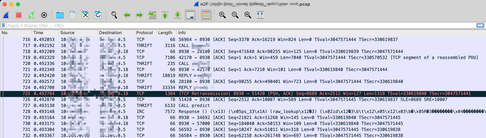

## **0x01 展示列**

wireshark 中的默认列已经足够分析一些简单的问题，但是对于一些细节问题（延迟、丢包等）还是不够的，好在 wireshark 允许添加扩展列。下面是一个个人使用的列，每一列的添加都有相关的原因。

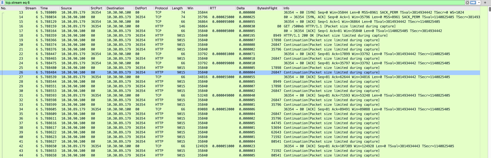

各列说明如下：

| 列名          | 说明                                                               |
| ------------- | ------------------------------------------------------------------ |
| No.           | 包的序列号。                                                       |
| Stream        | wireshark 对某条 TCP 连接分配的序列号。                            |
| Time          | 时间。                                                             |
| Source        | 数据发送方 IP。                                                    |
| SrcPort       | 数据发送方端口。                                                   |
| Destination   | 数据接收方 IP。                                                    |
| DstPort       | 数据接收方端口。                                                   |
| Protocol      | wireshark 探测到的协议。                                           |
| Length        | TCP 包中数据大小，Info 列中有但某些情况下不展示。                  |
| Win           | 滑动窗口的大小，可以及时发现窗口大小的变动。                       |
| RTT           | 仅在为 ACK 包时展示，显示 ACK 确认包的 RTT，从侧面反映出网络质量。 |
| Delta         | 显示当前包与上一个包的时间差值。                                   |
| BytesInFlight | 滑动窗口中已发送但未被确认的字节数。                               |
| Info          | wireshark 分析统计的包信息。                                       |

各列配置如下：

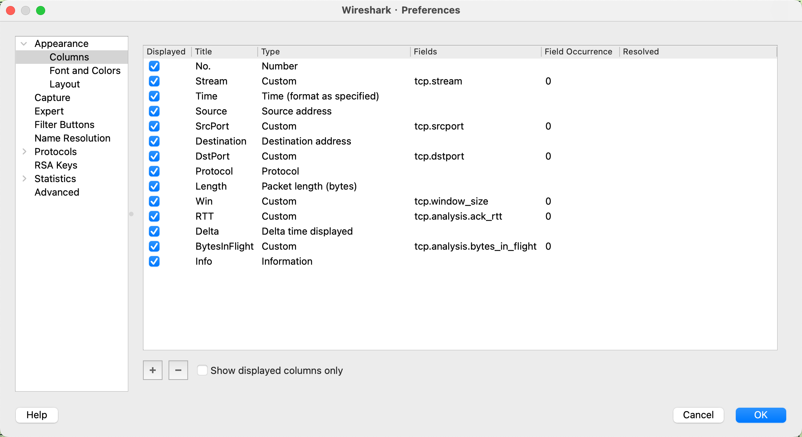

下面对某些列重点说明一下：

### **1.1 Win**

这个是发送端声明的自身的滑动窗口大小。慢启动、丢包、超时、拥塞控制等都会影响滑动窗口的大小，也因此窗口大小的变化可以体现出当前网络的质量的变化。

### **1.2 RTT**

这里面的 RTT 属于 ack_rtt，是一个数据包从发送到接收到对应的 ACK 包的时间差。这个 RTT 可以实时反映出网络延迟的变化，属于需要重点关注的，后面我们也可以看到一个单独统计 RTT 延迟的图。

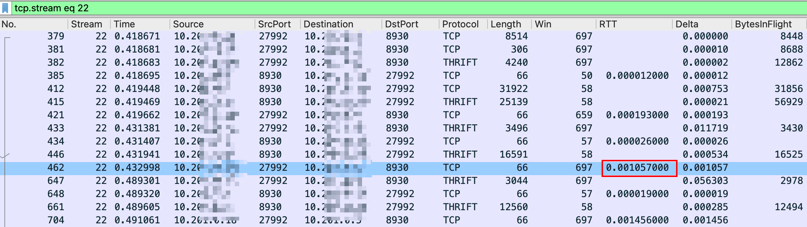

### **1.3 BytesInFlight**

该列展示的是滑动窗口中已发送但未被确认的字节数（在途字节数）的大小，考虑到发送端的 buffer 一般比较充足（发送 window）， 因此，此值约等于接收方的接收窗口大小。

## **0x02 过滤条件**

### **2.1 追踪某条 TCP 连接**

如果你的抓包条件是 对端端口或者对端 IP（如 host 1.2.3.4、port 1234 等），那你可能抓取到多个 TCP 连接的数据，按照抓包顺序，你看到的当前包的上一个包可能并不是本条 TCP 连接的包。为了过滤单条 TCP，你可以对需要跟踪的包点击右键，选择 Follow -> TCP Stream ，之后可以看到搜索框中出现了类似 tcp.stream eq 47 的条件，47 就是这条连接在本次抓包中的 ID。

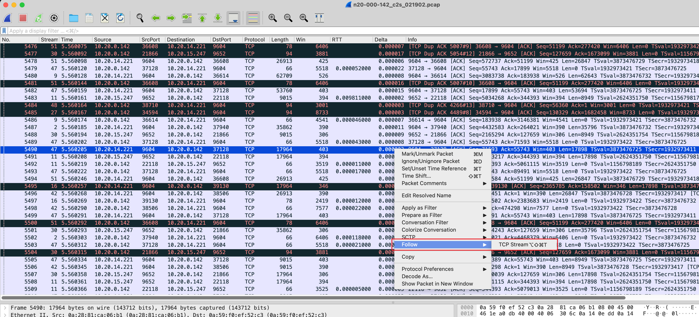

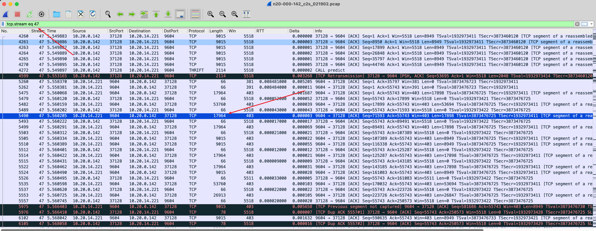

### **2.2 查找包含特定字符串的包**

为了在众多数据包中找到某个包含特定字符串（请求 ID）的包或者 TCP 连接，就要用到 wireshark 的查找模式， 按 Ctrl+F 或 CMD+F 打开查找框。查找方式一帮有两种，通过字符串查找或者通过字符串的 16 进制形式查找。

通过字符串形式查找记得要指定查找包的位置。

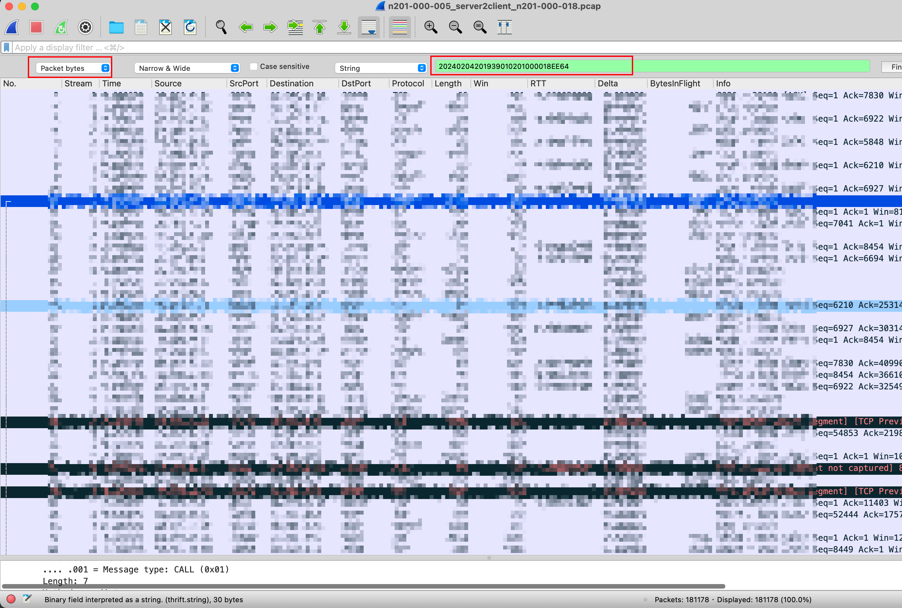

使用 16 进制形式查找，需要先将字符串转换为 16 进制形式，可以使用以下方式进行转换：

| Bashecho -ne "20240204201939010201000018EE64" | python3 -c 'import sys;print("".join([hex(ord(c))[2:].zfill(2) for c in sys.stdin.read()]))' |
|----------------------------------------------------------------------------------------------------------------------------------------------|

### **2.3 快速找出重传等问题包**

wireshark 本身具备对 TCP 数据包的分析能力，并且将其对外暴漏为过滤条件，这样可以让使用者通过过滤条件快速过滤出有问题的包。例如，查找所有重传的包，可以使用 tcp.analysis.retransmission 过滤规则进行过滤。

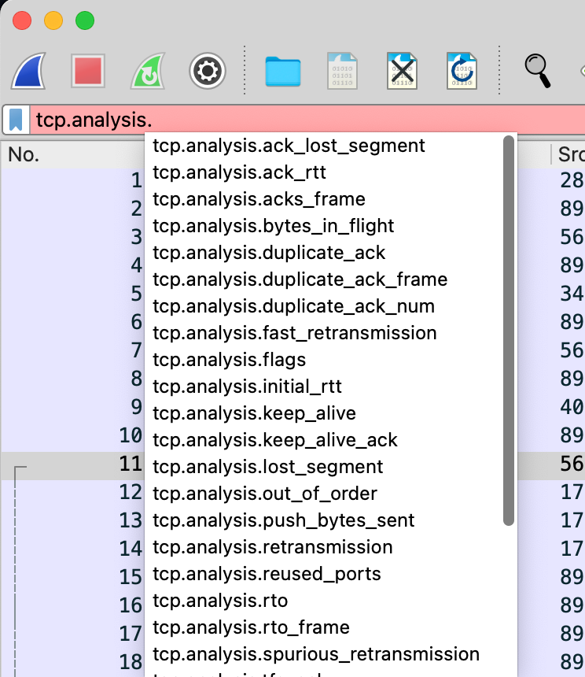

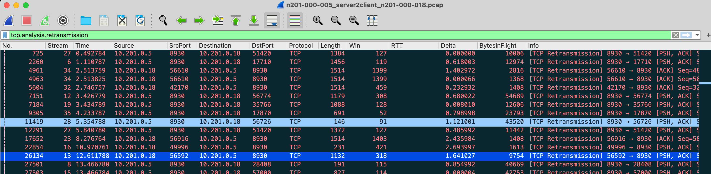

## **0x03 TCP 连接统计信息**

这里说的统计信息主要是 wireshark 中 Stattistics -> TCP Stream Graphs 中的功能。该功能主要针对某一条 TCP 连接进行的分析绘图。通过这些分析图，可以非常直观的了解到当前网络存在什么问题。

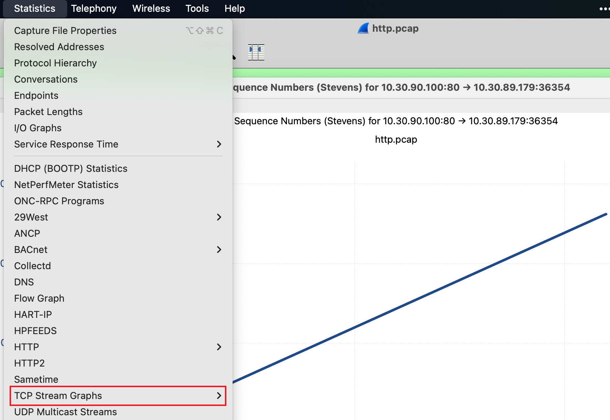

下面对这些功能逐一介绍，并给出使用场景。

### 3.1 Time Sequence (Stevens) 

因为发送数据（TCP Len）会使 Seq（序列号）增长，并且发送数据越多，Seq 序列号越大，也就是说，发送数据越快，Seq 增长也越快。如果将 Seq 大小和时间绘制一张图，那就可以很直观的表现出传输的速度。这个图就是 Time Sequence (Stevens)  。

一个好的网络质量持续传输数据抓取的包的图应该一个平滑增长的线，如下图是一个下载 500mb 文件的抓包图。

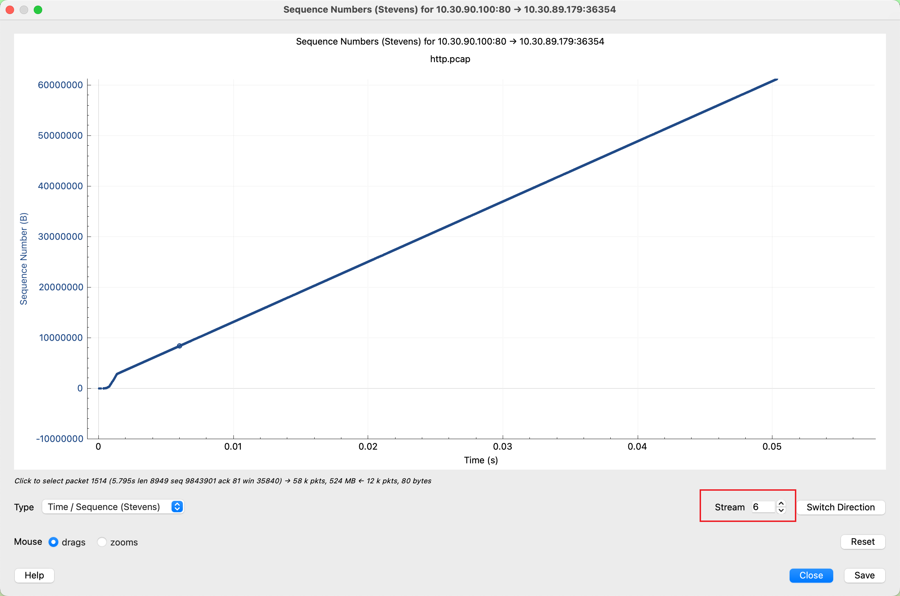

如果将图放大后会发现类似台阶一样的形状，这个主要是因为发送端滑动窗口满了，需要等对端 ACK 确认数据后才能释放已经发送并确认的数据窗口，然后继续发送后续数据。

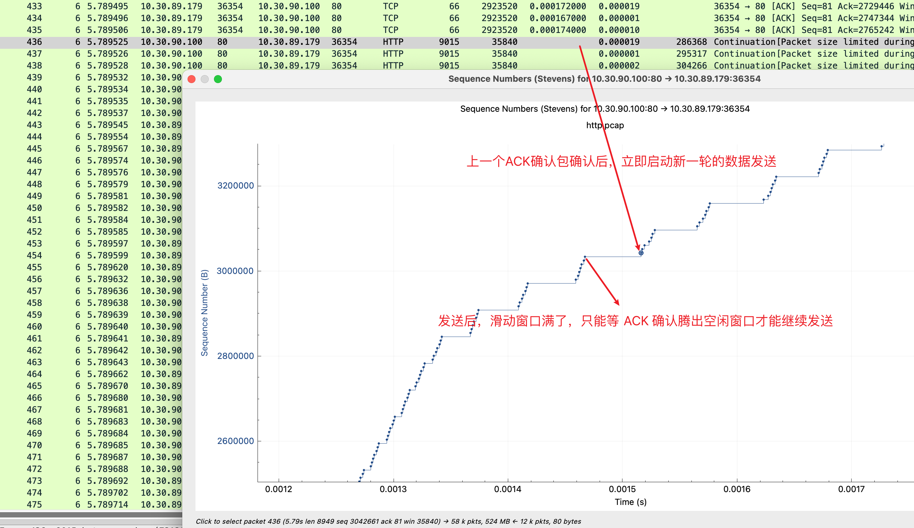

把视线移动到一开始，可以看到在 0.0013s 的时候，Seq 增长趋势放缓了。对比一下可以看到，放缓后，可以明显看到横线区域长度明显变长，也就是 ACK 返回时间变长了，也即 RTT 变大了。RTT 的增大直接导致了增速放缓。

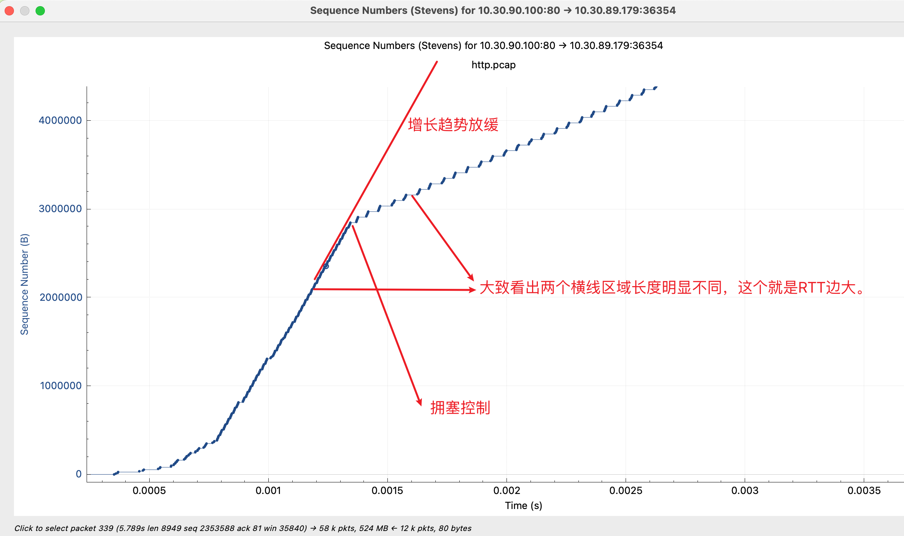

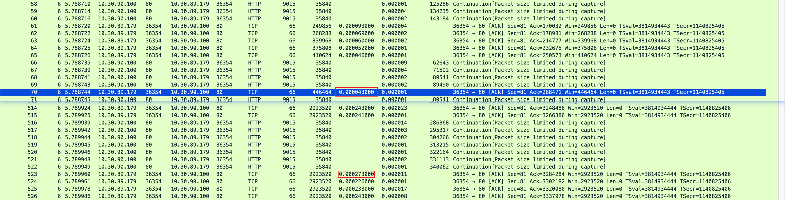

### 3.2 Throughput

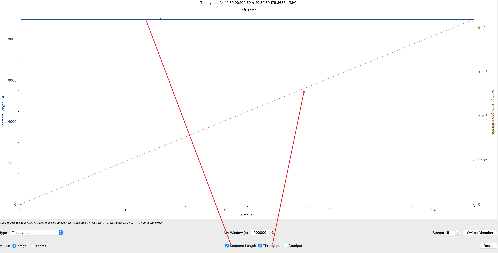

### 3.3 Round Trip Time

这里是各个数据包的 RTT 时间汇总出的图，这里只能看大的趋势，左边的时间是不正确的，wireshark 也已经[确认相关 bug](https://osqa-ask.wireshark.org/questions/38607/rtt-graph-showing-values-higher-than-tcpanalysisack_rtt/)。这里也可以看到，RTT 在某一时间点忽然变大，证实了上面说的结论。

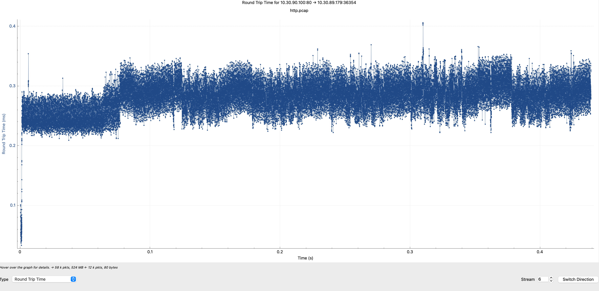

## **0x04 总结**

wireshark 是网络问题分析的一个核弹级利器，尤其是它的分析绘图的功能，很多时候网络问题抓个包使用 wireshark 很快就能定位出问题。但是本文的案例中我只是给出了一个网络资料较好的情况下的抓包分析结果，后面我会对不同状况下抓包结果进行分析分享，争取覆盖大部分场景的网络场景。
